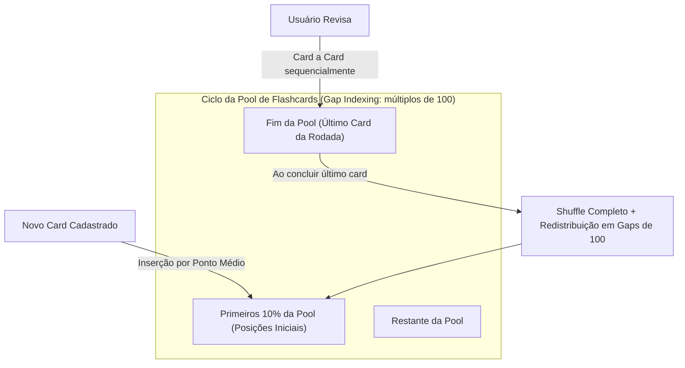
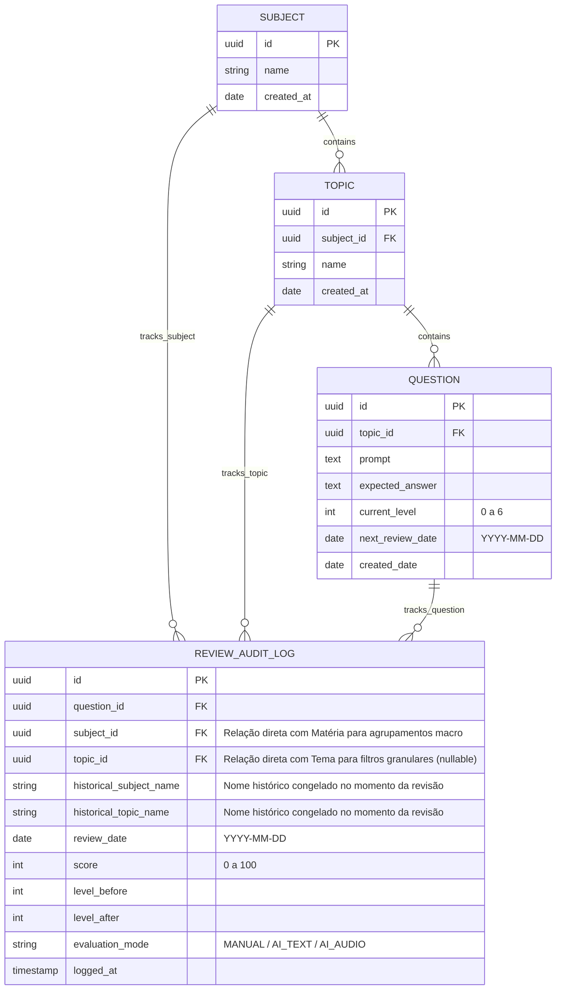
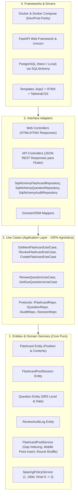
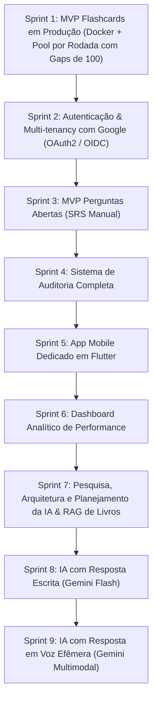

# Product Requirements Document (PRD) — v6.0
## Study Reviewer — Sistema Inteligente de Revisão Ativa e Repetição Espaçada

---

## 1. Visão Geral do Produto

### 1.1 Missão
O **Study Reviewer** é uma aplicação focada em aprendizado contínuo e retenção de longo prazo, dividida em dois sistemas complementares de estudo ativo:
1. **Flashcards (Pool Contínua por Rodadas):** Rotação sequencial da pool com inserção de novos cards nos **primeiros 10%** da fila e **shuffle geral** da lista toda ao concluir cada ciclo/rodada de revisão. Opera com navegação ágil, atalhos de teclado e gestos de toque no celular, sem notas e sem complexidade de agendamento por dias.
2. **Perguntas Abertas (Mecânica SRS Estrita):** Fila de repetição espaçada por calendário (`[1, 7, 15, 30, 60, 90, 180]` dias), promoção estrita a **100% de acerto**, penalidade de regressão no nível 6 (retorno ao nível 2 com reagendamento para `hoje + 15d`) e auditoria histórica completa.

---

### 1.2 Princípios de Engenharia e Arquitetura
* **Clean Architecture Estrita e Casos de Uso Agnósticos:** Divisão em 4 camadas concêntricas (Entities, Use Cases, Interface Adapters, Frameworks & Drivers). A camada de Casos de Uso é 100% agnóstica, servindo tanto os controladores web (Jinja2 + HTMX) quanto a futura API REST para o aplicativo mobile sem duplicação de lógica.
* **Paridade Dev/Prod com Docker:** Desenvolvimento e produção utilizam a mesma stack conteinerizada (Docker Compose com PostgreSQL e FastAPI).
* **Evolução Segura de Schema com Migrações Versionadas:** Requisito não-funcional de controle automatizado de versões de banco de dados, garantindo migrações contínuas sem quebras ou perda de dados.
* **Datas Puramente Calendárias:** Todo o agendamento de perguntas abertas opera no formato `YYYY-MM-DD` (sem horas, minutos ou desvios de fuso horário).
* **Segurança e Criptografia em Repouso com AES-256-GCM:** Autenticação segura na borda por sessão/cookie, sanitização estrita de inputs contra XSS (via biblioteca de sanitização como `nh3`) e proteção de segredos/tokens armazenados utilizando Criptografia Autenticada **AES-256-GCM (AEAD)**.
* **Auditoria Histórica e Privacidade por Design (LGPD):** Auditoria exclusiva para perguntas abertas ligada à Matéria (`subject_id`) e ao Tema (`topic_id`) com colunas desnormalizadas congeladas (`historical_subject_name`, `historical_topic_name`). Suporte a exportação de dados em JSON e diretriz de efemeridade estrita para áudios gravados na Sprint 9 (descarte imediato pós-transcrição).
* **Design System e Dark Mode Nativo:** Interface responsiva Mobile-First com TailwindCSS, suporte nativo a Tema Claro e Escuro (via seletor de classe, sem cintilação visual de carregamento/FOUC e com respeito ao `prefers-color-scheme`).

---

## 2. Mecânica dos Flashcards (Sprint 1 — Pool Contínua por Rodadas)

Os Flashcards **não** utilizam algoritmo de dias nem auditoria. Eles operam em uma **Pool Dinâmica de Rodada Completa** com suporte a estudo de **Todas as Matérias (Global)** ou com **Filtro por Matéria/Tema Específico**.

### 2.1 Regras de Operação da Pool & Gap Indexing

1. **Ordenação por Gap Indexing (Múltiplos de 100):**
   * Cada flashcard na pool de estudo possui um campo numérico `position`.
   * Na inicialização ou após cada shuffle geral, os cards recebem posições espaçadas de 100 em 100 (`100, 200, 300, 400...`).

2. **Inserção de Novos Cards nos Primeiros 10%:**
   * Quando um novo flashcard é cadastrado, ele é alocado em uma posição aleatória entre os primeiros 10% da fila:
     $$\text{índice\_alvo} = \text{random}(0, \max(1, \lfloor 0.1 \times N \rfloor))$$
   * A nova posição é calculada como o ponto médio entre o card anterior e o próximo daquele índice:
     $$\text{nova\_posição} = pos_{ant} + \lfloor (pos_{prox} - pos_{ant}) / 2 \rfloor$$
   * Isso permite inserção instantânea em banco relacional sem necessidade de renumerar os demais cards da pool.

3. **Tratamento Exaustivo de Edge Cases no Posicionamento:**
   * **Pool Vazia ($N = 0$):** O primeiro card inserido recebe `position = 100`.
   * **Pool Unitária ($N = 1$):** O novo card recebe `position = 50` (antes) ou `position = 200` (depois), conforme sorteio.
   * **Inserção no Início Absoluto (antes do primeiro card):** Se o card for inserido antes do índice 0, sua posição será $\lfloor pos_{primeiro} / 2 \rfloor$. Se $pos_{primeiro} \le 1$, o sistema dispara rebalanceamento preventivo.
   * **Esgotamento de Gap ($pos_{prox} - pos_{ant} \le 1$):** Caso múltiplos cards sejam inseridos consecutivamente no mesmo intervalo até não haver inteiros livres, o sistema dispara um rebalanceamento local dos vizinhos ou redistribuição uniforme da pool em múltiplos de 100.
   * **Exclusão de Card no Meio da Rodada:** Se um card for excluído enquanto uma rodada estiver em andamento, o card é removido e o tamanho $N$ decrementa. O ponteiro da rodada avança naturalmente para o próximo card da sequência sem quebrar a rodada. Se o card excluído era o último restante da rodada, o ciclo se encerra e o shuffle é acionado.

4. **Navegação e Persistência da Sessão:**
   * O estado da rodada é persistido em banco de dados na entidade `FlashcardPoolSession` (`session_id`, `current_position`, `round_number`, `subject_id_filter`), permitindo ao usuário pausar os estudos, fechar o navegador e retomar exatamente de onde parou.
   * Ao finalizar o último card da lista, a rodada se encerra: o sistema reembaralha todos os cards da pool ativa, redistribui as posições em múltiplos de 100, incrementa o `round_number` e posiciona o ponteiro no primeiro card da nova rodada.

5. **Ergonomia, Atalhos de Teclado e Gestos Touch:**
   * **Atalhos no Desktop:**
     * `Barra de Espaço`: Virar o card (alternar entre Pergunta e Resposta).
     * `Enter` ou `Seta para a Direita`: Avançar para o próximo card.
   * **Comandos Touch no Mobile (Web Responsivo e Flutter):**
     * `Toque Único (Tap)` no card: Virar o card / Revelar resposta.
     * `Deslizar para a Esquerda (Swipe Left)`: Avançar para o próximo card.
     * `Arrastar para Baixo (Pull to Refresh)`: Sincronizar sessão e recarregar a fila.
     * *Nota de Produto:* Não existe funcionalidade de favoritos; o foco é fluidez contínua sem categorizações paralelas.
   * **Indicador de Ritmo:** Exibição clara do progresso atual (ex: *"Card 14 de 50 • Rodada 2"*).

---

## 3. Mecânica das Perguntas Abertas (Mecânica SRS Estrita)

As perguntas abertas seguem o algoritmo estrito de repetição espaçada por calendário e auditoria completa.

### 3.1 Níveis de Intervalo e Regra de Penalidade
$$\text{Intervalos} = [1, 7, 15, 30, 60, 90, 180] \text{ dias}$$

| Nível | Intervalo | Score = 100% | Score < 100% |
| :---: | :---: | :--- | :--- |
| **0** | 1 dia | Avança para **Nível 1** (+7 dias) | Permanece no **Nível 0** (Reagenda para `hoje + 1d`) |
| **1** | 7 dias | Avança para **Nível 2** (+15 dias) | Permanece no **Nível 1** (Reagenda para `hoje + 7d`) |
| **2** | 15 dias | Avança para **Nível 3** (+30 dias) | Permanece no **Nível 2** (Reagenda para `hoje + 15d`) |
| **3** | 30 dias | Avança para **Nível 4** (+60 dias) | Permanece no **Nível 3** (Reagenda para `hoje + 30d`) |
| **4** | 60 dias | Avança para **Nível 5** (+90 dias) | Permanece no **Nível 4** (Reagenda para `hoje + 60d`) |
| **5** | 90 dias | Avança para **Nível 6** (+180 dias) | Permanece no **Nível 5** (Reagenda para `hoje + 90d`) |
| **6** | 180 dias | Permanece no **Nível 6** (`hoje + 180d`) | ⚠️ **Regride para o Nível 2** (Reagenda estritamente para `hoje + 15d`) |

### 3.2 Fases das Perguntas Abertas:
* **Fase 1 (MVP — Sprint 3):** Usuário visualiza a pergunta, elabora mentalmente a resposta, clica em "Ver Resposta Esperada" e atribui sua nota de 0 a 100 (sem digitação nem áudio).
* **Fase 2 (Planejamento de IA, RAG de Livros & Bancada de Avaliação — Sprint 7):** Concepção da base de livros digitalizados e arquitetura de múltiplos avaliadores.
* **Fase 3 (IA com Texto — Sprint 8):** Digitação da resposta e correção automática por IA com nota e feedback detalhado.
* **Fase 4 (IA com Voz — Sprint 9):** Gravação de voz com envio direto para o Gemini Flash para transcrição e avaliação semântica. O arquivo de áudio é estritamente efêmero, sendo descartado imediatamente após a resposta da IA para proteção da privacidade biométrica (LGPD).

---

## 4. Auditoria Completa de Performance (Perguntas Abertas)

A partir da Sprint 4, cada tentativa de revisão de pergunta aberta registra um log imutável:

---

## 5. Arquitetura de Software (Clean Architecture)

---

## 6. Ambiente e Deploy

* **Desenvolvimento Local:** Executado via `docker compose up` (FastAPI com hot-reload + PostgreSQL 16 persistente).
* **Produção:** Neon Serverless PostgreSQL (Free Tier) + Render.com Web Service via Dockerfile multi-stage enxuto rodando sob usuário não-root.
* **Segurança na Nuvem:** Autenticação de sessão ativada na borda para proteção dos dados pessoais em ambiente público, e encriptação com **AES-256-GCM** para segredos armazenados.

---

## 7. Critérios de Aceitação Gerais — Definition of Done (DoD)

Para que qualquer Sprint seja considerada concluída e receba autorização de merge para a branch `staging`:
1. [ ] **Aderência Estrita de Negócio:** 100% dos use cases e regras da sprint no PRD implementados sem desvios ou escopo fantasma.
2. [ ] **TDD Aplicado (Red-Green-Refactor):** Todos os testes unitários e de integração escritos antes do código de produção correspondente.
3. [ ] **100% de Cobertura de Testes Obrigatória:** Suíte de testes passando com 100% de cobertura confirmada no backend (`pytest-cov`) e frontend em processos totalmente isolados.
4. [ ] **Governança de Testes de Segurança:** Testes com impacto de segurança decorados com `@pytest.mark.security`, docstring estruturada contendo `"Vulnerabilidade prevenida:"` e `"Garantia de segurança:"`, e meta-teste AST 100% aprovado.
5. [ ] **Qualidade Estática de Código:** Linters e checagem de tipos (Ruff format/check e Mypy strict) passando com zero alertas e sem supressões artificiais.
6. [ ] **Aderência à Clean Architecture:** Núcleo de domínio Python puro (sem dependência de frameworks/ORM), use cases agnósticos e inversão de dependência via Protocols.
7. [ ] **Auditoria Unânime da Bancada:** Pareceres formais assinados pelos **13 Especialistas** no template oficial de PR (`[APROVADO]` ou `[N/A JUSTIFICADO]`).
8. [ ] **Paridade Docker Comprovada:** Aplicação e banco executando perfeitamente via `docker compose up`.
9. [ ] **Pull Request Aberta no GitHub para Staging:** A sprint só é finalizada com a execução de `gh pr create` no GitHub apontando para `staging`, com documentação, 100% de cobertura, os 13 pareceres aprovados e a URL oficial entregue ao usuário.

### 7.1 Bancada dos 13 Especialistas de Auditoria e Qualidade

Para assegurar excelência em todas as dimensões de entrega e confiabilidade, cada Pull Request para `staging` deve ser auditada e aprovada formalmente pelos 13 especialistas:
1. **Especialista de Produto (PO):** Aderência aos requisitos e valor de entrega do PRD sem escopo fantasma.
2. **Especialista QA:** Testabilidade, integridade de cenários BDD e barreira de 100% de cobertura.
3. **Especialista Arquiteto:** Preservação das fronteiras da Clean Architecture, regra de dependência e inversão via Protocols.
4. **Especialista de Segurança:** Auditoria contra OWASP Top 10, sanitização defensiva, zero credenciais no repositório e testes de segurança AST.
5. **Especialista de Telemetria:** Structured logging com correlation IDs, rastreabilidade e integridade operacional.
6. **Especialista de UX:** Ergonomia de estudo, atalhos de teclado ágeis, feedback imediato e navegação touch em mobile.
7. **Especialista de UI:** Design System consistente com Tailwind CSS, dark mode nativo e ausência de FOUC.
8. **Especialista de DevOps:** Paridade Dev/Prod via Docker Compose, contêiner multi-stage sob usuário não-root e esteiras modulares de CI/CD.
9. **Especialista de Acessibilidade:** Conformidade estrita com WCAG 2.1 nível AA, navegação completa por teclado e semântica WAI-ARIA.
10. **Especialista em LGPD:** Princípio da minimização de dados, proteção de privacidade e transparência.
11. **Especialista de Performance de Programação Python:** Eficiência algorítmica assintótica Big-O (tempo e espaço), uso de geradores, lookup O(1) e ausência de loops redundantes no backend.
12. **Especialista de Performance de Frontend:** Core Web Vitals (LCP, INP, CLS), Tailwind CSS estático minificado, ausência de layout thrashing e fragmentos HTMX parciais enxutos.
13. **Especialista de Performance de Banco de Dados:** Eliminação do antipadrão N+1 queries via eager loading (selectinload), cobertura de índices B-tree/covering, persistência em lote atômica e ciclos curtos de transação.

---

## 8. Roadmap Estratégico por Sprints

### 🎯 Sprint 1: MVP Flashcards em Produção (Concluída / Em Validação)
* **Objetivo:** Sistema de flashcards funcional em produção na nuvem, rodando localmente via Docker, com suporte a estudo global ou por matéria/tema selecionado.
* **Escopo:**
  * Setup Docker Compose com PostgreSQL e FastAPI.
  * Clean Architecture: Domínio de Flashcards com `FlashcardPoolService` operando via **Gap Indexing (múltiplos de 100)**:
    * Inserção aleatória no ponto médio dos primeiros 10% da pool com rebalanceamento automático contra colisões.
    * Navegação sequencial persistida via `FlashcardPoolSession` em banco de dados.
    * Fim de rodada com shuffle completo redistribuindo a pool em múltiplos de 100.
  * CRUD de Matérias, Temas e Flashcards com modo de cadastro ágil.
  * Interface web responsiva Mobile-First com Jinja2 + HTMX + TailwindCSS.
  * Suporte a Dark Mode nativo com prevenção de FOUC.
  * Atalhos de teclado no desktop (`Espaço`/`Enter`) e gestos ergonômicos de toque no mobile.
  * Autenticação de sessão na borda e criptografia AES-256-GCM para dados protegidos.
  * Deploy do banco no Neon e do app no Render.
* **Entregável:** Link de produção ativo no Render com Docker, sem auditoria analítica e 100% funcional.

---

### 🎯 Sprint 2: Autenticação, Multi-tenancy & Compartilhamento Read-Only com Google (OAuth2 / OIDC) (Próxima Sprint)
* **Objetivo:** Implementar autenticação centralizada via Google OAuth2 / OpenID Connect (OIDC), gestão de sessões seguras no backend (Web Jinja2/HTMX e API REST desacoplada para mobile), isolamento multi-inquilino (*multi-tenancy*) dos dados de estudo por usuário e suporte a **Compartilhamento Read-Only** de matérias (onde apenas o proprietário pode editar/excluir e outros estudantes podem estudar com sessões isoladas).
* **Escopo:**
  * **Clean Architecture & Domínio (Camada 1):**
    * Entidade `User` rica (`id: UUID`, `email: str`, `name: str`, `avatar_url: str | None`, `google_sub: str`, `created_at: date`) com validação de formato e invariantes.
    * Atualização da entidade `Subject` com `owner_id: UUID` e `is_public: bool = False`, além de métodos de autorização (`can_be_edited_by`, `can_be_studied_by`).
    * Atualização da entidade `FlashcardPoolSession` (adição de `user_id: UUID`), garantindo que o progresso de estudo seja 100% individual, mesmo ao estudar matéria pública de outro usuário.
  * **Casos de Uso e Portas Agnósticas (Camada 2):**
    * `AuthenticateWithGoogleUseCase`: recebe credencial/código OIDC, valida integridade da assinatura via porta, busca ou provisiona o usuário (JIT Provisioning) e emite a sessão autenticada.
    * `GetCurrentUserUseCase`: resolve a entidade do usuário ativo a partir do token de sessão.
    * `LogoutUseCase`: revoga e invalida a sessão ativa.
    * `ToggleSubjectPublicUseCase`: permite ao dono alternar a visibilidade da matéria.
    * Adequação dos use cases de flashcards/matérias para exigir e validar a titularidade do usuário logado (`user_id`): mutações exigem estritamente `owner_id == user_id` e consultas de estudo aceitam matérias próprias ou públicas (`is_public=True`).
    * Contratos abstratos (`typing.Protocol`): `IUserRepository`, `IGoogleAuthClient`, `ISessionTokenService`, `ISubjectRepository`.
  * **Adaptadores de Interface & Persistência (Camada 3):**
    * Implementação de `SqlAlchemyUserRepository`.
    * Atualização de `SqlAlchemySubjectRepository`, `SqlAlchemyFlashcardRepository` e `SqlAlchemySessionRepository` com filtros por titularidade e visibilidade pública (prevenção contra IDOR).
    * Controladores Web (`/auth/login`, `/auth/google`, `/auth/callback`, `/auth/logout`, `/subjects/{id}/toggle-public`) e API REST (`/api/v1/auth/*`).
    * Modelos ORM atualizados (`UserModel`, FKs em `subjects` e `flashcard_pool_sessions`).
  * **Frameworks, Infraestrutura & Segurança (Camada 4):**
    * Migração versionada via Alembic criando tabela `users`, colunas `owner_id` e `is_public` em `subjects` e associando foreign keys com `ondelete="CASCADE"`.
    * Cookies de sessão seguros com flags `HttpOnly`, `SameSite=Lax`, `Secure` e payload encriptado via **AES-256-GCM**.
    * Middleware / Dependency Injection no FastAPI (`get_current_user`) para proteção de rotas privadas e redirecionamento amigável com header `HX-Redirect`.
  * **Interface Web & UX/UI (Jinja2 + HTMX + TailwindCSS):**
    * Página de boas-vindas/login com botão padrão "Continuar com o Google" (Google Identity Services compliant).
    * Header com indicador do usuário autenticado (avatar, nome, menu dropdown com atalho de logout).
    * Listagem de matérias diferenciando "Minhas Matérias" (com permissão de edição) de "Matérias Públicas / Compartilhadas" (em modo Read-Only).
  * **LGPD & Governança de Segurança:**
    * Minimização Estrita de Dados (apenas `sub`, `email` e `name`, sem escopos excessivos na Google API).
    * Testes de segurança decorados com `@pytest.mark.security` cobrindo validação de token, proteção contra CSRF no fluxo OAuth via parâmetro `state` assinado, expiração de sessão e prevenção de IDOR multi-tenant.
* **Entregável:** Sistema protegido por login Google em produção, sessões seguras, dados estritamente isolados por usuário, compartilhamento read-only ativo e 100% de cobertura de testes.

---

### 📋 Sprints Futuras Subsequentes
* **Sprint 3:** MVP Perguntas Abertas (Mecânica SRS Manual com Níveis 0 a 6).
* **Sprint 4:** Sistema de Auditoria Completa de Performance (Logs Imutáveis).
* **Sprint 5:** App Mobile Dedicado em Flutter.
* **Sprint 6:** Dashboard Analítico de Performance & Análise de Compartilhamento Avançado (Clonagem/Fork de Matérias, Colaboração Multi-editor e Transferência de Propriedade).
* **Sprint 7:** Pesquisa, Arquitetura e Planejamento da IA & RAG de Livros.
* **Sprint 8:** IA com Resposta Escrita (Gemini Flash).
* **Sprint 9:** IA com Resposta em Voz Efêmera (Gemini Multimodal).

