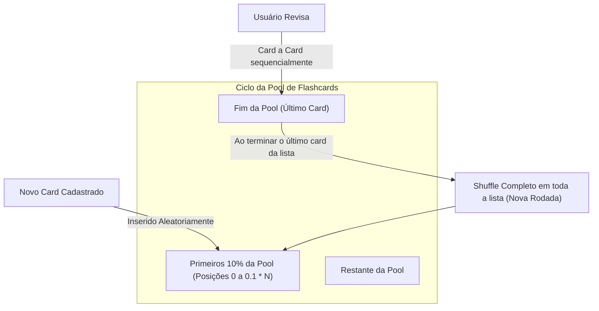
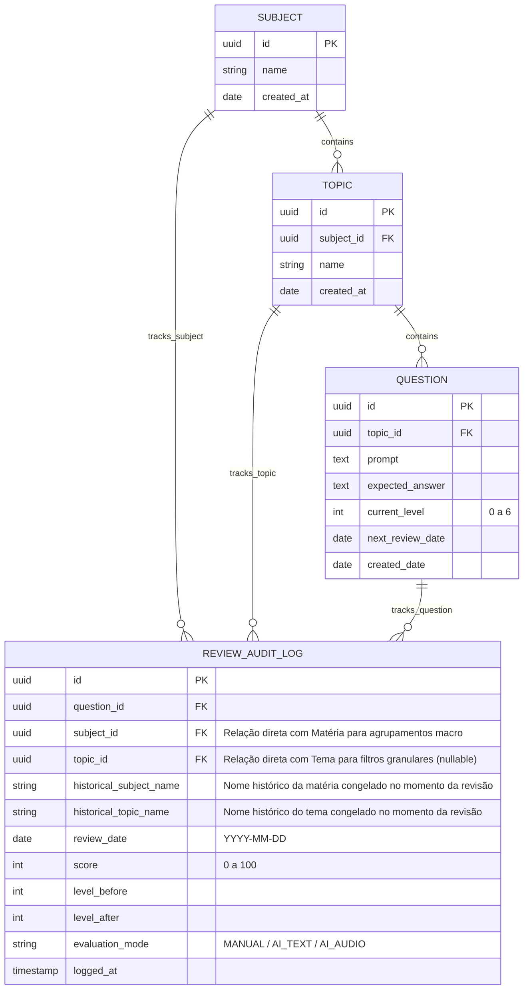
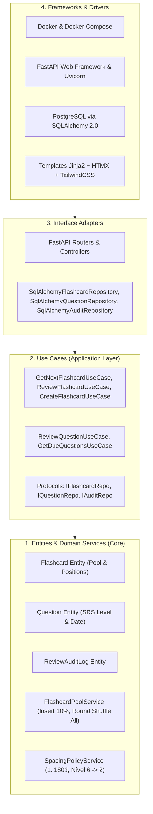
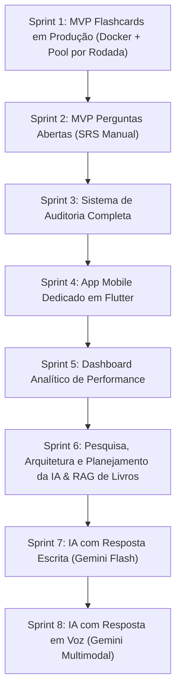

# Product Requirements Document (PRD) — v5.1
## Study Reviewer — Sistema Inteligente de Revisão Ativa e Repetição Espaçada

---

## 1. Visão Geral do Produto

### 1.1 Missão
O **Study Reviewer** é uma aplicação pessoal focada em aprendizado contínuo e retenção de longo prazo, dividida em dois sistemas complementares:
1. **Flashcards (Pool Contínua por Rodadas):** Rotação sequencial da pool com inserção aleatória de novos cards nos **primeiros 10%** da fila e **shuffle geral** da lista toda ao concluir cada ciclo/rodada de revisão.
2. **Perguntas Abertas (Mecânica SRS Estrita):** Fila de repetição espaçada por calendário (`[1, 7, 15, 30, 60, 90, 180]` dias), promoção estrita a **100% de acerto**, penalidade de regressão no nível 6 (retorno ao nível 2) e auditoria histórica completa.

### 1.2 Princípios de Engenharia e Arquitetura
* **Clean Architecture Estrita:** Divisão em 4 camadas concêntricas (Entities, Use Cases, Interface Adapters, Frameworks & Drivers).
* **Paridade Dev/Prod com Docker:** Desenvolvimento e produção utilizam a mesma stack conteinerizada (Docker Compose com PostgreSQL e FastAPI).
* **Datas Puramente Calendárias:** Todo o agendamento de perguntas abertas opera no formato `YYYY-MM-DD` (sem horas, minutos ou complicação de timezone).
* **Web Responsivo + Flutter Nativo (Sem PWA):** A interface web com Tailwind é responsiva para uso no celular e haverá um app dedicado em Flutter.
* **Auditoria Histórica Preservada:** Auditoria exclusiva para perguntas abertas, ligada diretamente à Matéria (`subject_id`) e ao Tema (`topic_id`), mantendo colunas explícitas de histórico desnormalizado (`historical_subject_name`, `historical_topic_name`).
* **Inteligência Artificial Planejada e Modular:** Fase preparatória dedicada para definir a arquitetura de base de conhecimento (grounding com livros digitalizados/RAG seletivo) e bancada de avaliação (personas/skills especializadas de correção).

---

## 2. Mecânica dos Flashcards (Sprint 1 — Pool Contínua por Rodadas)

Os Flashcards **não** utilizam algoritmo de dias nem auditoria. Eles operam em uma **Pool Dinâmica de Rodada Completa**:

### 2.1 Regras de Operação da Pool:
1. **Estrutura Ordenada:** A pool contém $N$ flashcards ordenados por posição (`0` a $N - 1$).
2. **Inserção de Novos Cards (Prioridade Inicial):**
   * Quando um novo flashcard é cadastrado, ele é inserido em uma posição aleatória dentro dos **primeiros 10%** da lista:
     $$\text{índice\_inserção} = \text{random}(0, \max(1, \lfloor 0.1 \times N \rfloor))$$
   * Isso assegura que novos conteúdos sejam revisados rapidamente sem ter que esperar toda a pool passar.
3. **Revisão Sequencial da Rodada:**
   * O usuário visualiza o card atual $\rightarrow$ clica em "Ver Resposta" $\rightarrow$ clica em "Próximo".
   * O ponteiro avança para o próximo card da fila.
4. **Fim de Rodada e Shuffle Geral:**
   * Quando o usuário finaliza a leitura do **último card da lista**, o ciclo da rodada se encerra.
   * O sistema realiza automaticamente um **embaralhamento completo (shuffle)** em todos os $N$ elementos da pool e reinicia o ponteiro na posição 0 para uma nova rodada imprevisível.
5. **Sem Notas e Sem Auditoria:** Flashcards não demandam autoavaliação nem logs analíticos, priorizando velocidade e fluidez.

---

## 3. Mecânica das Perguntas Abertas (Mecânica SRS Estrita)

As perguntas abertas seguem o algoritmo de repetição espaçada por calendário e auditoria completa.

### 3.1 Níveis de Intervalo e Regra de Penalidade
$$\text{Intervalos} = [1, 7, 15, 30, 60, 90, 180] \text{ dias}$$

| Nível | Intervalo | Score = 100% | Score < 100% |
| :---: | :---: | :--- | :--- |
| **0** | 1 dia | Avança para **Nível 1** (+7 dias) | Permanece no **Nível 0** (Reagenda para `hoje + 1d`) |
| **1** | 7 dias | Avança para **Nível 2** (+15 dias) | Permanece no **Nível 1** (Reagenda para `hoje + 7d`) |
| **2** | 15 dias | Avança para **Nível 3** (+30 dias) | Permanece no **Nível 2** (Reagenda para `hoje + 15d`) |
| **3** | 30 dias | Avança para **Nível 4** (+60 dias) | Permanece no **Nível 3** (Reagenda para `hoje + 30d`) |
| **4** | 60 dias | Avança para **Nível 5** (+90 dias) | Permanece no **Nível 4** (Reagenda para `hoje + 60d`) |
| **5** | 90 dias | Avança para **Nível 6** (+180 dias) | Permanece no **Nível 5** (Reagenda para `hoje + 90d`) |
| **6** | 180 dias | Permanece no **Nível 6** (`hoje + 180d`) | ⚠️ **Regride para o Nível 2** (`hoje + 15d`) |

### 3.2 Fases das Perguntas Abertas:
* **Fase 1 (MVP — Sprint 2):** Usuário visualiza a pergunta, elabora mentalmente a resposta, clica em "Ver Resposta Esperada" e atribui sua nota de 0 a 100 (sem digitação nem gravação de voz).
* **Fase 2 (Planejamento de IA, RAG de Livros & Bancada de Avaliação — Sprint 6):** Concepção da base de livros digitalizados, escolha de skills e arquitetura de múltiplos avaliadores.
* **Fase 3 (IA com Texto — Sprint 7):** Digitação da resposta e correção automática por IA com nota e feedback detalhado baseado nos livros e rubricas selecionados.
* **Fase 4 (IA com Voz — Sprint 8):** Gravação de voz com transcrição e avaliação semântica direta pelo Gemini Flash.

---

## 4. Auditoria Completa de Performance (Perguntas Abertas)

A partir da Sprint 3, cada tentativa de revisão de pergunta aberta registra um log imutável:

---

## 5. Arquitetura de Software (Clean Architecture)

---

## 6. Ambiente e Deploy (Docker & Cloud Gratuita)

* **Desenvolvimento Local:** Executado via `docker compose up` (FastAPI com hot reload + PostgreSQL 16 persistente).
* **Produção:** Neon Serverless PostgreSQL (Free Tier) + Render.com Web Service via Dockerfile.

---

## 7. Roadmap Estratégico por Sprints (8 Sprints)

### 🎯 Sprint 1: MVP Flashcards em Produção (Foco Imediato)
* **Objetivo:** Sistema de flashcards funcional em produção na nuvem, rodando localmente via Docker.
* **Escopo:**
  * Setup Docker & Docker Compose com PostgreSQL e FastAPI.
  * Clean Architecture: Domínio de Flashcards com `FlashcardPoolService`:
    * Novos cards inseridos aleatoriamente nos primeiros 10% da pool.
    * Navegação sequencial do topo até o fim.
    * Shuffle geral da pool completa ao concluir a leitura do último card.
  * CRUD de Matérias, Temas e Flashcards.
  * Interface web responsiva com HTMX + TailwindCSS.
  * Deploy do banco no Neon e do app no Render.
* **Entregável:** Link de produção ativo no Render com Docker, sem auditoria e 100% funcional.

### 🎯 Sprint 2: MVP Perguntas Abertas (SRS Manual)
* **Objetivo:** Adicionar o modo de perguntas abertas com espaçamento de 1 a 180 dias.
* **Escopo:**
  * Entidade `Question` com data puramente calendária (`YYYY-MM-DD`).
  * `SpacingPolicyService`: avanço com 100% e regressão do Nível 6 para o Nível 2 em caso de nota < 100%.
  * Fila diária de revisão (`next_review_date <= hoje`).
  * Interface manual simples: Usuário lê a pergunta, pensa na resposta, clica em "Ver Resposta Esperada" e seleciona sua nota de 0 a 100 (sem escrita nem áudio).
* **Entregável:** Modo de perguntas com algoritmo estrito de espaçamento ativo.

### 🎯 Sprint 3: Sistema de Auditoria Completa
* **Objetivo:** Iniciar gravação de auditoria imutável das perguntas abertas.
* **Escopo:**
  * Tabela `review_audit_log` com FK para `subject_id` e `topic_id`, colunas `historical_subject_name`, `historical_topic_name`, `score`, `level_before`, `level_after`, `review_date`.
  * Gravação automática a cada revisão submetida.
* **Entregável:** Persistência de auditoria ativa em produção.

### 🎯 Sprint 4: App Mobile Dedicado em Flutter
* **Objetivo:** Aplicativo nativo em Flutter para Android e iOS.
* **Escopo:**
  * Projeto Flutter consumindo a API REST do backend FastAPI.
  * Telas nativas de estudo da Pool de Flashcards e das Perguntas Abertas.
* **Entregável:** App Flutter rodando no smartphone conectado ao backend em produção.

### 🎯 Sprint 5: Dashboard Analítico de Performance
* **Objetivo:** Visualização analítica dos dados de estudo acumulados desde a Sprint 3.
* **Escopo:**
  * Painel com gráficos (taxa de acerto por matéria/tema, curva de esquecimento, mapa de calor de revisões por dia).
* **Entregável:** Aba de Estatísticas no Web e no app Flutter.

### 🎯 Sprint 6: Pesquisa, Arquitetura e Planejamento da IA, RAG de Livros & Bancada de Avaliação
* **Objetivo:** Projetar em detalhes o motor de IA antes de codificar a avaliação automática.
* **Tópicos de Análise e Planejamento:**
  1. **Base de Livros Digitalizados & RAG Seletivo:**
     * **Biblioteca Digital do Usuário:** Catálogo de livros, manuais, doutrinas ou PDFs cadastrados pelo usuário.
     * **Seleção Ativa de Obras para Validação:** O usuário poderá marcar quais livros específicos deseja utilizar como base de validação para cada matéria, tema ou sessão de revisão (ex: *"Validar respostas usando apenas o Livro X do Autor A e o Manual Y do Autor B"*).
     * **Estratégias de Grounding:** Avaliação entre RAG com busca vetorial (`pgvector` / embeddings) vs Gemini File API / Long Context Window (injeção direta do trecho ou índice do livro).
     * **Citações e Justificativas:** Análise da viabilidade da IA citar capítulo/página do livro selecionado onde o conceito se encontra.
  2. **Seleção de Skills & Personas de Avaliação:**
     * Perfis de avaliação configuráveis (ex: *Banca Examinadora Rigorosa FGV/Cebraspe*, *Professor Socrático Feynman*, *Code Reviewer Técnico*).
  3. **Bancada de Avaliação Multi-agente (Evaluation Panel):**
     * Modelo de múltiplos avaliadores virtuais atuando em conjunto para emitir notas parciais (ex: Precisão Teórica, Vocabulário Técnico, Clareza) e nota final de consenso.
  4. **PoC Técnica, Latência e Free Tier:**
     * Validação dos prompts de rubrica, JSON Schema estrito, estimativa de latência e cotas da API gratuita do Gemini.
* **Entregável:** Documento de Especificação Técnica da IA (Architecture Spike), detalhando o RAG de livros digitalizados, personas, schemas e viabilidade técnica.

### 🎯 Sprint 7: IA com Resposta Escrita (Google Gemini Flash)
* **Objetivo:** O usuário digita a resposta da pergunta aberta e a IA/Bancada avalia a precisão semântica (0-100%) confrontando com o gabarito e com os livros selecionados na Sprint 6.
* **Entregável:** Avaliação automática por IA de texto em produção.

### 🎯 Sprint 8: IA com Resposta em Voz (Gemini Multimodal)
* **Objetivo:** Gravação de áudio no navegador e no Flutter com envio direto para o Gemini Flash para transcrição e avaliação semântica fundamentada.
* **Entregável:** Revisão 100% por voz (Técnica Feynman automatizada).
