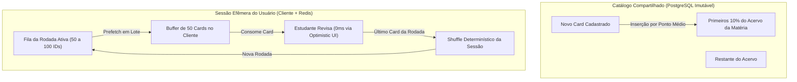
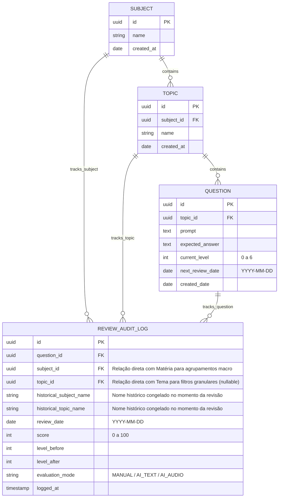
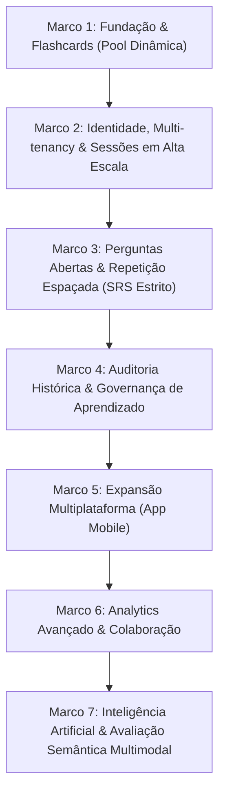

# Product Requirements Document (PRD) — v7.0
## Study Reviewer — Sistema Inteligente de Revisão Ativa e Repetição Espaçada

> **Changelog v7.0:** Evolução arquitetural do subsistema de Flashcards para Alta Escala Concorrente (10M de usuários e 500k simultâneos). Desacoplamento formal entre o **Catálogo Imutável de Flashcards** e a **Sessão Efêmera do Estudante** (`FlashcardPoolSession`), eliminando contenção de locks de banco e race conditions. Introdução de Prefetching Preditivo (0ms percebido com Dedicated Web Worker), rotação de lotes com Low-Water Mark, cache com TTL no Redis, persistência relacional append-only com particionamento temporal no PostgreSQL e conformidade integral com Privacy by Design da LGPD e acessibilidade WCAG 2.1 AA.

---

## 1. Visão Geral do Produto

### 1.1 Missão
O **Study Reviewer** é uma aplicação focada em aprendizado contínuo e retenção de longo prazo, dividida em dois sistemas complementares de estudo ativo:
1. **Flashcards (Pool Contínua por Rodadas em Alta Escala):** Rotação sequencial e contínua do baralho com inserção de novos cards nos **primeiros 10%** do catálogo da matéria e **shuffle efêmero por usuário** ao concluir cada ciclo/rodada de revisão. Opera com navegação instantânea de 0ms percebidos no cliente, atalhos ergonômicos de teclado e gestos de toque no celular, sem notas qualitativas e sem complexidade de agendamento por dias (rotação contínua e foco no fluxo de estudo).
2. **Perguntas Abertas (Mecânica SRS Estrita):** Fila de repetição espaçada por calendário (`[1, 7, 15, 30, 60, 90, 180]` dias), promoção estrita a **100% de acerto**, penalidade de regressão no nível 6 (retorno ao nível 2 com reagendamento para `hoje + 15d`) e auditoria histórica completa.

---

### 1.2 Princípios de Engenharia e Arquitetura
* **Clean Architecture Estrita e Casos de Uso Agnósticos:** Divisão em 4 camadas concêntricas (Entities, Use Cases, Interface Adapters, Frameworks & Drivers). A camada de Casos de Uso é 100% agnóstica, servindo tanto os controladores web (Jinja2 + HTMX) quanto a API REST para mobile sem duplicação de lógica.
* **Desacoplamento de Catálogo vs. Sessão Efêmera:** A entidade `Flashcard` pertence ao catálogo compartilhado da matéria e permanece estritamente **imutável** durante as sessões de estudo. A ordem de estudo e o embaralhamento pertencem exclusivamente à **Sessão do Usuário** (`FlashcardPoolSession`), garantindo isolamento absoluto entre múltiplos alunos concorrentes sem race conditions ou write amplification.
* **Arquitetura 3 Camadas de Alta Escala (Zero Latency & Write-Behind):**
  * **Cliente:** Prefetching preditivo de 50 cards com buffer em memória e **Dedicated Web Worker** gerenciando I/O no `IndexedDB` e despacho em lote via `fetch(keepalive: true)`, assegurando **INP $\le 50\text{ ms}$** e **0 ms** de transição percebida.
  * **Borda e Cache Efêmero:** Gateway com WAF e rate limiting (20 req/min), e **Redis Cluster** com nós de 6 a 8 GB de RAM operando com política `volatile-ttl` e TTL de 24 horas para absorção das filas ativas de estudo.
  * **Persistência Relacional:** PostgreSQL 16 com histórico append-only particionado por intervalo temporal (`PARTITION BY RANGE (reviewed_at)`), viabilizando descarte de dados antigos em $\mathcal{O}(1)$ sem sobrecarregar o autovacuum sob carga de até 1 bilhão de eventos/dia.
* **Paridade Dev/Prod com Docker:** Desenvolvimento e produção utilizam a mesma stack conteinerizada (Docker Compose com PostgreSQL 16, Redis 7 e FastAPI rodando sob usuário não-root).
* **Segurança e Criptografia em Repouso com AES-256-GCM:** Autenticação segura na borda por sessão/cookie, sanitização estrita de inputs contra XSS (via biblioteca de sanitização como `nh3`) e proteção de segredos/tokens armazenados utilizando Criptografia Autenticada **AES-256-GCM (AEAD)**.
* **Privacidade por Design (LGPD - Lei nº 13.709/2018):** Minimização de dados pessoais, expurgo atômico de dados locais (`IndexedDB`/`localStorage`) no logout do usuário, desidentificação irreversível de históricos de estudo (`ON DELETE SET NULL` no `user_id` de `study_events`) para fins analíticos sob o Art. 16, IV, e TTL de 2 horas em lotes locais offline.
* **Acessibilidade Universal (WCAG 2.1 nível AA):** Interfaces 100% operáveis por teclado com retenção programática de foco pós-transição (prevenção do Focus Loss Bug), anúncios em Live Regions atômicas (`aria-live="polite"`), atalhos configuráveis (WCAG 2.1.4) e respeito à diretiva `prefers-reduced-motion`.
* **Design System e Dark Mode Nativo:** Interface responsiva Mobile-First com TailwindCSS, suporte nativo a Tema Claro e Escuro (via seletor de classe, sem cintilação visual de carregamento/FOUC e com respeito ao `prefers-color-scheme`).

---

## 2. Mecânica dos Flashcards (Pool Contínua por Rodadas em Alta Escala)

Os Flashcards **não** utilizam algoritmo de dias nem notas qualitativas ('easy', 'hard'). Eles operam em uma **Pool Dinâmica de Rodada Completa** com suporte a estudo de **Todas as Matérias (Global)** ou com **Filtro por Matéria/Tema Específico**, projetada para operar com máxima fluidez e zero latência.

### 2.1 Regras de Operação da Pool & Gap Indexing

1. **Ordenação Base por Gap Indexing (Múltiplos de 100 no Catálogo):**
   * Cada flashcard cadastrado na matéria possui um campo numérico estático `position`.
   * Os cards recebem posições espaçadas de 100 em 100 (`100, 200, 300, 400...`), servindo de referência global para o acervo base.

2. **Inserção de Novos Cards nos Primeiros 10%:**
   * Quando um novo flashcard é cadastrado, ele é alocado em uma posição aleatória entre os primeiros 10% do acervo da matéria:
     $$\text{índice\_alvo} = \text{random}(0, \max(1, \lfloor 0.1 \times N \rfloor))$$
   * A nova posição é calculada como o ponto médio entre o card anterior e o próximo daquele índice:
     $$\text{nova\_posição} = pos_{ant} + \lfloor (pos_{prox} - pos_{ant}) / 2 \rfloor$$
   * Isso permite inserção instantânea em banco relacional sem necessidade de renumerar os demais cards do catálogo. Em sessões ativas concorrentes, vigora o *Snapshot Isolation por Rodada*: novos cards ingressam na fila do estudante apenas no ciclo/rodada seguinte.

3. **Tratamento Exaustivo de Edge Cases no Posicionamento:**
   * **Pool Vazia ($N = 0$):** O primeiro card inserido recebe `position = 100`.
   * **Pool Unitária ($N = 1$):** O novo card recebe `position = 50` (antes) ou `position = 200` (depois), conforme sorteio.
   * **Inserção no Início Absoluto (antes do primeiro card):** Se o card for inserido antes do índice 0, sua posição será $\lfloor pos_{primeiro} / 2 \rfloor$. Se $pos_{primeiro} \le 1$, o sistema dispara rebalanceamento preventivo.
   * **Esgotamento de Gap ($pos_{prox} - pos_{ant} \le 1$):** Caso múltiplos cards sejam inseridos consecutivamente no mesmo intervalo, o sistema dispara um rebalanceamento local ou redistribuição uniforme do acervo em múltiplos de 100.
   * **Exclusão de Card no Meio da Rodada:** Cards excluídos recebem *tombstone* (`deleted_at = NOW()`). Se um card excluído já estiver pré-carregado no lote ativo do estudante, a resposta é computada para conclusão, mas o card é sumariamente aposentado para rodadas subsequentes.

4. **Navegação, Shuffle Efêmero e Persistência de Sessão:**
   * O estado da rodada é mantido na entidade de domínio `FlashcardPoolSession` (`id`, `user_id`, `subject_id`, `topic_id_filter`, `round_number`, `current_index`, `card_queue: list[UUID]`), otimizada com `@dataclass(slots=True)` para alta densidade em memória.
   * A lista `card_queue` armazena exclusivamente os IDs da rodada ativa (50 a 100 cards), e **nunca** muta a entidade `Flashcard` no banco relacional.
   * Ao finalizar o último card da lista (`is_round_finished() == True`), o término da rodada dispara o shuffle apenas na coleção de IDs da sessão (`session.start_new_round(shuffled_ids)`), incrementa `round_number` e zera `current_index`.
   * O aluno pode pausar, fechar o navegador e retomar seus estudos de qualquer dispositivo sem risco de corrupção de estado por concorrência.

5. **Experiência do Estudante, Ergonomia e Acessibilidade (0ms Percebido):**
   * **Componente Flip 100% Client-Side:** O giro do flashcard ocorre instantaneamente no dispositivo via CSS 3D (`.is-flipped`, `perspective: 1000px`, `transform: rotateY(180deg)`), aposentando requisições HTTP para visualização do verso.
   * **Prefetch Preditivo com Low-Water Mark (10 cards):** O cliente baixa lotes de 50 cards completos. Ao atingir o card 40 (restando 10 cards no buffer), o lote subsequente é requisitado em background, eliminando congelamentos perceptíveis.
   * **Micro-transição Otimista:** A troca de card utiliza micro-animação acelerada por GPU (120ms a 150ms), eliminando o efeito abrupto/jarring e preservando o *flow state* do estudante.
   * **Os 5 Estados de Interface:** Tratamento estrito dos estados *Ideal*, *Empty* (Victory State com métricas da rodada), *Loading* (Skeleton de altura fixa `min-h-[380px]` para CLS zero), *Error* (banner com retry) e *Partial* (indicador de modo offline / sincronização pendente).
   * **Atalhos no Desktop:**
     * `Barra de Espaço`: Virar o card (alternar entre Pergunta e Resposta).
     * `Enter` ou `Seta para a Direita`: Avançar para o próximo card.
     * Desativação automática de atalhos em campos de digitação e opção de desligamento (WCAG 2.1.4).
   * **Comandos Touch no Mobile:**
     * `Toque Único (Tap)` no card: Virar o card / Revelar resposta.
     * `Deslizar para a Esquerda (Swipe Left)`: Avançar para o próximo card.
   * **Retenção Programática de Foco:** O foco do teclado é mantido no card após cada avanço dinâmico via `.focus()`, prevenindo o *Focus Loss Bug*.

---

## 3. Mecânica das Perguntas Abertas (Mecânica SRS Estrita)

As perguntas abertas seguem o algoritmo estrito de repetição espaçada por calendário e auditoria completa.

### 3.1 Níveis de Intervalo e Regra de Penalidade
$$\text{Intervalos} = [1, 7, 15, 30, 60, 90, 180] \text{ dias}$$

| Nível | Intervalo | Score = 100% | Score < 100% |
| :---: | :---: | :--- | :--- |
| **0** | 1 dia | Avança para **Nível 1** (+7 dias) | Permanece no **Nível 0** (Reagenda para `hoje + 1d`) |
| **1** | 7 dias | Avança para **Nível 2** (+15 dias) | Permanece no **Nível 1** (Reagenda para `hoje + 7d`) |
| **2** | 15 dias | Avança para **Nível 3** (+30 dias) | Permanece no **Nível 2** (Reagenda para `hoje + 15d`) |
| **3** | 30 dias | Avança para **Nível 4** (+60 dias) | Permanece no **Nível 3** (Reagenda para `hoje + 30d`) |
| **4** | 60 dias | Avança para **Nível 5** (+90 dias) | Permanece no **Nível 4** (Reagenda para `hoje + 60d`) |
| **5** | 90 dias | Avança para **Nível 6** (+180 dias) | Permanece no **Nível 5** (Reagenda para `hoje + 90d`) |
| **6** | 180 dias | Permanece no **Nível 6** (`hoje + 180d`) | ⚠️ **Regride para o Nível 2** (Reagenda estritamente para `hoje + 15d`) |

### 3.2 Fases das Perguntas Abertas:
* **Fase 1 (MVP — Sprint 3):** Usuário visualiza a pergunta, elabora mentalmente a resposta, clica em "Ver Resposta Esperada" e atribui sua nota de 0 a 100 (sem digitação nem áudio).
* **Fase 2 (Planejamento de IA, RAG de Livros & Bancada de Avaliação — Sprint 7):** Concepção da base de livros digitalizados e arquitetura de múltiplos avaliadores.
* **Fase 3 (IA com Texto — Sprint 8):** Digitação da resposta e correção automática por IA com nota e feedback detalhado.
* **Fase 4 (IA com Voz — Sprint 9):** Gravação de voz com envio direto para o Gemini Flash para transcrição e avaliação semântica. O arquivo de áudio é estritamente efêmero, sendo descartado imediatamente após a resposta da IA para proteção da privacidade biométrica (LGPD).

---

## 4. Auditoria Completa de Performance (Perguntas Abertas)

A partir da Sprint 4, cada tentativa de revisão de pergunta aberta registra um log imutável:

---

## 5. Arquitetura de Software (Clean Architecture & Alta Escala)

```mermaid
flowchart TD
    subgraph Camada_4["4. Frameworks & Drivers"]
        Docker["Docker Compose (Postgres 16 + Redis 7 + FastAPI)"]
        FastAPI_App["FastAPI Web Framework (Async + Uvicorn)"]
        Redis_Store["Redis Cluster (Filas Efêmeras, TTL 24h, volatile-ttl)"]
        Postgres_DB["PostgreSQL 16 (Particionado por Range Temporal)"]
        Frontend_Worker["Dedicated Web Worker (study-sync.worker.js) + IndexedDB"]
        Templates_HTMX["Templates Jinja2 + CSS 3D Flip + TailwindCSS"]
    end

    subgraph Camada_3["3. Interface Adapters"]
        Controllers_Web["Web Controllers (HTML/HTMX + orjson)"]
        Controllers_Sync["Batch Sync Controller (/study/sync-answers, Anti-IDOR, Anti-DoS)"]
        Controllers_API["API Controllers (REST JSON para Flutter)"]
        Repo_Impl["SqlAlchemyFlashcardRepository, RedisSessionRepository, SqlAlchemyAuditRepository"]
        Mappers["Domain/ORM/DTO Mappers"]
    end

    subgraph Camada_2["2. Use Cases (Application Layer - 100% Agnóstica)"]
        UC_Card["GetNextFlashcardUseCase, ReviewFlashcardUseCase, CreateFlashcardUseCase"]
        UC_Sync["SyncStudyAnswersBatchUseCase"]
        UC_Question["ReviewQuestionUseCase, GetDueQuestionsUseCase"]
        UC_Ports["Protocols: IFlashcardRepo, ISessionStore, IQuestionRepo, IAuditRepo"]
    end

    subgraph Camada_1["1. Entities & Domain Services (Core Puro)"]
        E_Flashcard["Flashcard Entity (Imutável em Sessão)"]
        E_Session["FlashcardPoolSession Entity (@dataclass slots=True, Fila de UUIDs)"]
        E_Question["Question Entity (SRS Level & Date)"]
        E_Audit["ReviewAuditLog Entity"]
        DS_Pool["FlashcardPoolService (Gap Indexing, Inserção 10%, Shuffle Efêmero)"]
        DS_Spacing["SpacingPolicyService (1..180d, Nível 6 -> 2)"]
    end

    Camada_4 --> Camada_3
    Camada_3 --> Camada_2
    Camada_2 --> Camada_1
```

---

## 6. Ambiente e Deploy

* **Desenvolvimento Local:** Executado via `docker compose up` (FastAPI com hot-reload + PostgreSQL 16 + Redis 7 com healthchecks configurados).
* **Produção:** PostgreSQL 16 gerenciado + Nó de Redis Cluster provisionado (6 a 8 GB de RAM) + Render/Cloud Run Web Service via Dockerfile multi-stage enxuto rodando sob usuário não-root.
* **Segurança na Nuvem:** Autenticação de sessão na borda, cookies encriptados via **AES-256-GCM**, rate limiting em endpoints em lote e validação temporal contra tampering.

---

## 7. Critérios de Aceitação Gerais — Definition of Done (DoD)

Para que qualquer Sprint seja considerada concluída e receba autorização de merge para a branch `staging`:
1. [ ] **Aderência Estrita de Negócio:** 100% dos use cases e regras da sprint no PRD implementados sem desvios ou escopo fantasma.
2. [ ] **TDD Aplicado (Red-Green-Refactor):** Todos os testes unitários e de integração escritos antes do código de produção correspondente.
3. [ ] **100% de Cobertura de Testes Obrigatória:** Suíte de testes passando com 100% de cobertura confirmada no backend (`pytest-cov`) e frontend em processos totalmente isolados.
4. [ ] **Governança de Testes de Segurança:** Testes com impacto de segurança decorados com `@pytest.mark.security`, docstring estruturada contendo `"Vulnerabilidade prevenida:"` e `"Garantia de segurança:"`, e meta-teste AST 100% aprovado.
5. [ ] **Qualidade Estática de Código:** Linters e checagem de tipos (Ruff format/check e Mypy strict) passando com zero alertas e sem supressões artificiais.
6. [ ] **Aderência à Clean Architecture:** Núcleo de domínio Python puro (sem dependência de frameworks/ORM), use cases agnósticos e inversão de dependência via Protocols.
7. [ ] **Auditoria Unânime da Bancada:** Pareceres formais assinados pelos **13 Especialistas** no template oficial de PR (`[APROVADO]` ou `[N/A JUSTIFICADO]`).
8. [ ] **Paridade Docker Comprovada:** Aplicação, Redis e banco executando perfeitamente via `docker compose up`.
9. [ ] **Pull Request Aberta no GitHub para Staging:** A sprint só é finalizada com a execução de `gh pr create` no GitHub apontando para `staging`, com documentação, 100% de cobertura, os 13 pareceres aprovados e a URL oficial entregue ao usuário.

### 7.1 Bancada dos 13 Especialistas de Auditoria e Qualidade
Cada Pull Request para `staging` é auditada e aprovada formalmente pela bancada completa de especialistas:
1. **Especialista de Produto (PO):** Aderência aos requisitos e valor de entrega do PRD sem escopo fantasma.
2. **Especialista QA:** Testabilidade, integridade de cenários BDD e barreira de 100% de cobertura.
3. **Especialista Arquiteto:** Preservação das fronteiras da Clean Architecture, regra de dependência e inversão via Protocols.
4. **Especialista de Segurança:** Auditoria contra OWASP Top 10, sanitização defensiva, zero credenciais no repositório e testes de segurança AST.
5. **Especialista de Telemetria:** Structured logging com correlation IDs, rastreabilidade distribuída (W3C TraceContext) e métricas operacionais de Redis/banco.
6. **Especialista de UX:** Ergonomia de estudo, transição fluida acelerada por GPU (120-150ms), atalhos de teclado ágeis, feedback de sincronização e navegação touch em mobile.
7. **Especialista de UI:** Design System consistente com Tailwind CSS, tratamento dos 5 estados de interface, Flip 100% CSS 3D e ausência de FOUC.
8. **Especialista de DevOps:** Paridade Dev/Prod via Docker Compose, contêiner multi-stage sob usuário não-root e esteiras modulares de CI/CD.
9. **Especialista de Acessibilidade:** Conformidade estrita com WCAG 2.1 nível AA, navegação completa por teclado com retenção de foco e semântica WAI-ARIA.
10. **Especialista em LGPD:** Minimização de dados, purga de dados locais no logout e anonimização de histórico analítico sob o Art. 16, IV.
11. **Especialista de Performance de Programação Python:** Eficiência Big-O, uso de `slots=True`, projeção escalar de IDs, pipelines não-bloqueantes (`redis.asyncio`/`asyncpg`) e serialização ultra-rápida (`orjson`).
12. **Especialista de Performance de Frontend:** Core Web Vitals (LCP, INP $\le 50$ms via Web Worker, CLS zero com CSS Containment), Tailwind CSS estático minificado e prefetch preditivo com Low-Water Mark.
13. **Especialista de Performance de Banco de Dados:** Eliminação de N+1 via `selectinload()`, particionamento temporal `PARTITION BY RANGE (reviewed_at)`, índices cobridores B-tree e ingestão atômica em batch.

---

## 8. Roadmap Estratégico de Evolução do Produto

O desenvolvimento do **Study Reviewer** é estruturado em fases incrementais orientadas à entrega contínua de valor, escalabilidade e inteligência de estudo:

### 8.1 Matriz de Marcos Estratégicos (Product Milestones)

| Marco | Dimensão de Valor | Principais Capacidades Entregues | Documentação Técnica de Execução |
| :--- | :--- | :--- | :--- |
| **Marco 1: Fundação & Flashcards** | Estudo Ativo Básico | Pool dinâmica por rodadas com Gap Indexing (múltiplos de 100), inserção nos primeiros 10%, atalhos ergonômicos de teclado e gestos touch, Clean Architecture e paridade Docker. | [`docs/specs/sprint-01-flashcards-spec.md`](docs/specs/sprint-01-flashcards-spec.md) |
| **Marco 2: Identidade & Alta Escala** | Multi-usuário & Performance | Login Google (OAuth2/OIDC), isolamento multi-tenant, compartilhamento read-only de matérias e arquitetura de sessões em alta escala (500k RPS amortizados, Redis, Web Worker e particionamento temporal). | [`docs/specs/sprint-02-auth-multitenancy-spec.md`](docs/specs/sprint-02-auth-multitenancy-spec.md) |
| **Marco 3: Perguntas Abertas (SRS)** | Retenção de Longo Prazo | Fila de repetição espaçada por calendário `[1..180d]`, promoção estrita a 100% de acerto e penalidade de regressão no Nível 6. | *Detalhamento técnico na SPEC da Sprint 03* |
| **Marco 4: Auditoria de Performance** | Métricas & Compliance | Trilha de auditoria imutável de revisões, congelamento de nomes históricos e exportação de dados (LGPD). | *Detalhamento técnico na SPEC da Sprint 04* |
| **Marco 5: Expansão Mobile** | Portabilidade & Ubiquidade | Aplicativo nativo/cross-platform em Flutter consumindo a API REST agnóstica existente. | *Detalhamento técnico na SPEC da Sprint 05* |
| **Marco 6: Analytics & Colaboração** | Insights & Estudo Social | Dashboards analíticos de retenção, clonagem (fork) de matérias públicas e colaboração multi-editor. | *Detalhamento técnico na SPEC da Sprint 06* |
| **Marco 7: IA & Avaliação Multimodal** | Correção Automatizada | Avaliação semântica de respostas abertas via Gemini Flash (texto) e Gemini Multimodal (áudio efêmero com descarte biométrico). | *Detalhamento técnico nas SPECs das Sprints 07, 08 e 09* |

> 📌 **Governança Documental:** O detalhamento técnico de implementação de cada sprint (arquivos alterados, schemas DTO, migrações Alembic e rotinas de teste) reside exclusivamente nos documentos de **Especificação Técnica da Sprint** (`docs/specs/sprint-XX-*-spec.md`) e nas **Pull Requests de Fechamento** (`docs/sprints/sprint-XX/`). O presente PRD mantém o foco perpétuo na **Visão, Regras de Negócio e Requisitos Globais do Produto**.
