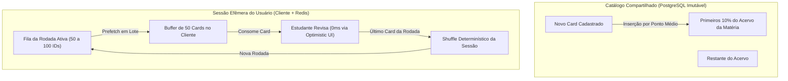
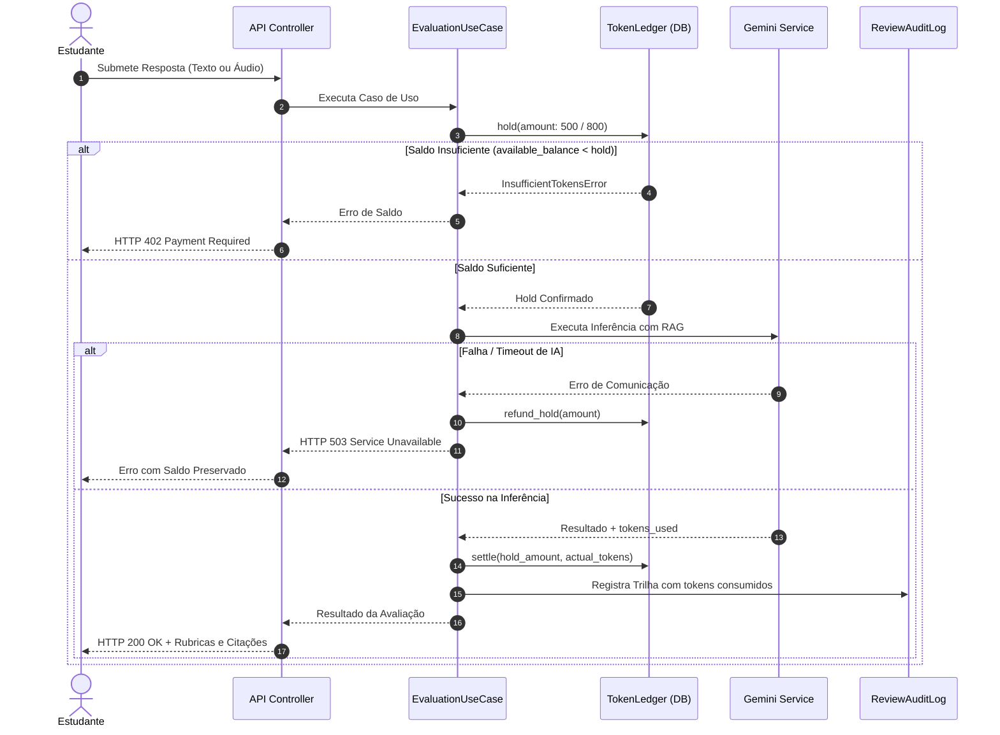
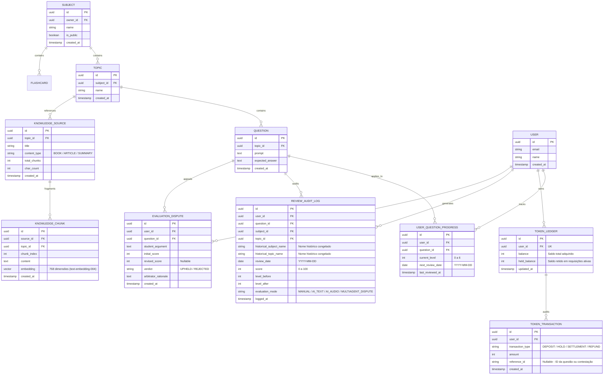
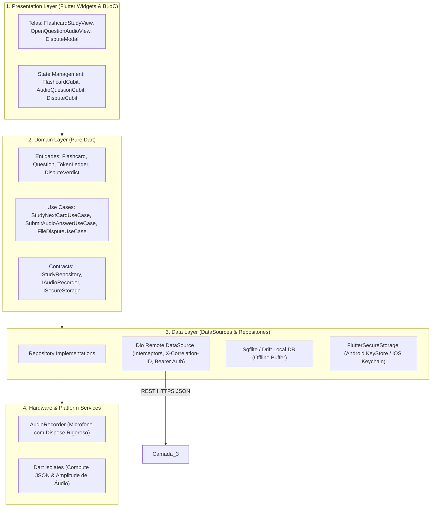
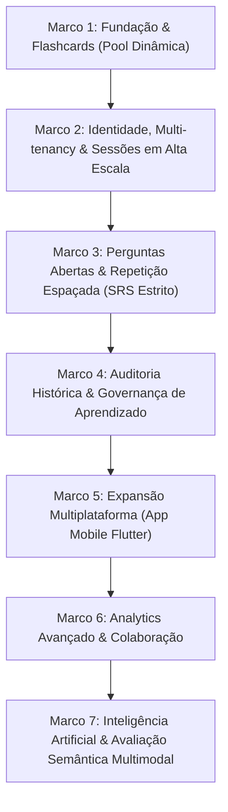

# Product Requirements Document (PRD) — v9.0
## Study Reviewer — Sistema Inteligente de Revisão Ativa, Repetição Espaçada & Avaliação Multimodal Grounded

> **Changelog v9.0:**
> - **Integração Integral do Subsistema de IA & RAG Multimodal (Marco 7 - Sprints 07, 08 e 09):** Homologação da base de conhecimento particionada por temas (`KnowledgeSource` e `KnowledgeChunk`), chunking semântico (512 tokens / 10% overlap), embeddings densos (`text-embedding-004`) de 768 dimensões, busca vetorial por cosseno ($\ge 0.70$) e validação factual de questões (`ValidateQuestionWithKnowledgeUseCase`).
> - **Avaliação Semântica Aterrada de Texto (Sprint 08):** Correção automática via Gemini 1.5 Flash com rubricas analíticas estruturadas (cobertura, precisão e profundidade de 0 a 100), extração de evidências das fontes e fallback em Cold-Start para o gabarito oficial (`expected_answer`).
> - **Economia de Tokens, FinOps & Two-Phase Metering (Sprint 08):** Livro-razão transacional (`TokenLedger` e `TokenTransaction`) com retenção preventiva (*Pre-Auth Hold* de 500/800/1000 tokens), liquidação atômica estrita pelo consumo real (*Settlement*), estorno automático em falhas (*Refund*), rejeição por saldo insuficiente (`HTTP 402 Payment Required`), travas anti-double-spending e conformidade PCI-DSS SAQ A.
> - **Avaliação Multimodal de Áudio com Privacidade Efêmera (Sprint 09):** Resposta oral com transcrição e avaliação semântica direta via Gemini Multimodal. Estrita conformidade com o Art. 16 da LGPD: eliminação imediata de dados biométricos em memória volátil (`del audio_bytes`), sem persistência de voz em disco, banco de dados ou buckets S3/GCS. Limite anti-DoS de 10 MB.
> - **Conselho Multiagente de Contestação Pedagógica (Sprint 09):** Deliberação recursal tripartite autônoma (*Student Advocate*, *Factual Critic*, *Arbitrator*). Estorno integral da retenção de garantia e repactuação de agendamento SRS em caso de provimento (*UPHELD*).
> - **Blindagem de Segurança em Profundidade:** Defesas ativas contra Prompt Injection e Jailbreak com enclausuramento sob delimitadores XML (`<student_answer_untrusted>`, `<dispute_argument_untrusted>`), validação rigorosa na borda, criptografia autenticada AES-256-GCM (Nonce 96-bit, Tag 128-bit), proteção anti-IDOR e anti-tampering temporal.
> - **Telemetria Distribuída & Observabilidade:** Rastreabilidade W3C TraceContext (`traceparent`), `X-Correlation-ID` de ponta a ponta, structured logging em formato JSON, veto absoluto a chamadas a `print()` em produção e SLA de inferência com TTFT $\le 800\text{ ms}$.
> - **Engenharia e Arquitetura do Cliente Móvel & Flutter:** Diretrizes OWASP MASVS com armazenamento em hardware seguro (*Android KeyStore* / *iOS Keychain*), compilação ofuscada com R8, ergonomia mobile (touch targets $\ge 48\text{ dp}$, *thumb zone*, *safe areas*), Clean Architecture mobile em Dart puro, reatividade granular folha com construtores `const`, deleção de processamento pesado para Dart Isolates (`compute()` / `Isolate.run()`), garantia de 60/120 FPS sem jank e descarte compulsório de recursos em `dispose()`.
> - **Bancada Integral dos 17 Especialistas Técnicos:** Expansão e formalização dos 17 pareceres formais de auditoria contínua em 5 clusters concorrentes e esteiras modulares de CI/CD.

---

## 1. Visão Geral do Produto

### 1.1 Missão
O **Study Reviewer** é uma plataforma de alta performance desenhada para maximizar a retenção cognitiva de longo prazo e acelerar a aprovação em exames de alta complexidade. O produto integra dois sistemas sinérgicos de estudo ativo:
1. **Flashcards (Pool Contínua por Rodadas em Alta Escala):** Rotação sequencial do baralho da matéria com inserção estocástica nos primeiros 10% do catálogo e embaralhamento (*shuffle*) efêmero por usuário ao concluir cada ciclo. Opera com navegação instantânea de **0 ms percebidos**, atalhos ergonômicos de teclado e gestos de toque mobile, sem notas subjetivas e sem atrito de agendamento por dias.
2. **Perguntas Abertas (Mecânica SRS Estrita & Inteligência Artificial Multimodal Grounded):** Repetição espaçada determinística por calendário (`[1, 7, 15, 30, 60, 90, 180]` dias), promoção condicionada a 100% de acerto e penalidade regressiva no Nível 6. O estudante pode elaborar respostas mentais (MVP), dissertativas digitadas ou gravadas verbalmente por voz efêmera, avaliadas por modelos fundacionais de IA ancorados na base bibliográfica canônica do tema, com direito a recurso perante o Conselho Multiagente de Contestação.

---

### 1.2 Princípios de Engenharia e Arquitetura

* **Clean Architecture Estrita e Casos de Uso Agnósticos:** Estruturação em 4 camadas concêntricas (Entities, Use Cases, Interface Adapters, Frameworks & Drivers). A camada de Casos de Uso é 100% agnóstica e desprovida de frameworks, servindo indistintamente renderizadores Web (Jinja2 + HTMX) e clientes móveis via API REST JSON.
* **Desacoplamento de Catálogo vs. Sessão Efêmera:** A entidade `Flashcard` e o catálogo de `Question` são imutáveis durante as sessões de estudo. O progresso do aluno reside exclusivamente em entidades de sessão (`FlashcardPoolSession`) e progresso individual (`UserQuestionProgress`), eliminando contenção de locks de banco e *write amplification*.
* **Arquitetura 3 Camadas de Alta Escala (Zero Latency & Write-Behind):**
  * *Cliente Web:* Prefetching preditivo de 50 cards com Dedicated Web Worker gerenciando I/O no `IndexedDB` e despacho assíncrono via `fetch(keepalive: true)`, assegurando **INP $\le 50\text{ ms}$** e transição percebida de **0 ms**.
  * *Borda e Cache Efêmero:* Gateway com WAF, rate limiting e Redis Cluster com nós de 6 a 8 GB operando com política `volatile-ttl` e TTL de 24h para filas de estudo ativas.
  * *Persistência Relacional Append-Only:* PostgreSQL 16 com histórico append-only particionado por intervalo temporal (`PARTITION BY RANGE (reviewed_at)`), viabilizando descarte de dados antigos em $\mathcal{O}(1)$ sem sobrecarregar o autovacuum sob carga de até 1 bilhão de eventos/dia.
* **Arquitetura e Segurança do Cliente Móvel (OWASP MASVS & Hardware Keystore):**
  * *Armazenamento Seguro Ancorado em Hardware:* Credenciais, JWT/Bearer tokens e chaves de sessão são armazenados obrigatoriamente no *Android KeyStore* (AES-256) e *iOS Keychain* (via `flutter_secure_storage`). O uso de *SharedPreferences* ou *UserDefaults* é restrito a preferências cosméticas de interface (ex: tema visual).
  * *Ofuscação de Binários e Anti-Engenharia Reversa:* Compilação de release com ProGuard/R8 no Android (`minifyEnabled true`, `shrinkResources true`) e compilação Flutter com `--obfuscate --split-debug-info`.
  * *Proteção Visual e Multitarefa:* Telas de perfil, configurações financeiras e transações ativam proteção contra captura de tela (`FLAG_SECURE` no Android / overlay seguro no iOS).
  * *Expurgo Seguro no Logout:* Ação de logout ou encerramento de conta invoca a limpeza atômica do cofre seguro (`flutter_secure_storage.deleteAll()`) e o wipe da base SQLite local.
* **Arquitetura do Cliente Flutter e Reatividade de Alta Performance:**
  * *Clean Architecture Mobile em Dart Puro:* 3 camadas isoladas: `Domain` (entidades imutáveis e use cases sem dependências do Flutter), `Data` (DTOs, cliente HTTP Dio com interceptors e banco SQLite local) e `Presentation` (widgets folha e BLoC/Cubit).
  * *Reatividade Granular Folha e Construtores Const:* Uso sistemático de construtores `const`, veto a `setState()` na raiz do `Scaffold` e reatividade isolada no nó mais folha da árvore via `BlocBuilder(buildWhen: ...)`, `BlocSelector` e `ValueListenableBuilder`.
  * *Virtualização em $\mathcal{O}(1)$:* Listas longas de matérias e históricos utilizam `ListView.builder` e `SliverList` com `itemExtent` explícito.
  * *Offload Computacional para Dart Isolates:* Parsing de JSON volumoso, criptografia de banco local e processamento de bytes e amplitude de áudio são delegados para threads secundárias via `compute()` / `Isolate.run()`, preservando a taxa de 60/120 FPS sem jank.
  * *Descarte Compulsório em `dispose()` (Zero Memory Leaks):* Encerramento mandatório de `AudioRecorder`, `RecordController`, `AnimationController`, `TextEditingController`, `FocusNode` e `StreamSubscription` em seus respectivos métodos `dispose()`.
* **Segurança Defensiva em Profundidade e Blindagem de IA:**
  * *Anti-Prompt Injection & Jailbreak Defense:* Entradas do estudante são delimitadas por tags XML explícitas (`<student_answer_untrusted>`, `<dispute_argument_untrusted>`), filtradas contra termos de override de sistema e forçadas a responder em JSON Schema determinístico.
  * *Sanitização no Write-Time:* Todo texto livre passa por sanitização defensiva via biblioteca de parsing semântico (`nh3`), permitindo apenas tags seguras e bloqueando vetores XSS e injection.
  * *Validação e Limites de Borda (Anti-DoS):* Tetos dimensionais estritos: áudio máximo de 10 MB, sincronização em lote de no máximo 256 KB (100 eventos), respostas dissertativas de 1 a 10.000 caracteres e recursos de contestação de 5 a 5.000 caracteres.
  * *Criptografia Autenticada AES-256-GCM (AEAD):* Cookies de sessão e segredos utilizam chave de 256 bits, Nonce de 96 bits via CSPRNG (`os.urandom`) e tag de autenticação de 128 bits.
  * *Proteção Anti-IDOR (CWE-639) em Cascata:* Toda mutação ou consulta valida estritamente a titularidade do recurso (`user_id == owner_id`), inclusive na inclusão de cards em sessões ativas e na submissão de contestações.
  * *Anti-Tampering Temporal:* Rejeição de eventos com timestamp no futuro (> 60 segundos) e descarte de eventos com mais de 30 dias de idade gerados offline.
* **Telemetria Distribuída e Observabilidade Estruturada:**
  * *Rastreabilidade W3C TraceContext:* Propagação de cabeçalhos `traceparent` e `X-Correlation-ID` por todas as camadas da aplicação até adaptadores externos.
  * *Structured Logging JSON & Zero `print()`:* Emissão exclusiva de logs estruturados em JSON contendo metadados semânticos (`event`, `user_id`, `correlation_id`, `tokens`, `execution_time_ms`). Chamadas a `print()` são sumariamente banidas do código de produção.
  * *Métricas e SLAs de IA:* Monitoramento de TTFT (*Time-to-First-Token*) $\le 800\text{ ms}$, latência p95 $\le 1.2\text{ s}$ para texto e p95 $\le 2.5\text{ s}$ para áudio.
* **Privacidade por Design e Efemeridade Biométrica (LGPD - Lei nº 13.709/2018):**
  * *Privacidade Efêmera de Áudio (Art. 16):* Gravações de voz são transmitidas em buffers voláteis na memória RAM (`bytes`), eliminadas imediatamente após a transcrição e inferência multimodal via `del audio_bytes` e descarte do buffer. Proibição absoluta de gravação de áudio em disco rígido, banco de dados ou buckets S3/GCS. Apenas a transcrição acadêmica é persistida.
  * *Minimização e Desidentificação:* Sanitização de PII antes de indexação vetorial no RAG, purga atômica no logout e desidentificação irreversível de históricos analíticos (`ON DELETE SET NULL` no `user_id` de `study_events` e `review_audit_logs`) sob o Art. 16, IV.
  * *Portabilidade e Acesso (Art. 18):* Disponibilização de exportação integral de histórico em formatos abertos (JSON e CSV sanitizado contra CSV Injection).
* **Integridade Econômica e Transacional (Two-Phase Token Metering & FinOps):**
  * *Prevenção de Inadimplência Concorrente:* Protocolo em duas fases com retenção prévia de saldo (*Pre-Auth Hold*) antes de invocar a IA e liquidação atômica estrita (*Settlement*) pelo consumo real apurado.
  * *Travas Anti-Double-Spending:* Operações sobre o livro-razão (`TokenLedger`) executadas sob travas transacionais ACID (`SELECT FOR UPDATE`).
  * *Conformidade PCI-DSS SAQ A:* Zero tráfego, manipulação ou armazenamento de dados sensíveis de pagamento (PAN/CVV) nos servidores da aplicação. Validação criptográfica de webhooks com HMAC SHA-256 e comparação segura de tempo.
* **Acessibilidade Universal (WCAG 2.1 nível AA):**
  * Operabilidade completa por teclado com retenção programática de foco pós-transição e *Focus Trap* estrito em diálogos modais (`aria-modal="true"`).
  * Semântica rica para leitores de tela com uso de `<meter>` e atributos `aria-valuenow` para notas e rubricas analíticas.
  * Regiões dinâmicas anunciadas via `aria-live="polite"` e paridade textual estrita para recursos de voz.
* **Design System e Dark Mode Nativo:** Interface responsiva Mobile-First com Tailwind CSS, suporte nativo a Tema Claro e Escuro sem FOUC e respeito ao `prefers-color-scheme` e `prefers-reduced-motion`.

---

## 2. Mecânica dos Flashcards (Pool Contínua por Rodadas em Alta Escala)

Os Flashcards operam em uma **Pool Dinâmica de Rodada Completa** com suporte a estudo global ou filtrado por matéria/tema, orientada a 0 ms de latência percebida.



### 2.1 Regras de Operação da Pool & Gap Indexing

1. **Ordenação Base por Gap Indexing (Múltiplos de 100 no Catálogo):** Cada flashcard possui um campo numérico estático `position` espaçado de 100 em 100 (`100, 200, 300...`).
2. **Inserção de Novos Cards nos Primeiros 10%:** Alocação por ponto médio estocástico nos primeiros 10% do acervo ($\text{índice\_alvo} = \text{random}(0, \max(1, \lfloor 0.1 \times N \rfloor))$) sem renumeração em massa. Em sessões concorrentes, vigora *Snapshot Isolation*: novos cards ingressam na rodada subsequente.
3. **Tratamento Exaustivo de Edge Cases no Posicionamento:**
   - *Pool Vazia ($N = 0$):* Primeiro card recebe `position = 100`.
   - *Pool Unitária ($N = 1$):* Novo card recebe `position = 50` ou `position = 200`.
   - *Inserção no Início Absoluto:* Posição $\lfloor pos_{primeiro} / 2 \rfloor$. Se $pos_{primeiro} \le 1$, rebalanceamento preventivo.
   - *Esgotamento de Gap ($pos_{prox} - pos_{ant} \le 1$):* Rebalanceamento local ou redistribuição uniforme em múltiplos de 100.
   - *Exclusão de Card no Meio da Rodada:* Marcação com tombstone (`deleted_at = NOW()`). Se já pré-carregado no buffer ativo, o card é aposentado para as rodadas seguintes.
4. **Navegação, Shuffle Efêmero e Persistência de Sessão:** O estado da rodada reside na entidade `FlashcardPoolSession` (`@dataclass(slots=True)`), mantendo apenas IDs na fila (`card_queue: list[UUID]`), sem mutar o banco relacional. Ao esgotar a fila, ocorre novo shuffle isolado da sessão, incrementando `round_number`.
5. **Ergonomia, Comandos Touch no Mobile e Acessibilidade:**
   - *Touch Targets Ergonômicos:* Todos os controles acionáveis possuem dimensão mínima estrita de **$48 \times 48\text{ dp}$** com espaçamento protetivo $\ge 8\text{ dp}$ (WCAG 2.5.5).
   - *Navegação na Natural Thumb Zone:* Controles de avanço, virada e pontuação posicionados no terço inferior da tela do dispositivo móvel.
   - *Safe Area Insets e Viewport Rolável:* Respeito aos insets do sistema (`SafeArea`), com formulários estruturados em `SingleChildScrollView` e `resizeToAvoidBottomInset: true` para prevenir quebra visual ao abrir o teclado virtual.
   - *Atalhos no Desktop:* `Espaço` (virar card), `Enter` ou `Seta Direita` (próximo card), desativados automaticamente em inputs de texto.
   - *Comandos Touch no Mobile:* Tap único (virar card) e Swipe Left (avançar para o próximo card), com micro-vibração háptica (`HapticFeedback.lightImpact()`).
   - *Componente Flip 100% Client-Side:* Giro 3D matricial acelerado por GPU sem chamadas HTTP para o verso.
   - *Prefetch com Low-Water Mark (10 cards):* Ao atingir o card 40 de um lote de 50, o lote seguinte é baixado em background pelo Web Worker / cliente mobile.
   - *Retenção Programática de Foco:* Foco mantido no card após cada transição via `.focus()`, eliminando o *Focus Loss Bug*.

---

## 3. Mecânica das Perguntas Abertas (Mecânica SRS Estrita & IA Multimodal Grounded)

As perguntas abertas operam sobre o algoritmo determinístico de repetição espaçada por calendário conjugado ao ecossistema de avaliação inteligente.

### 3.1 Níveis de Intervalo e Regra de Penalidade
$$\text{Intervalos} = [1, 7, 15, 30, 60, 90, 180] \text{ dias}$$

| Nível | Intervalo | Score = 100% | Score < 100% |
| :---: | :---: | :--- | :--- |
| **0** | 1 dia | Avança para **Nível 1** (+7 dias) | Permanece no **Nível 0** (Reagenda para `hoje + 1d`) |
| **1** | 7 dias | Avança para **Nível 2** (+15 dias) | Permanece no **Nível 1** (Reagenda para `hoje + 7d`) |
| **2** | 15 dias | Avança para **Nível 3** (+30 dias) | Permanece no **Nível 2** (Reagenda para `hoje + 15d`) |
| **3** | 30 dias | Avança para **Nível 4** (+60 dias) | Permanece no **Nível 3** (Reagenda para `hoje + 30d`) |
| **4** | 60 dias | Avança para **Nível 5** (+90 dias) | Permanece no **Nível 4** (Reagenda para `hoje + 60d`) |
| **5** | 90 dias | Avança para **Nível 6** (+180 dias) | Permanece no **Nível 5** (Reagenda para `hoje + 90d`) |
| **6** | 180 dias | Permanece no **Nível 6** (`hoje + 180d`) | ⚠️ **Regride para o Nível 2** (Reagenda estritamente para `hoje + 15d`) |

### 3.2 Fases Evolutivas das Perguntas Abertas
* **Fase 1 (MVP — Sprint 03):** Autoavaliação com visualização da resposta esperada e atribuição manual de nota de 0 a 100.
* **Fase 2 (RAG & Validação Factual — Sprint 07):** Ingestão de materiais de estudo por tema (`KnowledgeSource` e `KnowledgeChunk`), chunking semântico de 512 tokens com 10% de overlap, geração de embeddings de 768 dimensões (`text-embedding-004`), indexação vetorial e validação de consistência factual das questões antes de sua publicação.
* **Fase 3 (IA com Texto & FinOps — Sprint 08):** Resposta dissertativa avaliada por IA (Gemini 1.5 Flash) aterrada nos chunks do tema, com subscores analíticos (cobertura, precisão e profundidade), extração de citações e tarifação atômica em duas fases via `TokenLedger`.
* **Fase 4 (IA Multimodal de Áudio & Conselho de Contestação — Sprint 09):** Gravação de resposta por voz processada efemeramente (LGPD Art. 16) e câmara recursal autônoma (*Conselho Multiagente de Contestação*) para julgamento de recursos de notas.

---

### 3.3 Subsistema de Inteligência Artificial & Avaliação Grounded (Marco 7)

```mermaid
flowchart TD
    Student["Estudante (Web / Mobile)"] -->|Submete Resposta Texto ou Áudio| API["Controlador de Avaliação (/api/v1/questions/{id}/evaluate-*)"]
    API --> UC["EvaluateStudentAnswerUseCase / EvaluateAudioAnswerUseCase"]
    
    subgraph FinOps["Two-Phase Token Metering"]
        UC -->|1. Pre-Auth Hold| Ledger["TokenLedger (Hold 500 / 800 tokens)"]
        Ledger -->|Saldo Insuficiente?| Err402["HTTP 402 Payment Required"]
    end
    
    subgraph RAG["Aterramento Factual (Grounding)"]
        UC -->|2. Busca Semântica| Chunks["KnowledgeChunkRepository (Cosseno >= 0.70)"]
        Chunks -->|Chunks Disponíveis?| Context["Contexto de Fontes Doutrinárias"]
        Chunks -->|Cold-Start (Sem Chunks)?| Fallback["Fallback Canônico: expected_answer"]
    end
    
    subgraph Inference["Inferência Fundacional (Gemini 1.5 Flash)"]
        Context & Fallback --> Adapter["GeminiEvaluationAdapter (Text / Multimodal Audio)"]
        Adapter -->|Zero Persistência de Áudio| Purge["Purga Imediata de Bytes (LGPD Art. 16)"]
        Adapter -->|Gera Avaliação Estruturada| Result["AnswerEvaluationResult (Score 0-100, Subscores, Citações)"]
    end
    
    subgraph Settlement["Liquidação & Persistência"]
        Result -->|3. Atomic Settle| Ledger
        Result -->|4. Atualiza SRS| SRS["SpacingPolicyService (Avanço / Regressão)"]
        Result -->|5. Trilha Indelével| Audit["ReviewAuditLog (evaluation_mode)"]
    end
```

1. **Aterramento Factual (RAG Grounding) e Limiar de Similaridade:**
   - Chunks do tema da pergunta são recuperados via distância de cosseno. São injetados apenas fragmentos com similaridade $\ge 0.70$.
   - **Resiliência a Cold-Start:** Caso o tema não possua documentos bibliográficos indexados, o motor executa fallback gracioso e transparente para o gabarito canônico cadastrado na pergunta (`expected_answer`), impedindo qualquer indisponibilidade de estudo.
2. **Avaliação Semântica Estruturada:**
   - O modelo fundacional retorna obrigatoriamente um objeto tipado com: `score` (0 a 100), `feedback` pedagógico construtivo, `coverage_score` (0 a 100), `accuracy_score` (0 a 100), `depth_score` (0 a 100), `evidence_quotes` (citações literais das fontes) e `tokens_used`.
3. **Privacidade Efêmera de Áudio (LGPD Art. 16):**
   - Áudios são recebidos via multipart/form-data em buffer de memória volátil (máximo de 10 MB, formatos `audio/webm`, `audio/mp4`, `audio/wav`, `audio/ogg`, `audio/m4a`).
   - O áudio é transmitido diretamente à API multimodal do Gemini para transcrição e avaliação semântica simultânea.
   - Concluída a inferência, os bytes são sumariamente expurgados da memória (`del audio_bytes`). É **terminantemente proibida** a gravação de arquivos de voz em disco, banco de dados ou buckets de nuvem. Apenas o texto transcrito (`transcribed_text`) é retornado ao aluno e armazenado para fins pedagógicos.

---

### 3.4 Conselho Multiagente de Contestação Pedagógica ("Contestar Avaliação")

Quando o estudante discordar da nota atribuída pela IA, pode acionar o Conselho de Contestação via `POST /api/v1/questions/{question_id}/dispute`.

```mermaid
flowchart TD
    DisputeReq["Estudante Submete Contestação (5 a 5.000 chars)"] --> HoldDispute["Hold Preventivo de 1.000 Tokens"]
    HoldDispute --> DisputeBoard["Câmara Tripartite do Conselho Multiagente"]
    
    subgraph Camara["Conselho Multiagente de Contestação"]
        Advocate["1. Student Advocate (Defensor Pedagógico)"]
        Critic["2. Factual Critic (Crítico Doutrinário Estrito)"]
        Arbitrator["3. Arbitrator / Ombudsman (Árbitro Vinculante)"]
        
        Advocate -->|Argumento Pró-Estudante| Arbitrator
        Critic -->|Confronto com Chunks/Gabarito| Arbitrator
    end
    
    DisputeBoard --> Verdict{"Veredito do Árbitro"}
    
    Verdict -->|UPHELD (Deferido)| U1["Novo Score Calculado"]
    U1 --> U2["Reajuste Retroativo do Intervalo SRS"]
    U2 --> U3["Estorno/Reembolso Integral dos 1.000 Tokens (Refund)"]
    U3 --> U4["Audit Log gravado como MULTIAGENT_DISPUTE"]
    
    Verdict -->|REJECTED (Indeferido)| R1["Nota Original Mantida"]
    R1 --> R2["Liquidação Definitiva dos Tokens Consumidos (Settle)"]
```

1. **Papéis Antagônicos dos Agentes:**
   - *Student Advocate:* Analisa a resposta sob a melhor luz possível, identificando acertos parciais, equivalências conceituais e sinônimos técnicos válidos.
   - *Factual Critic:* Confronta a resposta rigidamente contra os fragmentos canônicos da base bibliográfica (`KnowledgeChunk`), apontando omissões, imprecisões e contradições.
   - *Arbitrator / Ombudsman:* Pondera dialeticamente as visões do Defensor e do Crítico, emitindo o veredito final estruturado: `verdict` (`UPHELD` ou `REJECTED`), `revised_score` (se deferido), `rationale` e `action_plan`.
2. **Regras Econômicas e Efeitos no SRS:**
   - *Deferimento (UPHELD):* Se o árbitro der provimento ao recurso, a nova nota substitui a anterior, o agendamento SRS é recalculado e os 1.000 tokens de garantia são **integralmente estornados** à conta do estudante.
   - *Indeferimento (REJECTED):* A nota anterior e o agendamento original são ratificados, e os tokens despendidos na deliberação são liquidados em definitivo.

---

### 3.5 Economia de Tokens, FinOps & Protocolo Two-Phase Metering

Toda inferência de IA e deliberação recursal é regida pelo protocolo de tarifação atômica em duas fases:



* **Estrutura do Livro-Razão:**
  - `TokenLedger`: Mantém `balance` (saldo adquirido), `held_balance` (saldo temporariamente bloqueado em requisições concorrentes ativas) e `available_balance = balance - held_balance`.
  - `TokenTransaction`: Registro indelével das mutações financeiras (`DEPOSIT`, `HOLD`, `SETTLEMENT`, `REFUND`), com `reference_id` associado à questão ou contestação.
* **Tabela de Retenções e Liquidações Típicas:**
  - *Avaliação de Resposta em Texto:* Hold de 500 tokens; liquidação real (média: 150 a 250 tokens).
  - *Avaliação de Resposta em Áudio:* Hold de 800 tokens; liquidação real (média: 300 a 500 tokens).
  - *Conselho de Contestação:* Hold de 1.000 tokens; estorno de 1.000 tokens em caso de *UPHELD*, liquidação real em caso de *REJECTED*.
* **Idempotência e Prevenção de Double-Spending:** Operações de recarga e hold exigem cabeçalho `Idempotency-Key` e travas transacionais pessimistas (`SELECT FOR UPDATE`), prevenindo débito concorrente indevido.
* **PCI-DSS SAQ A:** A aplicação não processa, transita nem armazena números de cartão de crédito. Todo fluxo de checkout utiliza tokenização na borda provida pelo gateway financeiro. Webhooks de pagamento são validados por assinatura criptográfica HMAC SHA-256 em tempo constante.

---

### 3.6 Experiência do Estudante, Ergonomia & Matriz dos 5 Estados de Interface

1. **Ergonomia Dissertativa e por Voz:**
   - *Textarea Auto-Expansível:* Campo de resposta dissertativa com auto-redimensionamento dinâmico, contador de caracteres em tempo real e atalho ergonômico de envio `Ctrl+Enter` / `Cmd+Enter`.
   - *Draft Auto-Save:* Preservação local contínua do rascunho em `sessionStorage` com debounce de 500 ms, impedindo a perda de respostas longas em recarregamentos acidentais da página.
   - *One-Tap Audio Recording:* Botão flutuante de gravação com controle em 1 toque (Gravar, Pausar, Finalizar, Cancelar), visualizador de onda sonora (*waveform*) em tempo real, teto de 120 segundos de fala e botão de pré-escuta antes do envio definitivo.
2. **Matriz dos 5 Estados de Interface (IA & Contestação):**
   - *Ideal State:* Apresentação balanceada da nota circular destacada, grid responsivo de 3 colunas para as rubricas analíticas (cobertura, precisão e profundidade com `<meter>`), container com borda colorida para as citações literais das fontes e selo com saldo remanescente de tokens.
   - *Empty State:* Área de texto expandida com placeholder orientador e botão de gravação por voz em destaque convidativo.
   - *Loading State:* Como a inferência de IA leva de 3 a 12 segundos, é **mandatório o uso de Skeletons estruturados com altura mínima reservada (`min-h-[340px]`)** via classes `animate-pulse`, simulando a disposição exata da nota e das rubricas, garantindo **Cumulative Layout Shift (CLS) = 0.00**.
   - *Error State:* Banners semânticos acolhedores com explicação amigável do erro, garantia explícita de que os tokens foram preservados/estornados, botão "Tentar Novamente" e preservação integral do texto digitado.
   - *Partial State:* Transição suave entre o upload de áudio e a deliberação dos agentes da câmara recursal.

---

### 3.7 Acessibilidade Universal (WCAG 2.1 AA) para IA, Áudio e Contestação

* **Navegação por Teclado e Focus Trap:** O modal de contestação opera com *Focus Trap* estrito (`aria-modal="true"`): a tecla `Tab` circula exclusivamente pelos controles do diálogo, `Escape` fecha o modal e, ao fechar, o foco programático retorna compulsoriamente ao botão que disparou a ação.
* **Semântica de Leitores de Tela:** As rubricas analíticas utilizam obrigatoriamente a tag `<meter>` ou `role="meter"` com atributos `aria-valuenow`, `aria-valuemin="0"`, `aria-valuemax="100"` e rótulos descritivos (`aria-label`), erradicando o uso de barras cosméticas não-acessíveis.
* **Independência de Cor:** Vereditos (*UPHELD* / *REJECTED*) utilizam combinação de ícones, contraste mínimo de 4.5:1 e texto explícito, sem depender unicamente de diferenciação verde/vermelho (WCAG 1.4.1).
* **Paridade Inclusiva e Transcrição Acessível:** A resposta por voz é uma conveniência opcional; o sistema garante 100% de paridade funcional por digitação textual. O texto transcrito do áudio é exposto na íntegra de forma acessível a estudantes surdos ou com deficiência auditiva.
* **Regiões Dinâmicas Vivas:** Notificações de progresso de gravação, inferência da IA e deliberação recursal são anunciadas de forma não-intrusiva a leitores de tela via `aria-live="polite"` (`role="status"`).

---

### 3.8 Performance Frontend e Ciclo de Vida de Áudio

* **Metas de Core Web Vitals:** **CLS = 0.00** garantido por CSS Containment (`contain: layout style`) e skeletons com altura reservada; **INP $\le 50\text{ ms}$** via *Optimistic UI* imediato; **LCP $\le 2.0\text{ s}$**.
* **Protocolo Compulsório de Teardown de Hardware de Áudio:** Ao finalizar ou cancelar a gravação, o cliente executa obrigatoriamente a liberação de hardware no navegador:
  ```javascript
  mediaStream.getTracks().forEach(track => track.stop());
  if (audioContext && audioContext.state !== 'closed') {
    audioContext.close();
  }
  ```
  A liberação imediata das trilhas de microfone erradica vazamentos de memória na heap e impede que o indicador de microfone permaneça aceso no sistema operacional do usuário.
* **Otimização de Payload:** Gravação configurada em `audio/webm;codecs=opus` a 16 kHz mono, gerando payloads enxutos (< 250 KB para 30s de fala).

---

### 3.9 Matriz Canônica BDD e Tabela de Edge Cases de IA & FinOps

#### Cenários BDD de Negócio (Gherkin):
```gherkin
Funcionalidade: Avaliação Aterrada de Resposta com Tarifação em Duas Fases
  Cenário: Avaliação com saldo suficiente e avanço no SRS
    Dado que o estudante possui 1.000 tokens disponíveis em seu TokenLedger
    E a pergunta dissertativa está vencida para revisão no motor SRS
    Quando o estudante submete sua resposta dissertativa com 250 caracteres
    Então o sistema realiza a retenção preventiva (Hold) de 500 tokens
    E o caso de uso recupera os chunks bibliográficos do tema com similaridade >= 0.70
    E a IA avalia a resposta atribuindo nota 100 com subscores analíticos
    E o sistema liquida (Settle) o débito real de 180 tokens consumidos
    E a pergunta avança para o próximo nível de intervalo na repetição espaçada
    E o log de auditoria é gravado com evaluation_mode = "AI_TEXT"

  Cenário: Bloqueio preventivo por saldo de tokens insuficiente
    Dado que o estudante possui apenas 150 tokens disponíveis em seu TokenLedger
    Quando o estudante tenta submeter uma resposta dissertativa (exigência de hold: 500 tokens)
    Então o sistema rejeita a operação com erro de domínio InsufficientTokensError
    E o código HTTP retornado é 402 Payment Required
    E nenhuma chamada de inferência à API de IA é executada
    E nenhum token é debitado da conta do estudante

  Cenário: Recurso ao Conselho Multiagente deferido (UPHELD) com estorno de tokens
    Dado que a resposta do estudante recebeu nota 60 na avaliação inicial
    E o estudante submete contestação fundamentada com 300 caracteres
    E o sistema retém 1.000 tokens de garantia recursal
    Quando a Câmara Tripartite delibera e o Árbitro decide pelo deferimento (UPHELD)
    Então a nota é revisada para 100 e o agendamento SRS é atualizado
    E os 1.000 tokens de garantia são integralmente estornados (Refund) para o estudante
    E o registro de auditoria é gravado com evaluation_mode = "MULTIAGENT_DISPUTE"
```

#### Tabela de Edge Cases de IA & FinOps:
| ID | Cenário Anômalo | Comportamento Determinado do Sistema | Código de Retorno |
| :---: | :--- | :--- | :---: |
| **EC-IA-01** | Resposta em branco ou contendo apenas espaços | Rejeição imediata sem hold de tokens nem chamada à IA. | `HTTP 422 Unprocessable` |
| **EC-IA-02** | Pergunta fora do prazo de revisão (`QuestionNotDueError`) | Bloqueio de submissão para preservar a integridade do espaçamento temporal. | `HTTP 400 Bad Request` |
| **EC-IA-03** | Saldo insuficiente para o hold de segurança | Bloqueio preventivo sem chamada à LLM externa (`InsufficientTokensError`). | `HTTP 402 Payment Required` |
| **EC-IA-04** | Timeout ou indisponibilidade temporária da API de IA | Estorno automático e integral da retenção (`refund_hold`) e mensagem amigável. | `HTTP 503 Service Unavailable` |
| **EC-IA-05** | Arquivo de áudio excedendo 10 MB ou formato corrompido | Rejeição na validação de borda com descarte do buffer de memória (Anti-DoS). | `HTTP 400 Bad Request` |
| **EC-IA-06** | Argumento de contestação fora do intervalo [5, 5000] chars | Rejeição inline com preservação do saldo de tokens. | `HTTP 422 Unprocessable` |
| **EC-IA-07** | Injeção de instruções maliciosas na resposta/recurso | Sanitização, enclausuramento sob `<student_answer_untrusted>` e schema estrito. | `HTTP 200 OK (Avaliado)` |

---

## 4. Auditoria Completa de Performance & Modelo Relacional/Vetorial

A partir da Sprint 04, expandida nas Sprints 07, 08 e 09, a persistência relacional e vetorial estrutura-se sob integridade referencial estrita e trilhas indeléveis:



* **Índices Cobridores B-Tree com Cláusula `INCLUDE`:** Tabelas de leitura frequente (`questions`, `user_question_progress`, `flashcards`) possuem índices cobridores B-tree compostos para permitir *Index-Only Scans* sem acesso às páginas de tabela heap.
* **Particionamento Temporal:** A tabela `study_events` e os logs de auditoria utilizam particionamento relacional por intervalo (`PARTITION BY RANGE (reviewed_at)`), assegurando que expurgos por retenção sob a LGPD ocorram via `DROP PARTITION` em $\mathcal{O}(1)$.

---

## 5. Arquitetura de Software (Clean Architecture Hexagonal & Alta Escala)

```mermaid
flowchart TD
    subgraph Camada_4["4. Frameworks, Drivers & Plataformas Externas"]
        Docker["Docker Compose / AWS Lambda Container (Mangum)"]
        FastAPI_App["FastAPI Web Framework (Async + Uvicorn)"]
        Redis_Store["Redis Cluster (Filas Efêmeras, TTL 24h)"]
        Postgres_DB["PostgreSQL 16 (Particionado + PgVector)"]
        Gemini_API["Google Gemini 1.5 Flash Multimodal & Embeddings"]
        Frontend_Worker["Dedicated Web Worker (study-sync.worker.js) + IndexedDB"]
        Mobile_Client["Flutter Client (Android KeyStore / iOS Keychain)"]
    end

    subgraph Camada_3["3. Interface Adapters"]
        Controllers_Web["Web Controllers (Jinja2 / HTMX)"]
        Controllers_API["REST API Controllers (/api/v1/* para Flutter)"]
        Repo_Impl["SqlAlchemy Repositories (Flashcards, Questions, Knowledge, Ledger)"]
        AI_Adapters["Gemini Adapters (AnswerEvaluation, AudioEvaluation, MultiAgentDispute)"]
        Mappers["Domain/ORM/DTO Mappers"]
    end

    subgraph Camada_2["2. Use Cases (Application Layer - 100% Agnóstica)"]
        UC_Cards["GetNextFlashcardUseCase, ReviewFlashcardUseCase, SyncStudyAnswersBatchUseCase"]
        UC_SRS["ReviewQuestionUseCase, GetDueQuestionsUseCase"]
        UC_RAG["IngestKnowledgeSourceUseCase, ValidateQuestionWithKnowledgeUseCase"]
        UC_Eval["EvaluateStudentAnswerUseCase, EvaluateAudioAnswerUseCase, DisputeEvaluationUseCase"]
        UC_Tokens["GetUserTokenBalanceUseCase, DepositTokensUseCase, ListTokenTransactionsUseCase"]
        UC_Ports["Domain Protocols (IRepository, IAnswerEvaluationService, IAudioService, IDisputeService)"]
    end

    subgraph Camada_1["1. Entities & Domain Services (Core Puro)"]
        E_Flashcard["Flashcard, FlashcardPoolSession (@dataclass slots=True)"]
        E_Question["Question, UserQuestionProgress, ReviewAuditLog"]
        E_Knowledge["KnowledgeSource, KnowledgeChunk"]
        E_Ledger["TokenLedger, TokenTransaction (@dataclass slots=True)"]
        E_Dispute["EvaluationDispute, DisputeBoardVerdict, DisputeOpinion"]
        DS_Services["SpacingPolicyService, FlashcardPoolService, KnowledgeGroundingService"]
    end

    Camada_4 --> Camada_3
    Camada_3 --> Camada_2
    Camada_2 --> Camada_1
```



### Arquitetura do Cliente Flutter (Mobile Clean Architecture):


---

## 6. Ambiente, Deploy & Infraestrutura

* **Desenvolvimento Local:** Executado via `docker compose up` (FastAPI com hot-reload + PostgreSQL 16 com extensão `pgvector` + Redis 7 com healthchecks configurados).
* **Produção Primária (AWS Serverless Always Free):**
  * *Compute:* AWS Lambda Container empacotado via `Dockerfile.lambda` com adaptador Mangum, sob usuário não-root.
  * *Networking:* AWS Lambda Function URL com política rigorosa de CORS e cabeçalhos de segurança na borda.
  * *Persistência na Nuvem:* PostgreSQL gerenciado (Neon / RDS) + DynamoDB com TTL para eventos voláteis sob custo R$ 0.
  * *Infraestrutura como Código (IaC):* Orquestrada inteiramente via AWS CloudFormation (`infra/template.yaml`).
* **Gerenciamento de Segredos e Variáveis de Ambiente:**
  * `GEMINI_API_KEY`: Injetada via secret manager / variáveis de ambiente seguras na nuvem.
  * `AES_SESSION_SECRET_KEY`: Chave de 32 bytes gerada via CSPRNG para cifragem AES-256-GCM.
  * `GOOGLE_CLIENT_ID` e `GOOGLE_CLIENT_SECRET`: Credenciais para autenticação OIDC.
* **Esteiras Modulares de CI/CD (GitHub Actions):** 7 workflows desacoplados e independentes:
  1. `ci-backend-lint.yml`: Ruff format e Ruff check.
  2. `ci-backend-types.yml`: Mypy strict mode.
  3. `ci-backend-governance.yml`: Governança AST dos 17 especialistas e testes de segurança.
  4. `ci-backend-tests-coverage.yml`: Pytest com barreira de 100% de cobertura de código.
  5. `ci-frontend-assets.yml`: Compilação de Tailwind CSS minificado.
  6. `ci-frontend-quality.yml`: Lints de templates Jinja2 e qualidade de client-side scripts.
  7. `cd-docker-parity.yml`: Validação contínua de paridade com `docker compose up`.

---

## 7. Critérios de Aceitação Gerais — Definition of Done (DoD)

Para que qualquer Sprint seja considerada concluída e receba autorização de merge para a branch `staging`:
1. [ ] **Aderência Estrita de Negócio:** 100% dos use cases, regras e matriz BDD da sprint no PRD implementados sem desvios ou escopo fantasma.
2. [ ] **TDD Aplicado (Red-Green-Refactor):** Todos os testes unitários e de integração escritos antes do código de produção correspondente.
3. [ ] **100% de Cobertura de Testes Obrigatória:** Suíte de testes passando com 100% de cobertura confirmada no backend (`pytest-cov`) e frontend em processos totalmente isolados.
4. [ ] **Governança de Testes de Segurança:** Testes com impacto de segurança decorados com `@pytest.mark.security`, docstring estruturada contendo `"Vulnerabilidade prevenida:"` e `"Garantia de segurança:"`, e meta-teste AST 100% aprovado.
5. [ ] **Isolamento de Testes de IA:** Testes automatizados de IA utilizam dublês de teste e mocks via Protocols (`IAnswerEvaluationService`, `IAudioAnswerEvaluationService`, `IMultiAgentDisputeService`), garantindo execução 100% determinística, offline e veloz em CI/CD.
6. [ ] **Qualidade Estática de Código:** Linters e checagem de tipos (Ruff format/check e Mypy strict) passando com zero alertas e sem supressões artificiais.
7. [ ] **Qualidade Estática Dart/Flutter:** No ecossistema móvel, `flutter analyze --fatal-infos` passando com zero erros, warnings ou infos, e ausência de memory leaks verificada nos métodos `dispose()`.
8. [ ] **Aderência à Clean Architecture:** Núcleo de domínio Python puro (sem dependência de frameworks/ORM), use cases agnósticos e inversão de dependência via Protocols.
9. [ ] **Auditoria Unânime da Bancada:** Pareceres formais assinados pelos **17 Especialistas** no template oficial de PR (`[APROVADO]` ou `[N/A JUSTIFICADO]`).
10. [ ] **Paridade Docker Comprovada:** Aplicação, Redis e banco executando perfeitamente via `docker compose up`.
11. [ ] **Pull Request Aberta no GitHub para Staging:** A sprint só é finalizada com a execução de `gh pr create` no GitHub apontando para `staging`, com documentação, 100% de cobertura, os 17 pareceres aprovados e a URL oficial entregue ao usuário.

---

### 7.1 Bancada dos 17 Especialistas de Auditoria e Qualidade

Cada Pull Request para `staging` é auditada e aprovada formalmente pela bancada completa de especialistas distribuídos em 5 clusters concorrentes:
1. **Especialista de Produto (PO):** Aderência aos requisitos e valor de entrega do PRD sem escopo fantasma.
2. **Especialista QA:** Testabilidade, integridade de cenários BDD e barreira de 100% de cobertura.
3. **Especialista Arquiteto:** Preservação das fronteiras da Clean Architecture, regra de dependência e inversão via Protocols.
4. **Especialista de Segurança:** Auditoria contra OWASP Top 10, sanitização defensiva (`nh3`), defesas contra Prompt Injection (`<student_answer_untrusted>`), limites de payload de áudio (10 MB), AES-256-GCM, proteção anti-IDOR e testes AST.
5. **Especialista de Telemetria:** Structured logging em JSON sem `print()`, correlation IDs, rastreabilidade distribuída (W3C TraceContext) e métricas operacionais de Redis, banco e IA (TTFT $\le 800\text{ ms}$).
6. **Especialista de UX:** Ergonomia de estudo dissertativo e por voz, salvamento de rascunhos em `sessionStorage`, atalho `Ctrl+Enter`, controle de 1 toque para gravação e fluxo recursal claro.
7. **Especialista de UI:** Design System consistente com Tailwind CSS, tratamento dos 5 estados de interface (Ideal, Empty, Loading com skeletons para CLS zero, Error e Partial), Flip 3D matricial e ausência de FOUC.
8. **Especialista de DevOps:** Paridade Dev/Prod via Docker Compose, contêiner multi-stage sob usuário não-root, infraestrutura AWS Serverless (Lambda Container, Function URL) e esteiras modulares de CI/CD.
9. **Especialista de Acessibilidade:** Conformidade estrita com WCAG 2.1 nível AA, navegação completa por teclado com retenção de foco, Focus Trap em diálogos recursais, rubricas com `<meter>` acessível e regiões dinâmicas `aria-live`.
10. **Especialista em LGPD:** Política de Privacidade Efêmera de Áudio (Art. 16) com purga imediata de biometria vocal em memória volátil, minimização de dados, expurgo no logout e anonimização de histórico analítico sob o Art. 16, IV.
11. **Especialista de Performance de Programação Python:** Eficiência Big-O, uso de `@dataclass(slots=True)`, pipelines não-bloqueantes assíncronos (`asyncio`), processamento de áudio com Zero-Disk Buffering e parsing otimizado.
12. **Especialista de Performance de Frontend:** Core Web Vitals (LCP $\le 2.0\text{ s}$, INP $\le 50\text{ ms}$, CLS = 0.00 com skeletons de altura reservada) e protocolo compulsório de teardown de hardware de áudio (`MediaStream.getTracks().stop()`).
13. **Especialista de Performance de Banco de Dados:** Eliminação de N+1 via `selectinload()`, particionamento temporal `PARTITION BY RANGE (reviewed_at)`, índices cobridores B-tree com cláusula `INCLUDE` e integridade transacional de tokens.
14. **Especialista Mobile:** Usabilidade ergonômica (touch targets $\ge 48\text{ dp}$, thumb zone, safe areas), segurança em dispositivos móveis (KeyStore/Keychain, ofuscação R8, `FLAG_SECURE`, zero storage plaintext), ciclo de vida de bateria e resiliência offline.
15. **Especialista Flutter:** Excelência em Dart/Flutter, arquitetura em 3 camadas (Domain Dart puro, Data e Presentation), otimização da árvore de widgets com `const` e reatividade granular folha, profiling de 60/120 FPS sem jank, offload para Dart Isolates (`compute()` / `Isolate.run()`) e descarte rigoroso de controladores em `dispose()`.
16. **Especialista em Arquitetura de IA:** Performance de inferência (TTFT $\le 800\text{ ms}$, prompt caching, token metering), resiliência operacional (circuit breakers, fallbacks canônicos e retentativas com jitter), segurança contra Prompt Injection e mitigação de alucinação via RAG factual (similaridade de cosseno $\ge 0.70$) e Conselho Multiagente de Contestação.
17. **Especialista de Pagamento e Cobrança:** Integridade financeira transacional com Two-Phase Token Metering (Hold prévio & Settlement atômico), prevenção de double-spending, estorno de tokens em recursos deferidos (*UPHELD*), idempotência estrita (`Idempotency-Key`) e conformidade PCI-DSS SAQ A.

---

## 8. Roadmap Estratégico de Evolução do Produto

O desenvolvimento do **Study Reviewer** estrutura-se em fases incrementais orientadas à entrega contínua de valor, escalabilidade e inteligência de estudo:



### 8.1 Matriz de Marcos Estratégicos (Product Milestones)

| Marco | Dimensão de Valor | Principais Capacidades Entregues | Status & Documentação Técnica |
| :--- | :--- | :--- | :--- |
| **Marco 1: Fundação & Flashcards** | Estudo Ativo Básico | Pool dinâmica por rodadas com Gap Indexing (múltiplos de 100), inserção nos primeiros 10%, atalhos ergonômicos e paridade Docker. | **Homologado**<br>[`docs/specs/sprint-01-flashcards-spec.md`](docs/specs/sprint-01-flashcards-spec.md) |
| **Marco 2: Identidade & Alta Escala** | Multi-usuário & Performance | Login Google (OAuth2/OIDC), isolamento multi-tenant, compartilhamento read-only e sessões em alta escala (Redis, Web Worker e particionamento temporal). | **Homologado**<br>[`docs/specs/sprint-02-auth-multitenancy-spec.md`](docs/specs/sprint-02-auth-multitenancy-spec.md) |
| **Marco 3: Perguntas Abertas (SRS)** | Retenção de Longo Prazo | Fila de repetição espaçada por calendário `[1..180d]`, promoção estrita a 100% de acerto e penalidade de regressão no Nível 6. | **Homologado**<br>[`docs/specs/sprint-03-open-questions-srs-spec.md`](docs/specs/sprint-03-open-questions-srs-spec.md) |
| **Marco 4: Auditoria de Performance** | Métricas & Compliance | Trilha de auditoria imutável de revisões, congelamento de nomes históricos e exportação de dados (LGPD). | **Homologado**<br>[`docs/specs/sprint-04-audit-logs-spec.md`](docs/specs/sprint-04-audit-logs-spec.md) |
| **Marco 5: Expansão Mobile** | Portabilidade & Ubiquidade | Aplicativo nativo em Flutter consumindo a API REST agnóstica existente, com Clean Architecture mobile e hardware seguro. | **Planejado / Em Execução**<br>[`docs/specs/sprint-05-mobile-app-google-play-spec.md`](docs/specs/sprint-05-mobile-app-google-play-spec.md) |
| **Marco 6: Analytics & Colaboração** | Insights & Estudo Social | Dashboards analíticos de retenção, clonagem (fork) de matérias públicas e colaboração multi-editor. | **Planejado**<br>*Detalhamento técnico na SPEC da Sprint 06* |
| **Marco 7: IA & Avaliação Multimodal** | Correção Automatizada | Base de conhecimento RAG (Sprint 07), avaliação de texto com Two-Phase Token Metering (Sprint 08) e avaliação de áudio efêmero com Conselho Multiagente de Contestação (Sprint 09). | **Homologado**<br>[`docs/specs/sprint-07-ai-rag-architecture-spec.md`](docs/specs/sprint-07-ai-rag-architecture-spec.md)<br>[`docs/specs/sprint-08-ai-text-evaluation-token-metering-spec.md`](docs/specs/sprint-08-ai-text-evaluation-token-metering-spec.md)<br>[`docs/specs/sprint-09-audio-evaluation-multiagent-spec.md`](docs/specs/sprint-09-audio-evaluation-multiagent-spec.md) |

> 📌 **Governança Documental:** O detalhamento técnico de implementação de cada sprint (arquivos alterados, schemas DTO, migrações Alembic e rotinas de teste) reside exclusivamente nos documentos de **Especificação Técnica da Sprint** (`docs/specs/sprint-XX-*-spec.md`) e nas **Pull Requests de Fechamento** (`docs/sprints/sprint-XX/`). O presente PRD mantém o alinhamento perpétuo e soberano com a **Visão, Regras de Negócio e Requisitos Globais do Produto**.
