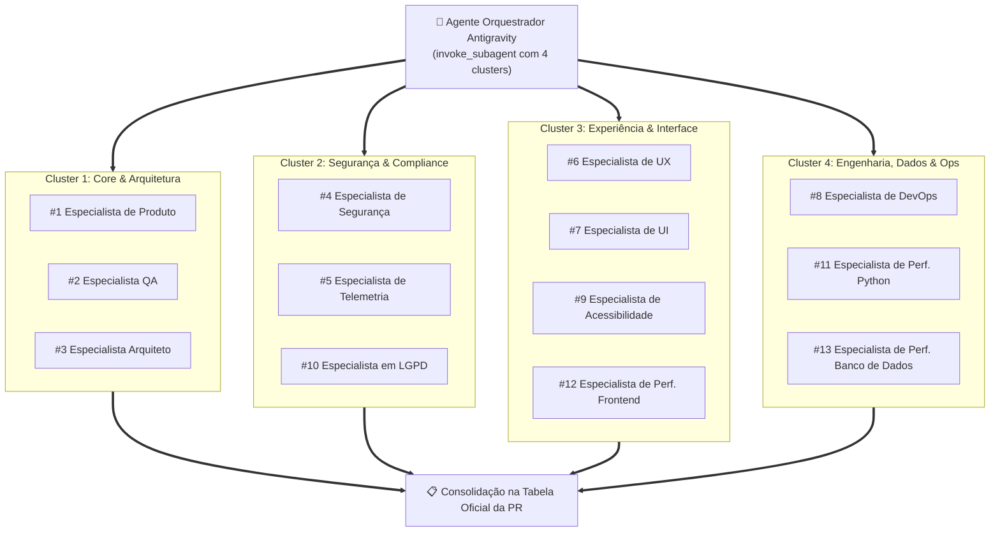

# Protocolo de Auditoria Concorrente por Clusters Multi-Agente
# Projeto: Study Reviewer

Este documento formaliza o **Protocolo de Auditoria Concorrente por Clusters Multi-Agente** para o encerramento de todas as Sprints do **Study Reviewer**.

---

## 1. Fundamentação e Motivação
A bancada de auditoria é composta por **13 Especialistas Técnicos**. Na auditoria sequencial tradicional, a análise individual de 13 personas leva de 15 a 25 minutos.

Como a auditoria pós-implementação avalia um **mesmo artefato estático** (`git diff staging...HEAD` e o resultado dos testes), as 13 perspectivas de avaliação são **completamente ortogonais e desacopladas**:
* Segurança não depende da análise de Acessibilidade.
* Performance de Banco de Dados não depende da análise de UI.
* Clean Architecture não depende da análise de Core Web Vitals.

A paralelização via **subagentes concorrentes (`invoke_subagent`)** reduz o tempo total de auditoria para **1 a 2 minutos** (tempo do cluster mais longo), garantindo rigor e zero viés acumulado.

---

## 2. Estrutura dos 4 Clusters Concorrentes

Os 13 especialistas são distribuídos em **4 Clusters de Competência Especializada**:



---

## 3. Matriz de Atribuição por Cluster

| Cluster | Especialistas | Skills Acionadas | Escopo de Auditoria do Diff |
| :--- | :--- | :--- | :--- |
| **Cluster 1: Core & Arquitetura** | • #1 Produto<br/>• #2 QA<br/>• #3 Arquiteto | `product-requirements-auditor`<br/>`qa-tdd-coverage-auditor`<br/>`architect-clean-arch-auditor` | Aderência aos requisitos do PRD, matriz BDD, cobertura 100%, regra de dependência Clean Arch e ADRs vigentes. |
| **Cluster 2: Segurança & Compliance** | • #4 Segurança<br/>• #5 Telemetria<br/>• #10 LGPD | `security-owasp-auditor`<br/>`security-test-enforcer`<br/>`telemetry-observability-auditor`<br/>`lgpd-privacy-auditor` | OWASP Top 10, sanitização na borda, meta-teste AST, decorator `@pytest.mark.security`, logs estruturados e minimização de dados LGPD. |
| **Cluster 3: Experiência & Interface** | • #6 UX<br/>• #7 UI<br/>• #9 Acessibilidade<br/>• #12 Perf. Frontend | `ux-journey-auditor`<br/>`ui-interface-auditor`<br/>`a11y-wcag-auditor`<br/>`frontend-performance-auditor` | Usabilidade, atalhos de teclado, Tailwind CSS minificado, integridade de templates Jinja2, WCAG 2.1 AA e Core Web Vitals (LCP/INP/CLS). |
| **Cluster 4: Engenharia, Dados & Ops** | • #8 DevOps<br/>• #11 Perf. Python<br/>• #13 Perf. Banco de Dados | `devops-infrastructure-auditor`<br/>`python-performance-auditor`<br/>`database-performance-auditor` | Docker multi-stage, usuário não-root, complexidade Big-O, uso de geradores, eliminação de queries N+1, índices B-tree/covering e bulk persistência. |

---

## 4. Instrução de Invocação para o Agente Orquestrador

Ao finalizar a implementação da Sprint, o agente orquestrador executa uma única chamada à ferramenta `invoke_subagent` passando o array com os 4 subagentes:

```json
{
  "Subagents": [
    {
      "TypeName": "self",
      "Role": "Cluster 1: Core & Arquitetura Auditor",
      "Prompt": "Você é o auditor dos especialistas #1 (Produto), #2 (QA) e #3 (Arquiteto). Analise o diff contra staging (git diff staging...HEAD) e emita o parecer formal formatado para cada um dos 3 especialistas."
    },
    {
      "TypeName": "self",
      "Role": "Cluster 2: Segurança & Compliance Auditor",
      "Prompt": "Você é o auditor dos especialistas #4 (Segurança), #5 (Telemetria) e #10 (LGPD). Inspecione o diff contra staging, testes de segurança AST e conformidade de privacidade, emitindo o parecer formal formatado para cada um dos 3 especialistas."
    },
    {
      "TypeName": "self",
      "Role": "Cluster 3: Experiência & Interface Auditor",
      "Prompt": "Você é o auditor dos especialistas #6 (UX), #7 (UI), #9 (Acessibilidade) e #12 (Performance Frontend). Inspecione os templates, estilos Tailwind e acessibilidade, emitindo o parecer formal formatado para cada um dos 4 especialistas."
    },
    {
      "TypeName": "self",
      "Role": "Cluster 4: Engenharia, Dados & Ops Auditor",
      "Prompt": "Você é o auditor dos especialistas #8 (DevOps), #11 (Performance Python) e #13 (Performance de Banco). Inspecione conteinerização, queries SQLAlchemy (prevenção N+1, índices) e complexidade algorítmica, emitindo o parecer formal formatado para cada um dos 3 especialistas."
    }
  ]
}
```

---

## 5. Saída Consolidada
O agente orquestrador recebe as respostas reativamente, junta as 13 linhas padronizadas no formato:
`| **X** | **Nome do Especialista** | [APROVADO] | Parecer técnico... |`
e preenche a seção **🏛️ Bancada dos 13 Especialistas — Auditoria Obrigatória** no template de Pull Request.
