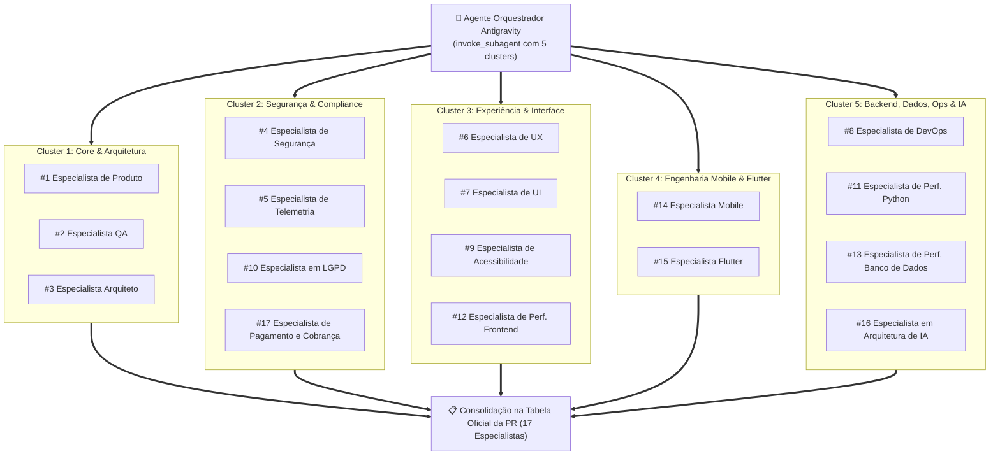

# Protocolo de Auditoria Concorrente por Clusters Multi-Agente
# Projeto: Study Reviewer

Este documento formaliza o **Protocolo de Auditoria Concorrente por Clusters Multi-Agente** para o encerramento de todas as Sprints do **Study Reviewer**.

---

## 1. Fundamentação e Motivação
A bancada de auditoria é composta por **17 Especialistas Técnicos**. Na auditoria sequencial tradicional, a análise individual de 17 personas levaria de 20 a 35 minutos.

Como a auditoria pós-implementação avalia um **mesmo artefato estático** (`git diff staging...HEAD` e o resultado dos testes), as 17 perspectivas de avaliação são **completamente ortogonais e desacopladas**:
* Segurança não depende da análise de Acessibilidade.
* Performance de Banco de Dados não depende da análise de UI.
* Clean Architecture não depende da análise de Core Web Vitals.
* Arquitetura de IA não depende da análise de Usabilidade Mobile.
* Integridade de Pagamentos não depende da análise de Lints do Flutter.

A paralelização via **subagentes concorrentes (`invoke_subagent`)** reduz o tempo total de auditoria para **1 a 2 minutos** (tempo do cluster mais longo), garantindo rigor e zero viés acumulado.

---

## 2. Estrutura dos 5 Clusters Concorrentes

Os 17 especialistas são distribuídos em **5 Clusters de Competência Especializada**:



---

## 3. Matriz de Atribuição por Cluster

| Cluster | Especialistas | Skills Acionadas | Escopo de Auditoria do Diff |
| :--- | :--- | :--- | :--- |
| **Cluster 1: Core & Arquitetura** | • #1 Produto<br/>• #2 QA<br/>• #3 Arquiteto | `product-requirements-auditor`<br/>`qa-tdd-coverage-auditor`<br/>`architect-clean-arch-auditor` | Aderência aos requisitos do PRD, matriz BDD, cobertura 100%, regra de dependência Clean Arch e ADRs vigentes. |
| **Cluster 2: Segurança & Compliance** | • #4 Segurança<br/>• #5 Telemetria<br/>• #10 LGPD<br/>• #17 Pagamento e Cobrança | `security-owasp-auditor`<br/>`security-test-enforcer`<br/>`telemetry-observability-auditor`<br/>`lgpd-privacy-auditor`<br/>`payment-transactions-auditor`<br/>`payment-gateways-webhook-auditor`<br/>`billing-lifecycle-auditor` | OWASP Top 10, sanitização na borda, meta-teste AST, decorator `@pytest.mark.security`, logs estruturados, minimização LGPD, idempotência financeira, webhooks HMAC e PCI-DSS SAQ A. |
| **Cluster 3: Experiência & Interface** | • #6 UX<br/>• #7 UI<br/>• #9 Acessibilidade<br/>• #12 Perf. Frontend | `ux-journey-auditor`<br/>`ui-interface-auditor`<br/>`a11y-wcag-auditor`<br/>`frontend-performance-auditor` | Usabilidade, atalhos de teclado, Tailwind CSS minificado, integridade de templates Jinja2, WCAG 2.1 AA e Core Web Vitals (LCP/INP/CLS). |
| **Cluster 4: Engenharia Mobile & Flutter** | • #14 Mobile<br/>• #15 Flutter | `mobile-usability-auditor`<br/>`mobile-security-auditor`<br/>`mobile-performance-auditor`<br/>`flutter-performance-auditor`<br/>`flutter-code-quality-auditor` | Touch targets (>= 48dp), safe areas, KeyStore/Keychain, resiliência offline, árvores de widgets com const, zero leaks em dispose, Isolate compute e flutter analyze. |
| **Cluster 5: Backend, Dados, Ops & IA** | • #8 DevOps<br/>• #11 Perf. Python<br/>• #13 Perf. Banco de Dados<br/>• #16 Arquitetura de IA | `devops-infrastructure-auditor`<br/>`python-performance-auditor`<br/>`database-performance-auditor`<br/>`ai-performance-auditor`<br/>`ai-resilience-auditor`<br/>`ai-security-auditor`<br/>`ai-hallucination-mitigator` | Docker multi-stage, usuário não-root, complexidade Big-O, ausência de queries N+1, índices covering, TTFT de inferência de IA, streaming SSE, circuit breakers e mitigação de alucinação. |

---

## 4. Instrução de Invocação para o Agente Orquestrador

Ao finalizar a implementação da Sprint, o agente orquestrador executa uma única chamada à ferramenta `invoke_subagent` passando o array com os 5 subagentes:

```json
{
  "Subagents": [
    {
      "TypeName": "self",
      "Role": "Cluster 1: Core & Arquitetura Auditor",
      "Prompt": "Você é o auditor dos especialistas #1 (Produto), #2 (QA) e #3 (Arquiteto). Analise o diff contra staging (git diff staging...HEAD) e emita o parecer formal formatado para cada um dos 3 especialistas."
    },
    {
      "TypeName": "self",
      "Role": "Cluster 2: Segurança & Compliance Auditor",
      "Prompt": "Você é o auditor dos especialistas #4 (Segurança), #5 (Telemetria), #10 (LGPD) e #17 (Pagamento e Cobrança). Inspecione o diff contra staging, testes de segurança AST, conformidade de privacidade, integridade transacional, idempotência financeira e webhooks, emitindo o parecer formal formatado para cada um dos 4 especialistas."
    },
    {
      "TypeName": "self",
      "Role": "Cluster 3: Experiência & Interface Auditor",
      "Prompt": "Você é o auditor dos especialistas #6 (UX), #7 (UI), #9 (Acessibilidade) e #12 (Performance Frontend). Inspecione os templates, estilos Tailwind e acessibilidade, emitindo o parecer formal formatado para cada um dos 4 especialistas."
    },
    {
      "TypeName": "self",
      "Role": "Cluster 4: Engenharia Mobile & Flutter Auditor",
      "Prompt": "Você é o auditor dos especialistas #14 (Mobile) e #15 (Flutter). Inspecione os diretórios mobile/, manifestos, armazenamento seguro, árvores de widgets Flutter, gerenciamento de dispose e lints Dart, emitindo o parecer formal formatado para cada um dos 2 especialistas."
    },
    {
      "TypeName": "self",
      "Role": "Cluster 5: Backend, Dados, Ops & IA Auditor",
      "Prompt": "Você é o auditor dos especialistas #8 (DevOps), #11 (Performance Python), #13 (Performance de Banco) e #16 (Arquitetura de IA). Inspecione conteinerização, complexidade algorítmica, queries SQLAlchemy (prevenção N+1, índices), inferência de IA (TTFT, streaming, circuit breaker e mitigação de alucinação), emitindo o parecer formal formatado para cada um dos 4 especialistas."
    }
  ]
}
```

---

## 5. Saída Consolidada & Abertura Obrigatória da PR
1. O agente orquestrador recebe as respostas reativamente, junta as 17 linhas padronizadas no formato:
   `| **X** | **Nome do Especialista** | [APROVADO] | Parecer técnico... |`
2. Preenche a seção **🏛️ Bancada dos 17 Especialistas — Auditoria Obrigatória** no template de Pull Request (`docs/sprints/sprint-XX/02-pull-request-sprint-XX.md`).
3. Executa o commit local e envia a branch ao GitHub:
   ```bash
   git push -u origin feature/sprint-XX-<nome>
   ```
4. **Abre obrigatoriamente a Pull Request para a branch `staging`:**
   ```bash
   gh pr create --base staging --head feature/sprint-XX-<nome> --title "Sprint XX — <Título>" --body-file docs/sprints/sprint-XX/02-pull-request-sprint-XX.md
   ```
5. **Retorna a URL oficial do PR ao usuário.** Nenhuma sprint é concluída sem a Pull Request aberta no GitHub.
