# Especificação Técnica (SPEC) — Sprint 01
## Módulo: MVP Flashcards em Produção (Clean Architecture & Gap Indexing)
### Projeto: Study Reviewer

---

## 1. Visão Geral e Fronteiras Arquiteturais

A **Sprint 01** implementa o subsistema completo de **Flashcards** baseado no [PRD.md](file:///c:/Users/Pichau/Desktop/study_reviewer/PRD.md) v5.2, estruturado sob os princípios de **Clean Architecture**, **TDD estrito**, **Gap Indexing** para a pool dinâmica e **Paridade Dev/Prod via Docker**.

A arquitetura organiza-se em 4 camadas concêntricas com fluxos de dependência estritamente centrípetos:

```mermaid
flowchart TD
    subgraph Camada_4["4. Frameworks & Drivers (src/infrastructure)"]
        Docker_DB["PostgreSQL 16 (Local / Neon)"]
        FastAPI_Web["FastAPI 0.115+ & Uvicorn"]
        Templates_Engine["Jinja2 + HTMX + TailwindCSS"]
        Alembic_Mig["Alembic Migrations"]
    end

    subgraph Camada_3["3. Interface Adapters (src/adapters)"]
        Controllers_Web["Web Controllers (HTML/HTMX Routers)"]
        Controllers_API["API Controllers (JSON REST Routers)"]
        Repo_Impl["SqlAlchemySubjectRepo, SqlAlchemyTopicRepo, SqlAlchemyFlashcardRepo, SqlAlchemySessionRepo"]
        Mappers["SubjectMapper, TopicMapper, FlashcardMapper, SessionMapper"]
        ORM_Models["SQLAlchemy Base Models (Tabelas)"]
    end

    subgraph Camada_2["2. Use Cases / Application (src/application)"]
        UC_Cards["CreateFlashcardUseCase, GetNextFlashcardUseCase, ReviewFlashcardUseCase, DeleteFlashcardUseCase"]
        UC_Taxonomy["CreateSubjectUseCase, ListSubjectsUseCase, CreateTopicUseCase, ListTopicsUseCase"]
        UC_Session["StartStudySessionUseCase, GetActiveSessionUseCase"]
        Ports_Out["Protocols: ISubjectRepository, ITopicRepository, IFlashcardRepository, ISessionRepository, IRandomGenerator"]
        DTOs["Input/Output Boundaries (Pydantic / Dataclasses agnósticas)"]
    end

    subgraph Camada_1["1. Entities & Domain Services (src/domain)"]
        E_Subject["Subject Entity"]
        E_Topic["Topic Entity"]
        E_Flashcard["Flashcard Entity (Com Position)"]
        E_Session["FlashcardPoolSession Entity"]
        DS_Pool["FlashcardPoolService (Gap Indexing, Inserção 10%, Shuffle, Rebalance)"]
        D_Exceptions["DomainValidationError, EntityNotFoundError, EmptyPoolError"]
    end

    Camada_4 --> Camada_3
    Camada_3 --> Camada_2
    Camada_2 --> Camada_1
```

---

## 2. Camada 1: Núcleo de Domínio (`src/domain/`)
*Python 100% puro, sem dependências de frameworks, ORMs ou bibliotecas externas de banco.*

### 2.1 Entidades e Value Objects
* **`Subject` (Matéria):**
  * `id: UUID`
  * `name: str` (validação: 2 a 100 caracteres, sem espaços vazios)
  * `created_at: date`
* **`Topic` (Tema):**
  * `id: UUID`
  * `subject_id: UUID`
  * `name: str` (validação: 2 a 100 caracteres)
  * `created_at: date`
* **`Flashcard`:**
  * `id: UUID`
  * `topic_id: UUID`
  * `front: str` (pergunta/frente: 1 a 5.000 caracteres)
  * `back: str` (resposta/verso: 1 a 10.000 caracteres)
  * `position: int` (posição de gap indexing na pool, padrão múltiplo de 100)
  * `created_at: date`
* **`FlashcardPoolSession`:**
  * `id: UUID`
  * `subject_id_filter: UUID | None` (None = Todas as Matérias / Global)
  * `topic_id_filter: UUID | None`
  * `current_position: int` (posição do card atualmente em exibição)
  * `round_number: int` (contador de rodadas iniciadas, padrão 1)
  * `is_active: bool`
  * `updated_at: datetime`

### 2.2 Domain Service: `FlashcardPoolService`
Encapsula o motor matemático e as regras operacionais da pool com **Gap Indexing**:
1. **`calculate_target_index(total_cards: int, rng: IRandomGenerator) -> int`:**
   * Retorna índice pseudoaleatório entre os primeiros 10% da pool:
     $$\text{índice\_alvo} = rng.\text{randint}(0, \max(1, \lfloor 0.1 \times N \rfloor))$$
2. **`calculate_new_position(prev_pos: int | None, next_pos: int | None) -> int`:**
   * Caso 1 (Pool vazia): retorna `100`.
   * Caso 2 (Inserção na cabeça antes do primeiro card): retorna $\max(1, \lfloor next\_pos / 2 \rfloor)$.
   * Caso 3 (Inserção no final após o último card): retorna $prev\_pos + 100$.
   * Caso 4 (Inserção entre dois cards): retorna $prev\_pos + \lfloor (next\_pos - prev\_pos) / 2 \rfloor$.
3. **`needs_rebalance(positions: list[int]) -> bool`:**
   * Avalia se a distância entre quaisquer duas posições consecutivas é $\le 1$ ou se a primeira posição atingiu $\le 1$.
4. **`rebalance_positions(cards: list[Flashcard]) -> list[Flashcard]`:**
   * Redistribui uniformemente as posições dos cards em múltiplos de 100 (`100, 200, 300...`) preservando a ordem relativa original.
5. **`execute_round_shuffle(cards: list[Flashcard], rng: IRandomGenerator) -> list[Flashcard]`:**
   * Embaralha a lista completa de cards via algoritmo Fisher-Yates utilizando o protocolo injetável `rng` e reatribui posições em múltiplos de 100.
6. **`get_next_card(cards: list[Flashcard], current_position: int) -> tuple[Flashcard | None, bool]`:**
   * Filtra cards com `position > current_position`.
   * Se houver card: retorna `(card, False)`.
   * Se não houver: indica fim de rodada `(None, True)`.

### 2.3 Exceções de Domínio
* `DomainValidationError`: Violação de invariantes (textos vazios, comprimentos inválidos).
* `EntityNotFoundError`: Entidade não encontrada para o ID informado.
* `EmptyPoolError`: Tentativa de iniciar sessão de estudo em matéria/tema sem nenhum flashcard.
* `DuplicateEntityError`: Tentativa de criar matéria/tema com nome duplicado no mesmo escopo.

---

## 3. Camada 2: Casos de Uso / Aplicação (`src/application/`)
*100% Agnóstica a HTTP/HTML, servindo Web e API com a mesma inteligência.*

### 3.1 Portas de Saída (Protocols)
* **`ISubjectRepository`:**
  * `save(subject: Subject) -> None`
  * `get_by_id(subject_id: UUID) -> Subject | None`
  * `list_all() -> list[Subject]`
  * `exists_by_name(name: str) -> bool`
* **`ITopicRepository`:**
  * `save(topic: Topic) -> None`
  * `get_by_id(topic_id: UUID) -> Topic | None`
  * `list_by_subject(subject_id: UUID) -> list[Topic]`
  * `exists_by_name(subject_id: UUID, name: str) -> bool`
* **`IFlashcardRepository`:**
  * `save(flashcard: Flashcard) -> None`
  * `save_all(flashcards: list[Flashcard]) -> None`
  * `get_by_id(flashcard_id: UUID) -> Flashcard | None`
  * `delete(flashcard_id: UUID) -> None`
  * `list_pool(subject_id: UUID | None, topic_id: UUID | None) -> list[Flashcard]` (ordenado por `position ASC`)
  * `count_pool(subject_id: UUID | None, topic_id: UUID | None) -> int`
* **`ISessionRepository`:**
  * `get_active_session(subject_id: UUID | None, topic_id: UUID | None) -> FlashcardPoolSession | None`
  * `save_session(session: FlashcardPoolSession) -> None`
* **`IRandomGenerator`:**
  * `randint(a: int, b: int) -> int`
  * `shuffle(items: list[Any]) -> None`

### 3.2 Casos de Uso
1. **`CreateSubjectUseCase(input: CreateSubjectDTO) -> SubjectDTO`**
2. **`ListSubjectsUseCase() -> list[SubjectDTO]`**
3. **`CreateTopicUseCase(input: CreateTopicDTO) -> TopicDTO`**
4. **`ListTopicsBySubjectUseCase(subject_id: UUID) -> list[TopicDTO]`**
5. **`CreateFlashcardUseCase(input: CreateFlashcardDTO) -> FlashcardDTO`:**
   * Obtém os cards atuais da pool.
   * Utiliza `FlashcardPoolService` para calcular a nova posição nos primeiros 10%.
   * Se necessitar de rebalanceamento, executa e persiste `save_all`.
   * Persiste o novo card.
6. **`GetNextFlashcardUseCase(input: GetNextCardDTO) -> StudyCardDTO`:**
   * Recupera ou inicializa a `FlashcardPoolSession`.
   * Busca o próximo card da pool após `session.current_position`.
   * Se a rodada encerrou: dispara `execute_round_shuffle`, incrementa `round_number`, persiste nova ordem de cards e sessão, e retorna o primeiro card da nova rodada com flag `round_shuffled = True`.
7. **`DeleteFlashcardUseCase(flashcard_id: UUID) -> None`:**
   * Remove o card. Se for o card atual da sessão, avança o ponteiro para o próximo sem quebrar a rodada.

---

## 4. Camada 3: Adaptadores de Interface (`src/adapters/`)

### 4.1 Persistência e Mappers (SQLAlchemy 2.0)
* **Modelos ORM:**
  * `SubjectModel` (`subjects`: `id`, `name`, `created_at`)
  * `TopicModel` (`topics`: `id`, `subject_id`, `name`, `created_at`)
  * `FlashcardModel` (`flashcards`: `id`, `topic_id`, `front`, `back`, `position`, `created_at`)
  * `PoolSessionModel` (`flashcard_pool_sessions`: `id`, `subject_id`, `topic_id`, `current_position`, `round_number`, `is_active`, `updated_at`)
* **Mappers:** Conversores bidirecionais isolados: `to_domain()` e `to_model()`.

### 4.2 Controladores Web (FastAPI + Jinja2 + HTMX)
* `GET /`: Redireciona para `/study`.
* `GET /study`: Tela de estudo responsiva (renderiza card atual, contador de rodada, barra inferior mobile e atalhos).
* `POST /study/flip`: Endpoint HTMX que alterna suavemente entre pergunta e resposta sem recarregar a tela.
* `POST /study/next`: Endpoint HTMX que avança para o próximo card, atualizando o contador e disparando anúncio sonoro/textual via `aria-live`.
* `GET /flashcards/new`: Tela de cadastro ágil com opção de salvar e continuar cadastrando.
* `POST /flashcards`: Criação de novo card.
* `GET /subjects`: Gerenciamento de Matérias e Temas.

### 4.3 Controladores de API REST (JSON para Flutter - Preparação)
* `GET /api/v1/study/next`: Retorna JSON do próximo card e metadados de rodada.
* `POST /api/v1/flashcards`: Endpoint JSON para criação.

---

## 5. Camada 4: Frameworks & Drivers (`src/infrastructure/`)

### 5.1 Paridade Dev/Prod com Docker Compose
* **`docker-compose.yml`:**
  * Serviço `db`: PostgreSQL 16 Alpine com healthcheck (`pg_isready -U postgres`) e volume persistente nomeado (`postgres_data`).
  * Serviço `web`: Build multi-stage local com hot-reload (volume mapeado em `src/`).
  * Dependência segura: `depends_on: db: condition: service_healthy`.

### 5.2 Segurança e Criptografia
* Middleware de cabeçalhos de segurança HTTP.
* Módulo `AES256GCMCipher` em `src/infrastructure/security/crypto.py` com criptografia autenticada.
* Sanitização de entradas com biblioteca defensiva `nh3`.

---

## 6. Mapeamento de Rastreabilidade com o PRD v5.2

| Requisito do PRD v5.2 | Componente na SPEC da Sprint 1 |
| :--- | :--- |
| Pool por Rodadas | `FlashcardPoolService.get_next_card` e `FlashcardPoolSession` |
| Inserção nos Primeiros 10% | `FlashcardPoolService.calculate_new_position` (Ponto Médio) |
| Shuffle Geral ao Fim de Rodada | `FlashcardPoolService.execute_round_shuffle` |
| Gap Indexing com Múltiplos de 100 | Campo `position` + `rebalance_positions` |
| Filtro Global ou por Matéria | `subject_id_filter` na sessão e repositório |
| Clean Architecture Estrita | 4 camadas físicas em `src/domain`, `application`, `adapters`, `infrastructure` |
| Dark Mode Nativo | Configuração Tailwind `darkMode: 'selector'` + script anti-FOUC |
| Criptografia AEAD | `AES256GCMCipher` em infraestrutura |
