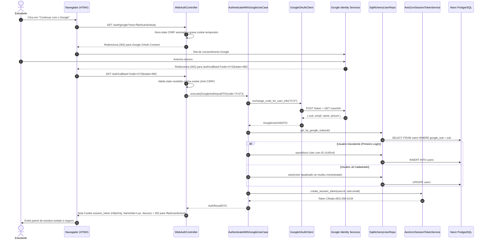

# Especificação Técnica (SPEC) — Sprint 02
## Módulo: Autenticação & Multi-tenancy com Google (OAuth2 / OIDC)
### Projeto: Study Reviewer

---

## 1. Visão Geral e Fronteiras Arquiteturais

A **Sprint 02** implementa a camada de **Identidade, Autenticação e Multi-tenancy** do **Study Reviewer** com base no [PRD.md](../../PRD.md) v6.0, [ADR-001](ADR-001-clean-architecture-layering.md), [ADR-006](ADR-006-google-oauth2-oidc-multitenancy.md) e [ADR-007](ADR-007-session-management-aes-256-gcm.md).

O objetivo central é prover login federado via Google OAuth2 / OpenID Connect (OIDC), gestão de sessões criptografadas de alta performance em cookies e headers de API via **AES-256-GCM**, e isolamento relacional multi-inquilino (*multi-tenancy*) dos dados de estudo por estudante (`owner_id`), erradicando vulnerabilidades de referência direta insegura (IDOR).

```mermaid
flowchart TD
    subgraph Camada_4["4. Frameworks & Drivers (src/infrastructure)"]
        Docker_DB["PostgreSQL 16 (Local / Neon)"]
        FastAPI_Web["FastAPI & Uvicorn (Middleware get_current_user)"]
        Google_OIDC["Google Identity Services (OAuth2 / OIDC)"]
        Alembic_Mig["Alembic Migrations (users, FK owner_id, FK user_id)"]
    end

    subgraph Camada_3["3. Interface Adapters (src/adapters)"]
        Controllers_Web["WebAuthController (/auth/login, /auth/google, /auth/callback, /auth/logout)"]
        Controllers_API["ApiAuthController (/api/v1/auth/google, /api/v1/auth/me)"]
        Repo_Impl["SqlAlchemyUserRepo, SqlAlchemySubjectRepo (com filtro owner_id)"]
        Crypto_Service["AesGcmSessionTokenService (AES-256-GCM)"]
        Google_Client["GoogleOAuthClient (httpx / google-auth)"]
        Mappers["UserMapper, SubjectMapper, FlashcardMapper"]
        ORM_Models["UserModel, SubjectModel (owner_id FK), SessionModel (user_id FK)"]
    end

    subgraph Camada_2["2. Use Cases / Application (src/application)"]
        UC_Auth["AuthenticateWithGoogleUseCase, GetCurrentUserUseCase, LogoutUseCase"]
        UC_Cards["CreateFlashcardUseCase, GetNextFlashcardUseCase (com user_id)"]
        UC_Taxonomy["CreateSubjectUseCase, ListSubjectsUseCase (com owner_id)"]
        Ports_Out["Protocols: IUserRepository, IGoogleAuthClient, ISessionTokenService, ISubjectRepository"]
        DTOs["GoogleAuthInputDTO, AuthResultDTO, UserDTO, SessionPayloadDTO"]
    end

    subgraph Camada_1["1. Entities & Domain Services (src/domain)"]
        E_User["User Entity (id, email, name, avatar_url, google_sub)"]
        E_Subject["Subject Entity (id, name, owner_id)"]
        E_Session["FlashcardPoolSession Entity (id, user_id, current_position, round_number)"]
        D_Exceptions["InvalidEmailError, InvalidGoogleSubError, UnauthorizedError, ResourceOwnershipError"]
    end

    Camada_4 --> Camada_3
    Camada_3 --> Camada_2
    Camada_2 --> Camada_1
```

---

## 2. Camada 1: Núcleo de Domínio (`src/domain/`)
*Python 100% puro, sem dependências de frameworks, ORMs ou bibliotecas externas de rede/banco.*

### 2.1 Entidades e Value Objects

* **`User` (Novo):**
  * `id: UUID`: Identificador único primário do usuário (UUIDv4).
  * `google_sub: str`: Identificador único universal emitido pelo Google OIDC (`sub`), imutável e obrigatório.
  * `email: str`: Endereço de e-mail do usuário (validação estrita RFC 5322, normalizado em minúsculas e sem espaços).
  * `name: str`: Nome de exibição (1 a 150 caracteres, sanitizado e sem espaços em branco nas extremidades).
  * `avatar_url: str | None`: URL da foto de perfil fornecida pelo Google (formato HTTP/HTTPS válido ou None).
  * `created_at: date`: Data pura de cadastro do usuário.
  * *Invariantes de Domínio:* Não permite e-mails em branco ou inválidos, nomes vazios ou `google_sub` vazio.

* **`Subject` (Atualização Multi-tenant):**
  * Adição do atributo obrigatório `owner_id: UUID`, vinculando a matéria ao estudante proprietário.
  * A unicidade do nome da matéria passa a ser restrita ao escopo do `owner_id` (dois usuários distintos podem possuir matérias com o mesmo nome, ex: "Direito Constitucional", sem colisão).

* **`FlashcardPoolSession` (Atualização Multi-tenant):**
  * Adição do atributo obrigatório `user_id: UUID`, vinculando a sessão de estudo e seu progresso ao usuário autenticado.

### 2.2 Exceções de Domínio
* `InvalidEmailError`: Lançada quando o formato do e-mail não atende ao padrão RFC 5322.
* `InvalidGoogleSubError`: Lançada se o identificador Google fornecido for vazio ou nulo.
* `UnauthorizedError`: Lançada na ausência de credenciais válidas ou sessão expirada.
* `ResourceOwnershipError`: Lançada quando um usuário tenta manipular recursos pertencentes a outro usuário (violação de multi-tenancy / IDOR).

---

## 3. Camada 2: Casos de Uso / Aplicação (`src/application/`)
*100% Agnóstica a protocolos de entrega (HTTP/HTML), compartilhada entre Web e API REST.*

### 3.1 Portas de Saída (Protocols)

* **`IUserRepository(Protocol)`:**
  * `save(user: User) -> None`: Persiste ou atualiza os dados do usuário.
  * `get_by_id(user_id: UUID) -> User | None`: Localiza usuário por seu ID primário.
  * `get_by_google_sub(google_sub: str) -> User | None`: Localiza usuário por seu ID do Google.
  * `get_by_email(email: str) -> User | None`: Localiza usuário pelo endereço de e-mail.

* **`IGoogleAuthClient(Protocol)`:**
  * `get_authorization_url(state: str, redirect_uri: str) -> str`: Monta a URL oficial do Google Identity com escopos `openid email profile`.
  * `exchange_code_for_user_info(code: str, redirect_uri: str) -> GoogleUserInfoDTO`: Troca o authorization code pelo token OIDC e extrai as claims do perfil.
  * `verify_id_token(id_token: str) -> GoogleUserInfoDTO`: Valida a assinatura de um id_token JWT recebido diretamente (usado pela API / Flutter).

* **`ISessionTokenService(Protocol)`:**
  * `create_session_token(user_id: UUID, email: str) -> str`: Criptografa o payload via AES-256-GCM gerando token seguro.
  * `verify_session_token(token: str) -> SessionPayloadDTO | None`: Decripta e valida integridade, autenticidade e prazo de expiração do token.

* **Atualização das Portas Existentes da Sprint 1:**
  * `ISubjectRepository`: `list_by_owner(owner_id: UUID) -> list[Subject]`, `get_by_id_and_owner(subject_id: UUID, owner_id: UUID) -> Subject | None`, `exists_by_name(owner_id: UUID, name: str) -> bool`.
  * `ITopicRepository`: `list_by_subject_and_owner(subject_id: UUID, owner_id: UUID) -> list[Topic]`, `get_by_id_and_owner(topic_id: UUID, owner_id: UUID) -> Topic | None`, `exists_by_name(subject_id: UUID, owner_id: UUID, name: str) -> bool`.
  * `IFlashcardRepository`: `list_pool_by_owner(owner_id: UUID, subject_id: UUID | None, topic_id: UUID | None) -> list[Flashcard]`, `get_by_id_and_owner(flashcard_id: UUID, owner_id: UUID) -> Flashcard | None`, `count_pool_by_owner(owner_id: UUID, subject_id: UUID | None, topic_id: UUID | None) -> int`.
  * `ISessionRepository`: `get_active_session_by_user(user_id: UUID, subject_id: UUID | None, topic_id: UUID | None) -> FlashcardPoolSession | None`.

### 3.2 DTOs de Aplicação
* `GoogleAuthInputDTO`: `code: str | None`, `id_token: str | None`, `redirect_uri: str`.
* `GoogleUserInfoDTO`: `sub: str`, `email: str`, `name: str`, `avatar_url: str | None`.
* `AuthResultDTO`: `user_id: UUID`, `email: str`, `name: str`, `avatar_url: str | None`, `session_token: str`, `is_new_user: bool`.
* `SessionPayloadDTO`: `user_id: UUID`, `email: str`, `iat: int`, `exp: int`.
* `UserDTO`: `id: UUID`, `email: str`, `name: str`, `avatar_url: str | None`, `created_at: date`.

### 3.3 Casos de Uso

1. **`AuthenticateWithGoogleUseCase`:**
   * Recebe `GoogleAuthInputDTO`.
   * Se informado `code`: consome `IGoogleAuthClient.exchange_code_for_user_info`.
   * Se informado `id_token`: consome `IGoogleAuthClient.verify_id_token`.
   * Localiza usuário no `IUserRepository` por `sub` ou `email`.
   * **JIT Provisioning:**
     - Se inexistente: cria nova entidade `User` e persiste via `IUserRepository.save`.
     - Se existente: atualiza `name` e `avatar_url` se houver alteração cadastral no Google.
   * Gera token de sessão através de `ISessionTokenService.create_session_token`.
   * Retorna `AuthResultDTO`.

2. **`GetCurrentUserUseCase`:**
   * Recebe o token de sessão serializado.
   * Valida o token através de `ISessionTokenService.verify_session_token`. Se inválido ou expirado, lança `UnauthorizedError`.
   * Busca e retorna os dados do usuário ativo no `IUserRepository`.

3. **`LogoutUseCase`:**
   * Executa a invalidação lógica e comando de encerramento de sessão.

4. **Adequação dos Use Cases da Sprint 1:**
   * `CreateSubjectUseCase(owner_id: UUID, input: CreateSubjectDTO)`: vincula o `owner_id` recebido à nova matéria.
   * `ListSubjectsUseCase(owner_id: UUID)`: filtra exclusivamente as matérias do proprietário.
   * `CreateTopicUseCase(owner_id: UUID, input: CreateTopicDTO)`: valida previamente se a matéria vinculada pertence a `owner_id`. Caso contrário, rejeita com `ResourceOwnershipError`.
   * `CreateFlashcardUseCase(owner_id: UUID, input: CreateFlashcardDTO)`: valida que os tópicos e matérias pertencem ao `owner_id`.
   * `GetNextFlashcardUseCase(user_id: UUID, input: GetNextCardDTO)`: recupera ou inicializa a pool de estudo isolada para o `user_id`.

---

## 4. Camada 3: Adaptadores de Interface (`src/adapters/`)

### 4.1 Repositórios e Mappers
* **`SqlAlchemyUserRepository`:** Implementa `IUserRepository` com mapeamento explícito via `UserMapper`.
* **Refatoração dos Repositórios Existentes:**
  - `SqlAlchemySubjectRepository`: cláusulas `.where(SubjectModel.owner_id == owner_id)`.
  - `SqlAlchemyTopicRepository`: cláusulas `.join(SubjectModel).where(SubjectModel.owner_id == owner_id)`.
  - `SqlAlchemyFlashcardRepository`: cláusulas com join de matéria e filtro `SubjectModel.owner_id == owner_id`.
  - `SqlAlchemySessionRepository`: cláusulas `.where(FlashcardPoolSessionModel.user_id == user_id)`.
  - Manutenção de `selectinload` para relacionamentos e prevenção de N+1 queries.

### 4.2 Criptografia de Sessão & Cliente Google
* **`AesGcmSessionTokenService`:**
  - Utiliza `cryptography.hazmat.primitives.ciphers.aead.AESGCM`.
  - Encripta payload serializado em JSON com nonce aleatório de 12 bytes.
  - Formato serializado: `base64url(nonce + ciphertext_and_tag)`.
* **`GoogleOAuthClient`:**
  - Utiliza `httpx` assíncrono para interagir com `https://oauth2.googleapis.com/token` e `https://openidconnect.googleapis.com/v1/userinfo`.
  - Em ambiente de testes, o protocolo injetável permite substituição por fake em memória sem chamadas HTTP.

### 4.3 Controladores Web (Jinja2 + HTMX)
* `GET /auth/login`: Renderiza página de login contendo botão oficial do Google Identity e preserva parâmetro de query `next` (ex: `/flashcards/study`).
* `GET /auth/google`:
  - Gera `state` aleatório criptograficamente assinado com a URL de retorno `next`.
  - Grava cookie temporário `oauth_state` (`HttpOnly`, `SameSite=Lax`, `Max-Age=300`).
  - Redireciona o navegador para o endpoint de consentimento do Google.
* `GET /auth/callback`:
  - Valida o parâmetro `state` recebido contra o cookie `oauth_state` (proteção CSRF).
  - Executa `AuthenticateWithGoogleUseCase` com o `code`.
  - Grava cookie de longa duração `session_token` (`HttpOnly`, `SameSite=Lax`, `Secure`, `Max-Age=2592000`).
  - Redireciona o usuário para o destino `next` ou `/flashcards/study`.
* `POST /auth/logout`:
  - Deleta o cookie `session_token`.
  - Redireciona para `/auth/login`.

### 4.4 Controladores de API REST (FastAPI Routers)
* `POST /api/v1/auth/google`: Recebe payload JSON `{"id_token": "..."}` e retorna `{ "access_token": "...", "token_type": "bearer", "user": { ... } }`.
* `GET /api/v1/auth/me`: Retorna os dados do usuário autenticado a partir do cabeçalho `Authorization: Bearer <token>`.

---

## 5. Camada 4: Frameworks, Infraestrutura & Dependências (`src/infrastructure/`)

### 5.1 Modelos ORM e Banco de Dados (PostgreSQL 16)
* **`UserModel` (`users`):**
  - `id`: UUID (Primary Key).
  - `google_sub`: String(100), Unique, Not Null, B-tree Index.
  - `email`: String(255), Unique, Not Null, B-tree Index.
  - `name`: String(150), Not Null.
  - `avatar_url`: String(1024), Nullable.
  - `created_at`: Date, Not Null.
* **Alterações em Tabelas Existentes:**
  - `subjects`: Adição de `owner_id: UUID` (Foreign Key `users.id` com `ondelete="CASCADE"`, Not Null).
  - `flashcard_pool_sessions`: Adição de `user_id: UUID` (Foreign Key `users.id` com `ondelete="CASCADE"`, Not Null).
  - Índice composto cobrindo `ix_subjects_owner_name` em `(owner_id, name)` garantindo unicidade por usuário.
  - Índice cobrindo `ix_sessions_user_filters` em `(user_id, subject_id_filter, topic_id_filter)`.

### 5.2 Migração Versionada Alembic
* Criação de nova revisão: `alembic revision --autogenerate -m "add_users_and_multitenancy"`.
* Se houver dados prévios no banco (da Sprint 1), a migração cria automaticamente um usuário padrão do sistema (*System Migration User*) para associar às matérias órfãs, mantendo a integridade referencial sem perda de registros.

### 5.3 FastAPI Security Dependency (`get_current_user`)
* Dependency injetável que inspeciona:
  1. Cabeçalho `Authorization: Bearer <token>`.
  2. Cookie `session_token`.
* Se o token for válido e o usuário existir: injeta a entidade `User` na rota.
* Se ausente ou inválido:
  - Em rotas web HTML/HTMX: redireciona para `/auth/login?next={current_url}` (ou emite header `HX-Redirect` caso a requisição venha via HTMX).
  - Em rotas de API: lança `HTTPException(status_code=401, detail="Não autenticado")`.

---

## 6. Mapeamento de Fluxo de Execução & Segurança

