# Especificação Técnica (SPEC) — Sprint 02
## Módulo: Autenticação & Multi-tenancy com Google (OAuth2 / OIDC) e Compartilhamento Read-Only
### Projeto: Study Reviewer

---

## 1. Visão Geral e Fronteiras Arquiteturais

A **Sprint 02** implementa a camada de **Identidade, Autenticação, Multi-tenancy e Compartilhamento Read-Only** do **Study Reviewer** com base no [PRD.md](../../PRD.md) v6.0, [ADR-001](ADR-001-clean-architecture-layering.md), [ADR-006](ADR-006-google-oauth2-oidc-multitenancy.md) e [ADR-007](ADR-007-session-management-aes-256-gcm.md).

O objetivo central é:
1. Prover login federado via Google OAuth2 / OpenID Connect (OIDC).
2. Gestão de sessões criptografadas de alta performance em cookies e headers de API via **AES-256-GCM**.
3. Isolamento relacional multi-inquilino (*multi-tenancy*) dos dados de estudo por estudante (`owner_id`), erradicando vulnerabilidades IDOR (*Insecure Direct Object Reference*).
4. Suporte a **Compartilhamento Read-Only**: o criador original (`owner`) é o único com permissão de edição e exclusão de seus cards e matérias, enquanto outros estudantes podem acessar e estudar matérias públicas/compartilhadas com sua própria sessão de estudo isolada.
5. Deferimento planejado de funcionalidades de **Clonagem (Fork)**, **Colaboração Multi-editor** e **Transferência de Propriedade** para as Sprints pré-IA (Sprints 6 e 7).

```mermaid
flowchart TD
    subgraph Camada_4["4. Frameworks & Drivers (src/infrastructure)"]
        Docker_DB["PostgreSQL 16 (Local / Neon)"]
        FastAPI_Web["FastAPI & Uvicorn (Middleware get_current_user)"]
        Google_OIDC["Google Identity Services (OAuth2 / OIDC)"]
        Alembic_Mig["Alembic Migrations (users, FK owner_id, is_public, FK user_id)"]
    end

    subgraph Camada_3["3. Interface Adapters (src/adapters)"]
        Controllers_Web["WebAuthController (/auth/login, /auth/google, /auth/callback, /auth/logout)"]
        Controllers_API["ApiAuthController (/api/v1/auth/google, /api/v1/auth/me)"]
        Repo_Impl["SqlAlchemyUserRepo, SqlAlchemySubjectRepo (filtros owner_id e is_public)"]
        Crypto_Service["AesGcmSessionTokenService (AES-256-GCM)"]
        Google_Client["GoogleOAuthClient (httpx / google-auth)"]
        Mappers["UserMapper, SubjectMapper, FlashcardMapper"]
        ORM_Models["UserModel, SubjectModel (owner_id FK, is_public), SessionModel (user_id FK)"]
    end

    subgraph Camada_2["2. Use Cases / Application (src/application)"]
        UC_Auth["AuthenticateWithGoogleUseCase, GetCurrentUserUseCase, LogoutUseCase"]
        UC_Cards["CreateFlashcardUseCase (owner check), GetNextFlashcardUseCase (sessão individual)"]
        UC_Taxonomy["CreateSubjectUseCase, ListSubjectsUseCase (owner + public), ToggleSubjectPublicUseCase"]
        Ports_Out["Protocols: IUserRepository, IGoogleAuthClient, ISessionTokenService, ISubjectRepository"]
        DTOs["GoogleAuthInputDTO, AuthResultDTO, UserDTO, SessionPayloadDTO"]
    end

    subgraph Camada_1["1. Entities & Domain Services (src/domain)"]
        E_User["User Entity (id, email, name, avatar_url, google_sub)"]
        E_Subject["Subject Entity (id, name, owner_id, is_public)"]
        E_Session["FlashcardPoolSession Entity (id, user_id, current_position, round_number)"]
        D_Exceptions["InvalidEmailError, InvalidGoogleSubError, UnauthorizedError, ResourceOwnershipError"]
    end

    Camada_4 --> Camada_3
    Camada_3 --> Camada_2
    Camada_2 --> Camada_1
```

---

## 2. Camada 1: Núcleo de Domínio (`src/domain/`)
*Python 100% puro, sem dependências de frameworks, ORMs ou bibliotecas externas de rede/banco.*

### 2.1 Entidades e Value Objects

* **`User` (Novo):**
  * `id: UUID`: Identificador único primário do usuário (UUIDv4).
  * `google_sub: str`: Identificador único universal emitido pelo Google OIDC (`sub`), imutável e obrigatório.
  * `email: str`: Endereço de e-mail do usuário (validação estrita RFC 5322, normalizado em minúsculas e sem espaços).
  * `name: str`: Nome de exibição (1 a 150 caracteres, sanitizado e sem espaços em branco nas extremidades).
  * `avatar_url: str | None`: URL da foto de perfil fornecida pelo Google (formato HTTP/HTTPS válido ou None).
  * `created_at: date`: Data pura de cadastro do usuário.
  * *Invariantes de Domínio:* Não permite e-mails em branco ou inválidos, nomes vazios ou `google_sub` vazio.

* **`Subject` (Atualização Multi-tenant & Read-Only Sharing):**
  * `owner_id: UUID`: Vincula a matéria ao estudante proprietário (criador original).
  * `is_public: bool`: Define se a matéria pode ser visualizada e estudada por outros usuários em modo somente-leitura (padrão: `False`).
  * Método de domínio `can_be_edited_by(user_id: UUID) -> bool`: Retorna `True` se e somente se `self.owner_id == user_id`.
  * Método de domínio `can_be_studied_by(user_id: UUID) -> bool`: Retorna `True` se `self.owner_id == user_id or self.is_public`.
  * A unicidade do nome da matéria permanece restrita ao escopo do `owner_id`.

* **`FlashcardPoolSession` (Atualização Multi-tenant):**
  * `user_id: UUID`: Vincula a sessão de estudo e seu progresso ao usuário autenticado.
  * *Regra de Isolamento:* Mesmo ao estudar uma matéria pública pertencente a outro autor, a sessão gerada e atualizada é estritamente vinculada ao `user_id` do estudante que está revisando.

### 2.2 Exceções de Domínio
* `InvalidEmailError`: Lançada quando o formato do e-mail não atende ao padrão RFC 5322.
* `InvalidGoogleSubError`: Lançada se o identificador Google fornecido for vazio ou nulo.
* `UnauthorizedError`: Lançada na ausência de credenciais válidas ou sessão expirada.
* `ResourceOwnershipError`: Lançada quando um usuário sem permissão tenta editar/excluir recursos ou acessar matérias privadas de terceiros (violação de multi-tenancy / IDOR).

---

## 3. Camada 2: Casos de Uso / Aplicação (`src/application/`)
*100% Agnóstica a protocolos de entrega (HTTP/HTML), compartilhada entre Web e API REST.*

### 3.1 Portas de Saída (Protocols)

* **`IUserRepository(Protocol)`:**
  * `save(user: User) -> None`: Persiste ou atualiza os dados do usuário.
  * `get_by_id(user_id: UUID) -> User | None`: Localiza usuário por seu ID primário.
  * `get_by_google_sub(google_sub: str) -> User | None`: Localiza usuário por seu ID do Google.
  * `get_by_email(email: str) -> User | None`: Localiza usuário pelo endereço de e-mail.

* **`IGoogleAuthClient(Protocol)`:**
  * `get_authorization_url(state: str, redirect_uri: str) -> str`: Monta a URL oficial do Google Identity com escopos `openid email profile`.
  * `exchange_code_for_user_info(code: str, redirect_uri: str) -> GoogleUserInfoDTO`: Troca o authorization code pelo token OIDC e extrai as claims do perfil.
  * `verify_id_token(id_token: str) -> GoogleUserInfoDTO`: Valida a assinatura de um id_token JWT recebido diretamente (usado pela API / Flutter).

* **`ISessionTokenService(Protocol)`:**
  * `create_session_token(user_id: UUID, email: str) -> str`: Criptografa o payload via AES-256-GCM gerando token seguro.
  * `verify_session_token(token: str) -> SessionPayloadDTO | None`: Decripta e valida integridade, autenticidade e prazo de expiração do token.

* **Atualização das Portas de Repositório:**
  * `ISubjectRepository`:
    - `list_by_owner(owner_id: UUID) -> list[Subject]` (apenas as matérias do próprio usuário).
    - `list_accessible(user_id: UUID) -> list[Subject]` (matérias do usuário + matérias públicas com `is_public=True`).
    - `get_by_id_for_user(subject_id: UUID, user_id: UUID) -> Subject | None` (retorna se for owner ou pública).
    - `get_by_id_and_owner(subject_id: UUID, owner_id: UUID) -> Subject | None` (estrito para mutações/edições).
    - `exists_by_name(owner_id: UUID, name: str) -> bool`.
  * `ITopicRepository`:
    - `list_by_subject(subject_id: UUID) -> list[Topic]`.
    - `get_by_id_and_owner(topic_id: UUID, owner_id: UUID) -> Topic | None`.
    - `exists_by_name(subject_id: UUID, name: str) -> bool`.
  * `IFlashcardRepository`:
    - `list_pool_by_subject(subject_id: UUID | None, topic_id: UUID | None) -> list[Flashcard]`.
    - `get_by_id_and_owner(flashcard_id: UUID, owner_id: UUID) -> Flashcard | None`.
    - `count_pool_accessible(user_id: UUID, subject_id: UUID | None, topic_id: UUID | None) -> int`.
  * `ISessionRepository`:
    - `get_active_session_by_user(user_id: UUID, subject_id: UUID | None, topic_id: UUID | None) -> FlashcardPoolSession | None`.

### 3.2 DTOs de Aplicação
* `GoogleAuthInputDTO`: `code: str | None`, `id_token: str | None`, `redirect_uri: str`.
* `GoogleUserInfoDTO`: `sub: str`, `email: str`, `name: str`, `avatar_url: str | None`.
* `AuthResultDTO`: `user_id: UUID`, `email: str`, `name: str`, `avatar_url: str | None`, `session_token: str`, `is_new_user: bool`.
* `SessionPayloadDTO`: `user_id: UUID`, `email: str`, `iat: int`, `exp: int`.
* `UserDTO`: `id: UUID`, `email: str`, `name: str`, `avatar_url: str | None`, `created_at: date`.
* `SubjectDTO`: `id: UUID`, `name: str`, `owner_id: UUID`, `is_public: bool`, `is_owner: bool`, `created_at: date`.

### 3.3 Casos de Uso

1. **`AuthenticateWithGoogleUseCase`:**
   * Valida credenciais com Google, executa JIT Provisioning (criação ou sincronização de perfil), emite token de sessão AES-256-GCM.
2. **`GetCurrentUserUseCase`:**
   * Valida token de sessão via `ISessionTokenService` e resolve o usuário no `IUserRepository`.
3. **`LogoutUseCase`:**
   * Invalida sessão ativa no cliente.
4. **Governança de Mutação nos Use Cases da Sprint 1:**
   * `CreateSubjectUseCase(owner_id: UUID, input: CreateSubjectDTO)`: cria matéria associada a `owner_id` com `is_public = input.is_public`.
   * `ListSubjectsUseCase(user_id: UUID)`: retorna matérias próprias (`is_owner=True`) e matérias públicas acessíveis (`is_owner=False`).
   * `ToggleSubjectPublicUseCase(owner_id: UUID, subject_id: UUID, is_public: bool)`: apenas o dono pode alternar visibilidade.
   * `CreateTopicUseCase(user_id: UUID, input: CreateTopicDTO)`: valida se `subject.owner_id == user_id`. Se não for dono (mesmo em matéria pública), lança `ResourceOwnershipError`.
   * `CreateFlashcardUseCase(user_id: UUID, input: CreateFlashcardDTO)`: valida se o usuário é o dono da matéria associada. Não-proprietários são bloqueados com `ResourceOwnershipError`.
   * `DeleteFlashcardUseCase(user_id: UUID, flashcard_id: UUID)`: valida se o usuário é o dono. Não-proprietários são bloqueados.
   * `StartStudySessionUseCase(user_id: UUID, input: StartSessionDTO)`: permite iniciar sessão se o usuário for o dono ou se a matéria for pública. A sessão é registrada com `session.user_id = user_id`.
   * `GetNextFlashcardUseCase(user_id: UUID, input: GetNextCardDTO)`: recupera e avança a pool de cards da matéria, registrando a evolução exclusivamente na sessão do estudante ativo.

---

## 4. Camada 3: Adaptadores de Interface (`src/adapters/`)

### 4.1 Repositórios e Mappers
* **`SqlAlchemyUserRepository`:** Implementa `IUserRepository` com mapeamento explícito via `UserMapper`.
* **Refatoração dos Repositórios com Suporte a Multi-tenancy e Read-Only:**
  - `SqlAlchemySubjectRepository`:
    * Consultas de escrita: `.where(SubjectModel.id == id, SubjectModel.owner_id == user_id)`.
    * Consultas de leitura: `.where(or_(SubjectModel.owner_id == user_id, SubjectModel.is_public.is_(True)))`.
  - `SqlAlchemyTopicRepository` e `SqlAlchemyFlashcardRepository`:
    * Mutações exigem verificação de titularidade da matéria de origem.
    * Leitura permite visualização e estudo se a matéria de origem for do usuário ou pública.
  - Manutenção de `selectinload` para relacionamentos e prevenção de N+1 queries.

### 4.2 Criptografia de Sessão & Cliente Google
* **`AesGcmSessionTokenService`:**
  - Criptografia simétrica autenticada com AES-256-GCM.
  - Formato serializado: `base64url(nonce + ciphertext_and_tag)`.
* **`GoogleOAuthClient`:**
  - Comunicação assíncrona com os endpoints do Google Identity, substituível por fake em memória nos testes.

### 4.3 Controladores Web e API
* `GET /auth/login`: Tela de boas-vindas com botão oficial Google.
* `GET /auth/google`: Geração de `state` CSRF e redirecionamento.
* `GET /auth/callback`: Validação de state, execução do use case, emissão do cookie `session_token` e redirecionamento.
* `POST /auth/logout`: Limpeza do cookie `session_token`.
* `POST /subjects/{id}/toggle-public`: Rota protegida para alternar status público da matéria (apenas owner).
* `POST /api/v1/auth/google` e `GET /api/v1/auth/me`: Endpoints REST desacoplados.

---

## 5. Camada 4: Frameworks, Infraestrutura & Dependências (`src/infrastructure/`)

### 5.1 Modelos ORM e Banco de Dados (PostgreSQL 16)
* **`UserModel` (`users`):**
  - `id`: UUID (Primary Key).
  - `google_sub`: String(100), Unique, Not Null, B-tree Index.
  - `email`: String(255), Unique, Not Null, B-tree Index.
  - `name`: String(150), Not Null.
  - `avatar_url`: String(1024), Nullable.
  - `created_at`: Date, Not Null.
* **Alterações nas Tabelas Existentes:**
  - `subjects`:
    * `owner_id`: UUID (FK `users.id` com `ondelete="CASCADE"`, Not Null).
    * `is_public`: Boolean, Not Null, default=False.
    * Índice cobrindo `ix_subjects_owner_public` em `(owner_id, is_public)`.
  - `flashcard_pool_sessions`:
    * `user_id`: UUID (FK `users.id` com `ondelete="CASCADE"`, Not Null).
    * Índice cobrindo `ix_sessions_user_filters` em `(user_id, subject_id_filter, topic_id_filter)`.

### 5.2 Migração Versionada Alembic
* Cria tabela `users`.
* Adiciona colunas `owner_id` e `is_public` em `subjects`.
* Adiciona coluna `user_id` em `flashcard_pool_sessions`.
* Cria usuário de migração do sistema para vincular a registros preexistentes em desenvolvimento.

### 5.3 FastAPI Security Dependency (`get_current_user`)
* Dependency que valida o cookie `session_token` ou cabeçalho Bearer, decripta via AES-256-GCM e injeta a entidade `User`.
* Rotas Web: redireciona para `/auth/login` (ou header `HX-Redirect`).
* Rotas API: retorna HTTP 401 Unauthorized.
