# Especificação Técnica (SPEC) — Sprint 03
## Módulo: Perguntas Abertas & Repetição Espaçada (SRS Estrito — Fase 1 MVP)
### Projeto: Study Reviewer

---

## 1. Visão Geral e Fronteiras Arquiteturais

A **Sprint 03** implementa o segundo subsistema de aprendizado ativo do **Study Reviewer**: o motor de **Repetição Espaçada por Calendário (Spaced Repetition System - SRS Estrito)** para **Perguntas Abertas**, conforme estabelecido no [PRD.md](../../PRD.md) v7.0 (Seções 1.1, 3, 5 e 8.1 - Marco 3), alinhado às diretrizes de Clean Architecture ([ADR-001](../adrs/ADR-001-clean-architecture-layering.md)), Paridade de Dados ([ADR-003](../adrs/ADR-003-docker-dev-prod-parity-and-migrations.md)) e Multi-tenancy ([ADR-006](../adrs/ADR-006-google-oauth2-oidc-multitenancy.md)).

### 1.1 Objetivos Centrais da Entrega
1. **Desacoplamento de Catálogo vs. Progresso Individual:** A pergunta (`Question`) reside no catálogo imutável da matéria, enquanto a evolução no SRS (`UserQuestionProgress`) é individual por estudante, permitindo o estudo de matérias públicas sem contaminação mútua de calendários e níveis.
2. **Motor SRS Estrito:** Implementação do `SpacingPolicyService` com a régua de intervalos $[1, 7, 15, 30, 60, 90, 180]$ dias, promoção estrita unicamente com 100% de acerto e penalidade de regressão severa no Nível 6 (queda para o Nível 2 e reagendamento para $\text{hoje} + 15\text{d}$).
3. **Fase 1 (MVP Manual) & Autoavaliação Híbrida Neutra:** O estudante lê o enunciado, reflete mentalmente (*Active Recall*), aciona a revelação do gabarito oficial e avalia seu desempenho através de 5 botões neutros de presets (`0%`, `25%`, `50%`, `75%`, `100%`) sincronizados com um slider contínuo de 0 a 100.
4. **Navegação Global e Aba "Revisão":** Nova aba no menu principal com badge dinâmico indicando o total de perguntas pendentes no dia ($\text{next\_review\_date} \le \text{hoje}$), oferecendo revisão contínua e tratamento diferenciado entre o estado "Inbox Zero" (todas revisadas) e "Onboarding" (sem matérias/perguntas).
5. **Acessibilidade WCAG 2.1 AA:** Totalmente operável por teclado, foco programático sem perda (*focus retention*), compatibilidade com WCAG 2.1.4 (atalhos rápidos `1` a `5`, `Espaço` e `Enter`), padrão WAI-ARIA Disclosure (`aria-expanded`/`aria-controls`), `aria-pressed` nos presets e anúncios em Live Regions (`aria-live="polite"`).
6. **Suporte a Markdown Seguro & Imagens Anti-CLS:** Renderização de Markdown no enunciado e resposta com imagens seguras via URL (`https://`), estritamente sanitizadas no momento da escrita (*write-time sanitization*) por `nh3` e delimitadas visualmente para evitar deslocamento de layout (*Zero CLS*).
7. **Alta Eficiência de Banco e Zero N+1:** Junção antecipada em consulta única via `JOIN` entre progresso, pergunta, tema e matéria, associada a índice cobridor B-Tree com cláusula `INCLUDE` (`ix_user_question_due_covering`) para viabilizar *Index-Only Scans*.

```mermaid
flowchart TD
    subgraph Camada_4["4. Frameworks & Drivers (src/infrastructure)"]
        Docker_DB["PostgreSQL 16 / SQLite (Local & CI)"]
        FastAPI_Web["FastAPI 0.115+ & Jinja2 Templates (Threadpool síncrono)"]
        Alembic_Mig["Alembic Migrations (questions, user_question_progress)"]
    end

    subgraph Camada_3["3. Interface Adapters (src/adapters)"]
        Controllers_Web["WebQuestionsController (/questions/study, /questions/manage)"]
        Controllers_API["ApiQuestionsController (/api/v1/questions)"]
        Repo_Impl["SqlAlchemyQuestionRepo, SqlAlchemyQuestionProgressRepo"]
        Mappers["QuestionMapper, QuestionProgressMapper"]
        ORM_Models["QuestionModel, UserQuestionProgressModel"]
        Sanitizer["MarkdownSanitizerService (nh3 whitelist - Write-time)"]
    end

    subgraph Camada_2["2. Use Cases / Application (src/application)"]
        UC_Create["CreateQuestionUseCase, UpdateQuestionUseCase, DeleteQuestionUseCase"]
        UC_Due["GetDueQuestionsUseCase (Fila do dia - CQS Estrito de Leitura)"]
        UC_Review["ReviewQuestionUseCase (Cálculo SRS & Mutação com Validação Anti-IDOR)"]
        UC_List["ListQuestionsByTopicUseCase, GetQuestionByIdUseCase"]
        Ports_Out["Protocols: IQuestionRepo, IQuestionProgressRepo, ISubjectRepo, ITopicRepo, IClockService"]
        DTOs["CreateQuestionDTO, UpdateQuestionDTO, QuestionDTO, DueQuestionItemDTO, ReviewInputDTO, ReviewResultDTO"]
    end

    subgraph Camada_1["1. Entities & Domain Services (src/domain)"]
        E_Question["Question Entity (Catálogo imutável, slots=True)"]
        E_Progress["UserQuestionProgress Entity (Progresso por usuário, slots=True, método apply_review)"]
        DS_SRS["SpacingPolicyService (Intervalos 1..180d, Tupla estática, Penalidade Nível 6 -> 2)"]
        D_Exceptions["InvalidScoreError, QuestionNotFoundError, QuestionNotDueError, InvalidPromptError, InvalidExpectedAnswerError"]
    end

    Camada_4 --> Camada_3
    Camada_3 --> Camada_2
    Camada_2 --> Camada_1
```



---

## 2. Camada 1: Núcleo de Domínio (`src/domain/`)
*Python 100% puro, sem dependências de frameworks, ORM ou bibliotecas externas.*

### 2.1 Entidades e Value Objects

* **`Question` (Catálogo da Matéria):**
  * Definida com `@dataclass(slots=True)` para alta densidade em memória:
  * `id: UUID`: Identificador único primário (UUIDv4).
  * `topic_id: UUID`: Identificador do tema associado (`Topic`).
  * `prompt: str`: Enunciado da pergunta (1 a 10.000 caracteres, não vazio, sanitizado).
  * `expected_answer: str`: Resposta esperada / gabarito oficial (1 a 10.000 caracteres, não vazio, sanitizado).
  * `created_at: date`: Data de cadastro do card no acervo.
  * *Invariantes:* `prompt` e `expected_answer` são submetidos a `.strip()` no `__post_init__` e não podem ser vazios ou exceder 10.000 caracteres.

* **`UserQuestionProgress` (Progresso Individual de Estudo):**
  * Definida com `@dataclass(slots=True)` e método de negócio rico:
  * `id: UUID`: Identificador único do registro de progresso (UUIDv4).
  * `user_id: UUID`: Estudante ao qual pertence este histórico de revisão.
  * `question_id: UUID`: Pergunta avaliada.
  * `current_level: int`: Nível de retenção atual no SRS ($0 \le \text{current\_level} \le 6$). Padrão inicial: `0`.
  * `next_review_date: date`: Data de calendário da próxima revisão programada. Inicial: data da criação/início (imediato).
  * `last_reviewed_at: datetime | None`: Timestamp da última resposta submetida (ou `None` se nunca respondida).
  * **Método de Domínio Rico:**
    ```python
    def apply_review(self, new_level: int, next_date: date, reviewed_at: datetime) -> None:
        """Aplica a transição calculada pelo SpacingPolicyService preservando invariantes."""
        if not (0 <= new_level <= 6):
            raise DomainValidationError("O nível SRS deve pertencer ao intervalo [0, 6].")
        self.current_level = new_level
        self.next_review_date = next_date
        self.last_reviewed_at = reviewed_at
    ```

### 2.2 Domain Service: `SpacingPolicyService`
Encapsula as regras matemáticas do algoritmo SRS com complexidade $\mathcal{O}(1)$ temporal e espacial:
* **Constante de Intervalos (Tupla Estática em Bytecode):**
  $$\text{INTERVALS: tuple[int, ...]} = (1, 7, 15, 30, 60, 90, 180)$$
* **Assinatura:** `calculate_next_schedule(current_level: int, score: int, review_date: date) -> tuple[int, date]`
* **Regras Algorítmicas:**
  1. **Validação de Entrada:** Se $\text{score} < 0$ ou $\text{score} > 100$, levanta `InvalidScoreError`. Se $\text{current\_level} \notin [0, 6]$, levanta `DomainValidationError`.
  2. **Caso de Sucesso Pleno ($\text{score} = 100$):**
     * Se $\text{current\_level} < 6$:
       * $\text{novo\_nível} = \text{current\_level} + 1$
       * $\text{nova\_data} = \text{review\_date} + \text{timedelta}(\text{days}=\text{INTERVALS}[\text{novo\_nível}])$
     * Se $\text{current\_level} = 6$:
       * $\text{novo\_nível} = 6$ (permanece no topo)
       * $\text{nova\_data} = \text{review\_date} + \text{timedelta}(\text{days}=180)$
  3. **Caso de Falha ou Acerto Parcial ($\text{score} < 100$):**
     * Se $\text{current\_level} == 6$:
       * ⚠️ **Penalidade de Regressão Severa:** $\text{novo\_nível} = 2$
       * $\text{nova\_data} = \text{review\_date} + \text{timedelta}(\text{days}=15)$
     * Se $\text{current\_level} < 6$:
       * Permanece no nível atual: $\text{novo\_nível} = \text{current\_level}$
       * $\text{nova\_data} = \text{review\_date} + \text{timedelta}(\text{days}=\text{INTERVALS}[\text{current\_level}])$
  4. Retorna a tupla `(novo_nível, nova_data)`.

### 2.3 Exceções de Domínio
* `InvalidScoreError`: Nota informada fora do intervalo fechado $[0, 100]$.
* `QuestionNotFoundError`: Pergunta inexistente ou desativada.
* `QuestionNotDueError`: Tentativa de revisar pergunta cuja data de vencimento é futura (`next_review_date > hoje`), prevenindo exploits de gamificação e saltos artificiais de nível.
* `InvalidPromptError`: Enunciado vazio ou ultrapassando 10.000 caracteres.
* `InvalidExpectedAnswerError`: Gabarito vazio ou ultrapassando 10.000 caracteres.

---

## 3. Camada 2: Casos de Uso / Aplicação (`src/application/`)
*100% agnóstica a protocolos de rede, compartilhada entre Web e API REST.*

### 3.1 Portas de Saída (Protocols)

* **`IQuestionRepository(Protocol)`:**
  * `save(question: Question) -> None`
  * `get_by_id(question_id: UUID) -> Question | None`
  * `list_by_topic(topic_id: UUID) -> list[Question]`
  * `delete(question_id: UUID) -> None`
* **`IQuestionProgressRepository(Protocol)`:**
  * `save(progress: UserQuestionProgress) -> None`
  * `get_by_user_and_question(user_id: UUID, question_id: UUID) -> UserQuestionProgress | None`
  * `get_due_questions(user_id: UUID, reference_date: date, subject_id: UUID | None = None, topic_id: UUID | None = None, limit: int = 50) -> list[DueQuestionItemDTO]`
  * `count_due_questions(user_id: UUID, reference_date: date) -> int`
  * `get_next_review_date(user_id: UUID, reference_date: date) -> date | None`
  * `initialize_progress_for_questions(user_id: UUID, question_ids: list[UUID], initial_date: date) -> None`
* **`ISubjectRepository(Protocol)` & `ITopicRepository(Protocol)`:**
  * Injetados nos casos de uso para validação rigorosa de autoria (`owner_id`) e autorização de estudo (`can_be_studied_by`).
* **`IClockService(Protocol)`:**
  * `today() -> date`
  * `now() -> datetime`

### 3.2 DTOs (Data Transfer Objects com `slots=True, frozen=True`)
* `CreateQuestionDTO(topic_id: UUID, prompt: str, expected_answer: str)`
* `UpdateQuestionDTO(question_id: UUID, prompt: str, expected_answer: str)`
* `QuestionDTO(id: UUID, topic_id: UUID, prompt: str, expected_answer: str, created_at: date)`
* `DueQuestionItemDTO(question_id: UUID, subject_name: str, topic_name: str, prompt: str, expected_answer: str, current_level: int, interval_days: int, due_date: date)`
* `ReviewQuestionInputDTO(question_id: UUID, score: int)`
* `ReviewQuestionResultDTO(question_id: UUID, previous_level: int, new_level: int, next_review_date: date, interval_days: int, is_promoted: bool, is_regressed: bool)`

### 3.3 Casos de Uso e Regras de Execução

1. **`CreateQuestionUseCase`:**
   * Busca o tema e sua matéria correspondente.
   * Valida se `subject.can_be_edited_by(user_id)`. Se falso, lança `ResourceOwnershipError` (HTTP 403).
   * Executa a sanitização preventiva de Markdown (*write-time*) via `MarkdownSanitizerService`.
   * Salva a entidade `Question` e cria o `UserQuestionProgress` inicial para o autor com `current_level = 0, next_review_date = clock.today()`.
2. **`GetDueQuestionsUseCase` (Princípio CQS Estrito de Leitura):**
   * Consulta idempotente de leitura. **Não insere dados no banco.**
   * **Política de Contenção de Fila (Anti-Queue Explosion):**
     * Na visualização global (sem filtros), lista perguntas de matérias do usuário ou matérias públicas nas quais o usuário já possua registro em `user_question_progress`.
     * Quando o usuário solicita estudo com filtro explícito de matéria pública (`subject_id`), aciona previamente `initialize_progress_for_questions` para registrar as perguntas daquela matéria específica em lote.
   * Retorna os cards ordenados deterministicamente por:
     $$\text{ORDER BY next\_review\_date ASC, current\_level ASC, question\_id ASC}$$
3. **`ReviewQuestionUseCase` (Proteção Anti-IDOR & Validação Temporal):**
   * Localiza a pergunta e a matéria pai via tema.
   * **Guarda Anti-IDOR:** Verifica se `subject.can_be_studied_by(user_id)`. Se a matéria for privada e pertencer a outro usuário, lança `ResourceOwnershipError` (HTTP 403).
   * Recupera ou provisiona o `UserQuestionProgress` do estudante.
   * **Guarda Anti-Exploit Temporal:** Verifica se `progress.next_review_date > clock.today()`. Se verdadeiro, rejeita a submissão com `QuestionNotDueError` (HTTP 400).
   * Calcula o novo nível e reagendamento via `SpacingPolicyService`.
   * Atualiza a entidade com `progress.apply_review(new_level, next_date, clock.now())` e persiste.
   * Emite log estruturado de telemetria sem PII.

---

## 4. Camada 3: Adaptadores de Interface (`src/adapters/`)

### 4.1 Modelagem ORM e Migração Alembic Bidirecional

```python
class QuestionModel(Base):
    __tablename__ = "questions"
    id: Mapped[UUID] = mapped_column(primary_key=True, default=uuid4)
    topic_id: Mapped[UUID] = mapped_column(ForeignKey("topics.id", ondelete="CASCADE"), nullable=False, index=True)
    prompt: Mapped[str] = mapped_column(Text, nullable=False)
    expected_answer: Mapped[str] = mapped_column(Text, nullable=False)
    created_at: Mapped[date] = mapped_column(Date, nullable=False, server_default=func.current_date())

class UserQuestionProgressModel(Base):
    __tablename__ = "user_question_progress"
    id: Mapped[UUID] = mapped_column(primary_key=True, default=uuid4)
    user_id: Mapped[UUID] = mapped_column(ForeignKey("users.id", ondelete="CASCADE"), nullable=False, index=True)
    question_id: Mapped[UUID] = mapped_column(ForeignKey("questions.id", ondelete="CASCADE"), nullable=False, index=True)
    current_level: Mapped[int] = mapped_column(Integer, nullable=False, server_default="0")
    next_review_date: Mapped[date] = mapped_column(Date, nullable=False, index=True)
    last_reviewed_at: Mapped[datetime | None] = mapped_column(DateTime(timezone=True), nullable=True)

    __table_args__ = (
        UniqueConstraint("user_id", "question_id", name="uq_user_question_progress"),
        # Índice Cobridor com INCLUDE para Index-Only Scans no PostgreSQL 16
        Index(
            "ix_user_question_due_covering",
            "user_id",
            "next_review_date",
            postgresql_include=["question_id", "current_level", "last_reviewed_at"],
        ),
    )
```

* **Script de Migração Alembic (`alembic/versions/*_sprint_03_questions_and_srs_progress.py`):**
  * `upgrade()`: Cria `questions` com índices, cria `user_question_progress` com foreign keys e cria o índice cobridor `ix_user_question_due_covering`.
  * `downgrade()`: Executa a remoção em **ordem reversa estrita** (drop de `user_question_progress` antes de `questions`) garantindo integridade referencial.

### 4.2 Endpoints e Rotas com Execução no Threadpool FastAPI
*Para evitar bloquear o event loop do FastAPI com I/O síncrono do SQLAlchemy, todos os endpoints são declarados com `def` síncrono.*

#### Controladores Web (HTML / HTMX):
* `GET /questions/study`: Renderiza a tela de revisão com as perguntas pendentes. Suporta query params opcionais `subject_id` e `topic_id`. Se a fila estiver vazia, renderiza o Inbox Zero com a data da próxima revisão ou o estado de Onboarding caso não existam matérias.
* `POST /questions/{id}/review`: Recebe `score` via HTMX, processa via `ReviewQuestionUseCase` e devolve o próximo card acompanhado de swap out-of-band (`hx-swap-oob="true"`) para atualizar o badge da navbar. Protegido com rate limit de 60 req/min.
* `GET /topics/{topic_id}/questions`: Gerenciamento de perguntas do tema (apenas proprietário).
* `POST /topics/{topic_id}/questions`: Cadastro com limite de payload de 128 KB.
* `PUT /questions/{id}` & `DELETE /questions/{id}`: Edição e remoção de cards.

#### Controladores API REST (JSON para Mobile/Flutter):
* `GET /api/v1/questions/due`: Lista JSON das perguntas pendentes e data da próxima revisão.
* `POST /api/v1/questions/{id}/review`: Submissão de nota com retorno do DTO estruturado.

---

## 5. Interface de Usuário, Ergonomia & Acessibilidade

### 5.1 Componente Híbrido de Autoavaliação e Máquina de Estados
O estudo ativo opera estritamente em **duas fases sequenciais**:
1. **Fase A (Active Recall / Fechado):**
   * O estudante visualiza o enunciado formatado em Markdown seguro.
   * O botão `<button type="button" id="btn-reveal-answer" aria-expanded="false" aria-controls="expected-answer-section">Revelar Resposta Esperada</button>` é o único controle ativo.
   * O painel de autoavaliação (presets e slider) permanece desabilitado (`disabled`) e com `opacity-40 pointer-events-none`. Atalhos numéricos `1` a `5` são bloqueados nesta fase.
2. **Fase B (Autoavaliação Calibrada / Aberto):**
   * Ao acionar a revelação (clique, tecla `Espaço` ou `Enter`), `aria-expanded` passa a `true`.
   * O container de gabarito expande suavemente e o foco programático é movido para o painel de avaliação sem *Focus Loss*.
   * Os controles são habilitados imediatamente:
     * **5 Presets Neutros:** Botões estilizados na paleta Slate/Gray (`0%`, `25%`, `50%`, `75%`, `100%`) com `aria-pressed="false|true"`.
     * **Slider Contínuo (0 a 100):** `<input type="range" min="0" max="100" step="1" id="score-slider" aria-label="Nota de autoavaliação de 0 a 100 por cento">`.
     * **Display Dinâmico:** `<output id="score-display">100%</output>`.
     * **Botão de Confirmação:** `[ Confirmar e Próxima ]` (`hx-disabled-elt="this, .btn-preset"` contra cliques duplos).

### 5.2 Os 5 Estados Essenciais de Interface
1. **Ideal State:** Card renderizado com tags de taxonomia, badge de nível SRS (`Nível X • Intervalo Yd`) e contador sequencial.
2. **Loading State:** Durante o round-trip HTMX, `hx-indicator` exibe spinner suave e os botões de ação são desabilitados.
3. **Empty State de Catálogo (Onboarding):** Exibido quando o aluno não possui nenhuma pergunta cadastrada, com CTA orientador: *"Cadastre sua primeira matéria ou pergunta"*.
4. **Empty State de Fila (Inbox Zero):** Exibido quando todas as perguntas do dia foram concluídas:
   * Ilustração comemorativa e mensagem *"Tudo em dia por hoje! Nenhuma pergunta pendente."*
   * Indicação da data do próximo vencimento obtida via `get_next_review_date`.
5. **Error State:** Banner flutuante com botão *"Tentar Novamente"* preservando o estado do slider e a resposta revelada na tela.

### 5.3 Acessibilidade Estrita (WCAG 2.1 AA) & Performance Frontend
* **Atalhos Acessíveis (WCAG 2.1.4):**
  * Teclas `1`, `2`, `3`, `4`, `5` mapeiam para as notas `0%`, `25%`, `50%`, `75%`, `100%` **apenas** quando a resposta estiver revelada.
  * O listener ignora eventos se `document.activeElement` for `INPUT` ou `TEXTAREA`.
* **Live Regions WAI-ARIA:** Tag `<div id="srs-announcer" class="sr-only" aria-live="polite" aria-atomic="true"></div>` presente no HTML estático base, anunciando revelação de gabarito e avanço de perguntas.
* **Prevenção de CLS (Zero Layout Shift):**
  * O container do card estabelece altura mínima de `min-h-[420px] sm:min-h-[480px]`.
  * Imagens recebem `loading="lazy"` e wrapper com proporção contida (`max-h-80 object-contain`) e altura mínima reservada (`min-h-[160px]`).
* **Transições GPU:** Animação de swap HTMX utilizando unicamente `opacity` e `transform: translate3d`, com supressão sob `prefers-reduced-motion: reduce`.
* **Navegação Mobile:** Atualização do grid da barra inferior mobile em `base.html` para 4 colunas (`grid-cols-4`), acomodando a aba *"Revisão"* com badge flutuante.

---

## 6. Segurança, Sanitização & Proteção de Dados (LGPD)

1. **Defesa em Profundidade contra IDOR:**
   * Validação de propriedade e autorização de estudo em cascata: `CreateQuestion`, `UpdateQuestion`, `DeleteQuestion` e `ReviewQuestion`.
2. **Sanitização de Markdown no Write-time (Anti-XSS):**
   * O parsing e limpeza via `nh3` ocorrem no salvamento do card. Tags permitidas: `p`, `b`, `i`, `strong`, `em`, `code`, `pre`, `ul`, `ol`, `li`, `blockquote`, `img`, `h1`, `h2`, `h3`.
   * A tag `img` é restrita aos atributos `src`, `alt`, `title`. O protocolo é limitado estritamente a `https://`.
3. **Garantia Anti-SSRF:**
   * O servidor Python **jamais** executa requisições HTTP de download das imagens de URLs contidas no Markdown. As imagens são carregadas exclusivamente pelo navegador do cliente final.
4. **Proteção de Dados & LGPD:**
   * A exclusão de uma conta de usuário aciona `ON DELETE CASCADE` em `user_question_progress`, expurgando todo o histórico individual (Direito ao Esquecimento - Art. 18, VI).
   * O logout emite o cabeçalho `Clear-Site-Data: "cache", "storage"` para purga de dados locais.
   * Suporte à exportabilidade de dados (Art. 18, V) via rota API REST com serialização estruturada do progresso SRS do estudante.

---

## 7. Observabilidade, Telemetria & Rastreabilidade W3C

* **Structured Logging (JSON):**
  Cada transição de nível no motor SRS emite log estruturado com contexto completo de telemetria:
  ```json
  {
    "event": "srs_question_reviewed",
    "timestamp": "2026-10-10T14:32:00.123Z",
    "traceparent": "00-4bf92f3577b34da6a3ce929d0e0e4736-00f067aa0ba902b7-01",
    "user_id": "e4b3c2a1-0000-4000-8000-000000000001",
    "question_id": "c1b2a3d4-0000-4000-8000-000000000002",
    "score": 100,
    "previous_level": 1,
    "new_level": 2,
    "interval_days": 15,
    "is_promoted": true,
    "is_regressed": false,
    "duration_ms": 14.2
  }
  ```
* **Higienização Mandatória de Telemetria:** Proibição estrita de logar o texto integral de `prompt` e `expected_answer`, evitando vazamento de conteúdo intelectual e PII nos agregadores de log (CloudWatch/Loki).
* **Propagação de W3C TraceContext:** O middleware extrai o cabeçalho `traceparent` de requisições recebidas ou gera um novo identificador compatível W3C, injetando-o no contexto de execução do log.

---

## 8. Critérios de Aceitação da Sprint 03 — Definition of Done (DoD)

1. [ ] **Cobertura de Testes de 100%:** Backend com 100.00% de cobertura confirmada (`pytest --cov=src --cov-fail-under=100`).
2. [ ] **Governança de Segurança AST:** Todos os testes de segurança decorados com `@pytest.mark.security` e docstrings com `"Vulnerabilidade prevenida:"` e `"Garantia de segurança:"`.
3. [ ] **Acessibilidade WCAG 2.1 AA:** Suíte de testes verificando semântica WAI-ARIA, conformidade com WCAG 2.1.4 e anéis de foco.
4. [ ] **Prevenção de N+1 Queries:** Teste de integração monitorando a contagem de queries SQL no carregamento da fila do dia.
5. [ ] **Migração Alembic Testada:** Ciclo de migração (`upgrade -> downgrade -> upgrade`) validado e funcional em PostgreSQL e SQLite.
6. [ ] **Auditoria dos 13 Especialistas:** Pareceres unânimes aprovados pela bancada multi-agente via protocolo paralelo.
