# Especificação Técnica (SPEC) — Sprint 04
## Módulo: Auditoria Histórica de Performance & Hub de Desempenho (Métricas & Compliance LGPD)
### Projeto: Study Reviewer
**Versão:** 2.0 (Pós-Auditoria Unânime dos 13 Especialistas / 4 Clusters)  
**Status:** `APROVADO PELA BANCADA TÉCNICA — PRONTO PARA IMPLEMENTAÇÃO TDD`  
**Governança:** *Study Reviewer Architecture & Quality Council*

---

## 1. Visão Geral e Fronteiras Arquiteturais

A **Sprint 04** consolida o **Marco 4** do [PRD.md](../../PRD.md) v7.0 (Seções 4 e 8.1), entregando a infraestrutura de **Auditoria Histórica Indelével**, **Métricas de Aprendizado**, **Hub de Desempenho (Aba "Desempenho")** e **Governança/Portabilidade de Dados (LGPD)**, em estrita conformidade com Clean Architecture ([ADR-001](../adrs/ADR-001-clean-architecture-layering.md)), Paridade Docker/Dev ([ADR-003](../adrs/ADR-003-docker-dev-prod-parity-and-migrations.md)), Multi-tenancy ([ADR-006](../adrs/ADR-006-google-oauth2-oidc-multitenancy.md)), Gestão Stateless AES-256-GCM ([ADR-007](../adrs/ADR-007-session-management-aes-256-gcm.md)) e Trilha com Snapshot Isolation ([ADR-009](../adrs/ADR-009-audit-logs-and-historical-retention.md)).

```mermaid
flowchart TD
    subgraph Camada_4["4. Frameworks & Drivers (src/infrastructure)"]
        Docker_DB["PostgreSQL 16 / SQLite (Local & CI)"]
        FastAPI_Web["FastAPI 0.115+ & Jinja2 Templates (SSR Nativo)"]
        Alembic_Mig["Alembic Migration Dialeto-Dependente (PostgreSQL INCLUDE / SQLite)"]
        Telemetry["OpenTelemetry / Prometheus (traceparent W3C, Métricas)"]
    end

    subgraph Camada_3["3. Interface Adapters (src/adapters)"]
        Controllers_Web["PerformanceWebController (/performance, /performance/export)"]
        Controllers_API["PerformanceApiController (/api/v1/performance/stats, /history, /export)"]
        Repo_Impl["SqlAlchemyReviewAuditRepository (Index-Only Scans, yield_per)"]
        Mappers["ReviewAuditMapper"]
        ORM_Models["ReviewAuditLogModel (FK Indexes, postgresql_include)"]
    end

    subgraph Camada_2["2. Use Cases / Application (src/application)"]
        UC_Review["ReviewQuestionUseCase (Transação Atômica ACID: Progresso + Audit)"]
        UC_Stats["GetUserStudyStatisticsUseCase (KPIs, Nível 4+, Retenção, Curvas)"]
        UC_History["ListUserReviewAuditLogsUseCase (Histórico paginado com filtros)"]
        UC_Export["ExportUserDataUseCase (Streaming O(1) de JSON e CSV Sanitizado)"]
        Ports_Out["Protocols: IReviewAuditRepository, IQuestionProgressRepository, IClockService"]
        DTOs["UserStatisticsDTO, ReviewAuditLogDTO, AuditLogFilterDTO, ExportDataChunkDTO"]
    end

    subgraph Camada_1["1. Entities & Domain Services (src/domain)"]
        E_Audit["ReviewAuditLog Entity (slots=True, frozen=True, snapshot congelado)"]
        DS_Stats["StudyStatisticsCalculatorService (Cálculo determinístico O(1))"]
        D_Exceptions["InvalidScoreError, DomainValidationError, AuditLogError"]
    end

    Camada_4 --> Camada_3
    Camada_3 --> Camada_2
    Camada_2 --> Camada_1
```



---

## 2. Camada 1: Núcleo de Domínio (`src/domain/`)

### 2.1 Entidade `ReviewAuditLog` (Otimizada para Python 3.13)
Implementada como dataclass pura de alto desempenho em memória (`@dataclass(slots=True, frozen=True)`), garantindo imutabilidade estrita pós-instanciação e eliminando o bug de default mutável via `field(default_factory=uuid4)`:

```python
from dataclasses import dataclass, field
from uuid import UUID, uuid4
from datetime import date, datetime
from src.domain.exceptions import DomainValidationError


@dataclass(slots=True, frozen=True)
class ReviewAuditLog:
    """Entidade indelével representando uma tentativa de revisão de pergunta aberta.

    Preserva snapshot textual congelado da matéria e do tema no instante da avaliação,
    garantindo imunidade analítica a edições ou exclusões posteriores do catálogo.
    """

    user_id: UUID | None
    question_id: UUID | None
    subject_id: UUID | None
    topic_id: UUID | None
    historical_subject_name: str
    historical_topic_name: str
    review_date: date
    score: int
    level_before: int
    level_after: int
    evaluation_mode: str = "MANUAL"
    logged_at: datetime | None = None
    id: UUID = field(default_factory=uuid4)

    def __post_init__(self) -> None:
        if not (0 <= self.score <= 100):
            raise DomainValidationError(f"O score deve estar entre 0 e 100. Recebido: {self.score}")
        if not (0 <= self.level_before <= 6):
            raise DomainValidationError(
                f"O level_before deve estar entre 0 e 6. Recebido: {self.level_before}"
            )
        if not (0 <= self.level_after <= 6):
            raise DomainValidationError(
                f"O level_after deve estar entre 0 e 6. Recebido: {self.level_after}"
            )
        if not self.historical_subject_name or not self.historical_subject_name.strip():
            raise DomainValidationError("O nome histórico da matéria não pode ser vazio.")
        if not self.historical_topic_name or not self.historical_topic_name.strip():
            raise DomainValidationError("O nome histórico do tema não pode ser vazio.")
        if self.evaluation_mode not in ("MANUAL", "AI_TEXT", "AI_AUDIO"):
            raise DomainValidationError(f"Modo de avaliação inválido: {self.evaluation_mode}")

    @property
    def is_promoted(self) -> bool:
        return self.level_after > self.level_before

    @property
    def is_regressed(self) -> bool:
        return self.level_after < self.level_before
```

### 2.2 Domain Service: `StudyStatisticsCalculatorService`
Responsável pelo cálculo determinístico das métricas a partir dos dados do estudante:
* **Taxa de Retenção Global:** $\text{Taxa} = \frac{\text{Total de revisões com score } = 100}{\text{Total geral de revisões}} \times 100$ (retornando `0.0` caso `total == 0` com tratamento gracioso de divisão por zero).
* **Retenção Madura (Nível 4 ou mais):** Contagem de perguntas cujo `current_level >= 4` (intervalos de 60, 90 e 180 dias fixados na memória de longo prazo).
* **Distribuição SRS Atual:** Contagem agregada de perguntas nos níveis `[0, 1, 2, 3, 4, 5, 6]`.
* **Série Temporal de Aprendizado:** Agrupamento por dia/semana de revisões realizadas e novos ingressos em Nível 4+.

---

## 3. Camada 2: Aplicação e Casos de Uso (`src/application/`)

### 3.1 Atualização de `ReviewQuestionUseCase` (Atomicidade Transacional ACID)
Para garantir consistência estrita (`UC-S04-01` e `UC-S04-44`), a gravação do progresso (`user_question_progress`) e a inserção do log de auditoria (`review_audit_logs`) ocorrem sob a mesma transação lógica. Os repositórios executam `flush()` e o commit é gerido centralizadamente:

```python
# Dentro de ReviewQuestionUseCase.execute():
# 1. Atualiza e persiste o progresso (flush)
progress.apply_review(new_level=new_level, next_date=next_date, reviewed_at=self._clock.now())
self._progress_repo.save(progress)

# 2. Instancia o log de auditoria imutável com nomes congelados
audit_log = ReviewAuditLog(
    user_id=user_id,
    question_id=dto.question_id,
    subject_id=subject.id,
    topic_id=topic.id,
    historical_subject_name=subject.name,
    historical_topic_name=topic.name,
    review_date=today,
    score=dto.score,
    level_before=previous_level,
    level_after=new_level,
    evaluation_mode="MANUAL",
    logged_at=self._clock.now(),
)
self._audit_repo.save(audit_log)

# 3. Commit atômico conjunto: se audit_repo falhar, o progresso é revertido (ROLLBACK)
self._unit_of_work.commit()
```

### 3.2 Novo Caso de Uso: `GetUserStudyStatisticsUseCase`
* **Entrada:** `user_id: UUID` (extraído estritamente da sessão segura AES-256-GCM, prevenindo IDOR).
* **Saída:** `UserStatisticsDTO` com:
  - `retention_rate: float`: Taxa percentual de retenção (0.0 a 100.0%).
  - `mature_questions_count: int`: Quantidade de perguntas em Nível 4+.
  - `total_reviews_count: int`: Total acumulado de revisões realizadas.
  - `active_days_count: int`: Total de datas distintas com ao menos 1 revisão.
  - `srs_distribution: dict[int, int]`: Dicionário com a contagem de perguntas em cada nível (0 a 6).
  - `mature_evolution_timeline: list[DailyMatureDataPointDTO]`: Série temporal com a evolução de cards em nível 4+.
  - `reviews_activity_timeline: list[DailyActivityDataPointDTO]`: Série temporal com revisões por dia (últimos 30 dias).
  - `subject_performances: list[SubjectPerformanceDTO]`: Desempenho agrupado por matéria.

### 3.3 Novo Caso de Uso: `ListUserReviewAuditLogsUseCase`
* **Entrada:** `user_id: UUID`, `page: int = 1`, `page_size: int = 20`, `subject_id: UUID | None = None`
* **Saída:** `PaginatedAuditLogsDTO` com lista de `ReviewAuditLogDTO`, total de itens e total de páginas.
* **Segurança Anti-IDOR (`UC-S04-37`):** Ao filtrar por `subject_id`, a consulta filtra obrigatoriamente por `user_id = :session_user_id AND subject_id = :subject_id`. Se a matéria não pertencer ao usuário, retorna lista vazia (HTTP 200) sem vazar a existência do recurso (anti-enumeração / CWE-209).

### 3.4 Novo Caso de Uso: `ExportUserDataUseCase` (Streaming em Memória $\mathcal{O}(1)$)
* **Entrada:** `user_id: UUID`, `format: str` (`"json"` ou `"csv"`).
* **Saída:** Gerador de chunks de texto (`Generator[str, None, None]`) transmitido via `StreamingResponse`:
  - **Prevenção de CSV Formula Injection (CWE-1236 / `UC-S04-35`):** Textos livres (matéria, tema, pergunta) que comecem com `=`, `+`, `-`, `@`, `\t` ou `\r` são prefixados defensivamente com apóstrofo (`'`) e escapados em aspas conforme a RFC 4180.
  - **Formato CSV:** UTF-8 com BOM (`\ufeff`) para compatibilidade nativa com Excel e Google Sheets.
  - **Formato JSON:** Objeto estruturado com perfil do titular, resumo de retenção e array paginado em lotes de 500 itens.
  - **Sanitização de Metadados de Terceiros (LGPD Art. 18 / `UC-S04-42`):** Expurgo de IDs e e-mails de outros criadores em matérias públicas estudadas.
  - **Nome de Arquivo com Timestamp Determinístico (`UC-S04-03`):** `study_reviewer_export_YYYYMMDD_HHMMSS.json` / `.csv` (sem vazar UUIDs de usuário e imune a CRLF Injection).

---

## 4. Camada 3: Adaptadores de Interface (`src/adapters/`)

### 4.1 Modelo ORM `ReviewAuditLogModel` e DDL Relacional Otimizado
Localizado em `src/adapters/persistence/models.py`:

```python
class ReviewAuditLogModel(Base):
    """Tabela de Auditoria Imutável de Revisões (Sprint 04)."""

    __tablename__ = "review_audit_logs"
    __table_args__ = (
        # Índice cobridor B-Tree com INCLUDE no PostgreSQL para Index-Only Scans
        Index(
            "ix_review_audit_user_date",
            "user_id",
            text("review_date DESC"),
            text("logged_at DESC"),
            postgresql_include=["score", "level_before", "level_after", "evaluation_mode"],
        ),
        Index("ix_review_audit_user_subject", "user_id", "subject_id", text("review_date DESC")),
        # Índices dedicados em FKs para prevenir Seq Scans em operações de ON DELETE SET NULL
        Index("ix_review_audit_subject_id", "subject_id"),
        Index("ix_review_audit_topic_id", "topic_id"),
        Index("ix_review_audit_question_id", "question_id"),
    )

    id: Mapped[UUID] = mapped_column(Uuid, primary_key=True, default=uuid4)
    user_id: Mapped[UUID | None] = mapped_column(
        Uuid, ForeignKey("users.id", ondelete="SET NULL"), nullable=True, index=True
    )
    question_id: Mapped[UUID | None] = mapped_column(
        Uuid, ForeignKey("questions.id", ondelete="SET NULL"), nullable=True
    )
    subject_id: Mapped[UUID | None] = mapped_column(
        Uuid, ForeignKey("subjects.id", ondelete="SET NULL"), nullable=True
    )
    topic_id: Mapped[UUID | None] = mapped_column(
        Uuid, ForeignKey("topics.id", ondelete="SET NULL"), nullable=True
    )
    historical_subject_name: Mapped[str] = mapped_column(String(100), nullable=False)
    historical_topic_name: Mapped[str] = mapped_column(String(100), nullable=False)
    review_date: Mapped[date] = mapped_column(Date, nullable=False)
    score: Mapped[int] = mapped_column(Integer, nullable=False)
    level_before: Mapped[int] = mapped_column(Integer, nullable=False)
    level_after: Mapped[int] = mapped_column(Integer, nullable=False)
    evaluation_mode: Mapped[str] = mapped_column(String(20), nullable=False, default="MANUAL")
    logged_at: Mapped[datetime] = mapped_column(
        DateTime(timezone=True), nullable=False, default=func.now
    )
```

### 4.2 Repositório `SqlAlchemyReviewAuditRepository`
Implementa o protocolo `IReviewAuditRepository`:
* `save(log: ReviewAuditLog) -> None`
* `list_by_user(user_id: UUID, limit: int, offset: int, subject_id: UUID | None = None) -> list[ReviewAuditLog]`
* `count_by_user(user_id: UUID, subject_id: UUID | None = None) -> int`
* `stream_by_user(user_id: UUID, chunk_size: int = 1000) -> Generator[ReviewAuditLog, None, None]` (utilizando `session.scalars(stmt).yield_per(chunk_size)`).
* `get_user_summary_stats(user_id: UUID) -> UserSummaryMetricsDTO` (agregação direta no PostgreSQL via `func.count`, `func.avg`, `func.count(distinct)`).

### 4.3 Controladores Web e API
* **Web (`PerformanceWebController`):**
  - `GET /performance`: Renderiza o Hub de Desempenho com KPIs, gráficos SSR SVG e tabela inicial.
  - `GET /performance/history`: Retorna o fragmento HTML (HTMX) da tabela paginada com suporte a troca de página e filtro por matéria.
  - `GET /performance/export?format=json|csv`: Dispara o download com `StreamingResponse`, cabeçalhos defensivos (`X-Content-Type-Options: nosniff`, `Cache-Control: no-store`, `Content-Disposition: attachment; filename=...`).
* **API REST (`PerformanceApiController`):**
  - `GET /api/v1/performance/stats`: Retorna o JSON completo de estatísticas para o futuro app Flutter.
  - `GET /api/v1/performance/history`: Retorna o JSON paginado de logs.
  - `GET /api/v1/performance/export?format=json|csv`: Endpoint unificado de exportação.

---

## 5. Camada 4: Interface do Usuário (UI/UX, Acessibilidade & CWV)

### 5.1 Nova Aba na Barra de Navegação Global (Desktop e Mobile)
* **Desktop Topbar (`base.html`):** Adição da 4ª aba principal:
  `[ Estudar Flashcards ]  [ Revisão SRS (badge) ]  [ Desempenho ]  [ Cadastros ▾ ]`
* **Mobile Bottom Nav (`base.html`):** Evolução da barra móvel inferior de 3 colunas para **4 colunas (`grid grid-cols-4`)**, preservando touch targets $\ge 48\text{px}$ com foco e espaçamento adequados (`UC-S04-19`).

### 5.2 Hub de Desempenho (`performance_hub.html`)
1. **Cards de KPIs com Reserva Dimensional (`min-h-[110px]` para CLS = 0):**
   - *Taxa de Retenção Global* (com badge semântico).
   - *Retenção Madura (Nível 4+)*: exibe quantidade absoluta, proporção sobre o acervo (`19 de 45 cards - 42%`) e botão de ajuda com tooltip acessível (`UC-S04-22`): *"Perguntas com intervalos de 60, 90 e 180 dias fixadas na sua memória de longo prazo."*.
   - *Total de Revisões*.
   - *Dias Ativos de Estudo*.
2. **Gráficos Nativos SSR SVG (Zero Dependências JS / INP $\le 50$ms):**
   - Curvas vetoriais calculadas no servidor e renderizadas em SVG estático com `viewBox="0 0 800 280"` e altura mínima reservada (`min-h-[280px]`).
   - **Camada de Acessibilidade Dual-Layer (WCAG 1.1.1 / `UC-S04-20`):** Cada gráfico visual SVG é acompanhado por uma tabela HTML oculta com a classe `.sr-only` contendo cabeçalhos semânticos e dados para leitores de tela.
3. **Seção de Portabilidade LGPD com Feedback Visual em 3 Tempos (`UC-S04-23`):**
   - Botões "Baixar Histórico (JSON)" e "Baixar Histórico (CSV)".
   - Ao clicar, o botão exibe spinner SVG, texto *"Gerando arquivo..."*, atributo `aria-busy="true"` e a Live Region anuncia *"Preparando seu arquivo..."*. Ao receber o stream, o botão restaura o estado e exibe toast de confirmação.
4. **Tabela de Histórico Auditável com HTMX e Retenção de Foco (`UC-S04-21`):**
   - Paginação rápida via HTMX (`hx-get`, `hx-target="#history-table-container"`).
   - O listener `htmx:afterSwap` direciona programaticamente o foco para o caption da tabela (`tabindex="-1"`), eliminando Focus Loss.
   - **Badges com Alto Contraste (Ratio $\ge 4.5:1$) e Redundância Semântica (`UC-S04-26`):**
     - Promoção: `text-emerald-800 bg-emerald-100 dark:text-emerald-300 dark:bg-emerald-950/60` com ícone `↑ Promovido`.
     - Regressão: `text-rose-800 bg-rose-100 dark:text-rose-300 dark:bg-rose-950/60` com ícone `↓ Regredido`.
     - Manutenção: `text-slate-800 bg-slate-100 dark:text-slate-300 dark:bg-slate-800` com símbolo `= Mantido`.

---

## 6. Governança, CI/CD e Definition of Done (DoD)

1. [ ] **Cobertura 100% Obrigatória:** Suíte de testes passando com 100.00% de cobertura confirmada (`pytest --cov=src --cov-fail-under=100`).
2. [ ] **Governança de Segurança e Meta-teste AST:** Testes de exportação em streaming, prevenção de IDOR e CSV injection decorados com `@pytest.mark.security` e docstrings com `"Vulnerabilidade prevenida:"` e `"Garantia de segurança:"`.
3. [ ] **Qualidade Estática:** `ruff check`, `ruff format --check` e `mypy` strict passando com zero erros.
4. [ ] **Paridade de Migrações Alembic:** Script de migração com execução bidirecional (`upgrade head` e `downgrade -1`) aprovada no PostgreSQL 16 e SQLite (`UC-S04-46`).
5. [ ] **Auditoria dos 13 Especialistas:** Aprovação formal unânime dos 4 clusters de competência.
6. [ ] **Pull Request Aberta para Staging:** Criação efetiva da PR no GitHub via `gh pr create`.
