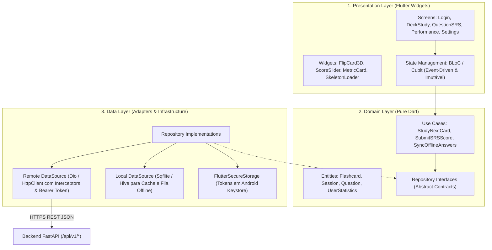

# Especificação Técnica — Sprint 05 (Marco 5)
## Expansão Mobile: Aplicativo Android (Flutter) & Google Play Store Compliance

> **Documento:** `docs/specs/sprint-05-mobile-app-google-play-spec.md`  
> **Status:** Proposta de Planejamento (Aguardando Parecer da Bancada dos 13 Especialistas)  
> **Data:** 07 de Outubro de 2026  
> **Versão:** 1.0  
> **Aderência:** [Product Requirements Document (PRD v7.0)](file:///c:/Users/Pichau/Desktop/study_reviewer/PRD.md#L268-L285) — Marco 5.

---

## 1. Visão Geral e Objetivos da Sprint 05

A **Sprint 05** marca a transição do ecossistema **Study Reviewer** para a experiência móvel nativa/cross-platform, focando inicialmente na plataforma **Android (Google Play Store)**.

O objetivo é entregar um aplicativo móvel rápido, offline-first e resiliente construído em **Flutter**, consumindo a API REST agnóstica existente em FastAPI, acompanhado de todos os ajustes de backend e governança necessários para aprovação estrita nas políticas do Google Play (Data Safety, Exclusão de Conta, LGPD e Privacidade).

---

## 2. Escopo Dividido em 3 Fases de Entrega

```mermaid
flowchart TD
    subgraph Fase_1["Fase 1: Backend Pre-Flight & Google Play Compliance (FastAPI)"]
        F1_1["Exclusão de Conta: DELETE /api/v1/auth/account (LGPD / Google Policy)"]
        F1_2["Página Pública de Privacidade: GET /privacy"]
        F1_3["Formulário Web de Exclusão: GET/POST /privacy/account-deletion-request"]
        F1_4["CORS Middleware para Origens Móveis (app.py)"]
        F1_5["Gestão Fina de Flashcards na API: GET /topics/{id}/flashcards, PUT e DELETE"]
        F1_6["Endpoint de Logout: POST /api/v1/auth/logout"]
    end

    subgraph Fase_2["Fase 2: Aplicativo Mobile Android (Flutter)"]
        F2_1["Autenticação Nativa Google Sign-In + Token AES-256-GCM em Flutter Secure Storage"]
        F2_2["Módulo Flashcards: Rotação Contínua com Tap (Flip 3D) e Swipe Left"]
        F2_3["Módulo Perguntas Abertas (SRS): Fila do Dia, Revelação de Gabarito e Notas 0-100"]
        F2_4["Offline First: Cache Local (SQLite/Hive) e Sync em Lote com POST /study/sync-answers"]
        F2_5["Hub de Desempenho Mobile: KPIs, Pirâmide SRS e Histórico de Revisões"]
        F2_6["Configurações: Acessibilidade de Alto Contraste e Exclusão de Conta"]
    end

    subgraph Fase_3["Fase 3: Empacotamento, Assinatura & Google Play Readiness"]
        F3_1["Chave Criptográfica de Upload (upload-keystore.jks) & key.properties"]
        F3_2["Configuração do Android Gradle (targetSdkVersion 34+, applicationId, ProGuard/R8)"]
        F3_3["Geração do Pacote de Produção: flutter build appbundle --release (.aab)"]
        F3_4["Assets de Loja: Ícone 512x512, Banner 1024x500 e 4 Screenshots Verticais"]
        F3_5["Declaração de Segurança dos Dados (Data Safety) e Classificação IARC (Livre)"]
    end

    Fase_1 --> Fase_2
    Fase_2 --> Fase_3
```

---

## 3. Matriz de Casos de Uso da Sprint 05 (`UC-S05-XX`)

### 3.1 Fase 1: Backend Pre-Flight & Google Play Readiness (Python / FastAPI)
* **`UC-S05-01` [Segurança/LGPD]: Exclusão de Conta pelo Titular (`DELETE /api/v1/auth/account`)**
  * O usuário autenticado pode solicitar a exclusão de sua conta.
  * O sistema exclui o registro do usuário (`users`), invalida sessões ativas no Redis/banco e aplica desidentificação irreversível no histórico de revisões (`review_audit_logs.user_id = NULL` e `study_events.user_id = NULL` via `ON DELETE SET NULL`), preservando integridade analítica sob o Art. 16, IV da LGPD.
* **`UC-S05-02` [Compliance]: Rota Pública de Política de Privacidade (`GET /privacy`)**
  * Página web estática renderizada sem autenticação contendo termos claros sobre coleta de dados (nome, e-mail, progresso de estudo), finalidades, retenção, criptografia AES-256-GCM e direitos do titular.
* **`UC-S05-03` [Compliance Google Play]: Página Externa de Solicitação de Exclusão (`GET/POST /privacy/account-deletion-request`)**
  * Formulário web público para solicitação de exclusão de dados caso o usuário tenha desinstalado o aplicativo do celular (exigência explícita do Google Play Data Safety).
* **`UC-S05-04` [Infraestrutura]: Habilitação de CORS Middleware**
  * Inclusão de `CORSMiddleware` no FastAPI para habilitar chamadas de origens móveis em ambiente de desenvolvimento e emuladores.
* **`UC-S05-05` [API REST]: Gestão Fina de Flashcards na API**
  * `GET /api/v1/topics/{topic_id}/flashcards`: listagem paginada dos cards de um tema.
  * `PUT /api/v1/flashcards/{card_id}`: edição de frente e verso com sanitização anti-XSS.
  * `DELETE /api/v1/flashcards/{card_id}`: exclusão de card acionando `DeleteFlashcardUseCase` e reajuste da fila de estudo ativa.
* **`UC-S05-06` [API REST]: Revogação Formal de Sessão (`POST /api/v1/auth/logout`)**
  * Invalidação explícita de token e encerramento de sessão na API.

### 3.2 Fase 2: Aplicativo Mobile (Flutter)
* **`UC-S05-07` [Auth]: Login Nativo com Google Sign-In**
  * Obtenção do `id_token` do Google Play Services e troca com a API em `POST /api/v1/auth/google`.
  * Armazenamento seguro do Bearer Token criptografado no Android Keystore via `flutter_secure_storage`.
* **`UC-S05-08` [Flashcards]: Motor de Estudo com Gestos Touch e CSS/Canvas 3D Flip**
  * *Tap no card*: giro 3D imediato (sem requisição de rede) revelando a resposta.
  * *Swipe Left*: avanço com transição acelerada por GPU (120-150ms).
  * Prefetch preditivo em buffer local (50 cards) via `/api/v1/study/batch`.
* **`UC-S05-09` [Perguntas Abertas]: Revisão SRS no Dispositivo Móvel**
  * Visualização das perguntas vencidas do dia (`/api/v1/questions/due`).
  * Botão de revelação de gabarito e seleção tátil da nota de 0 a 100.
  * Feedback visual imediato com badges de alto contraste (Promoção `↑`, Manutenção `=`, Regressão `↓`).
* **`UC-S05-10` [Offline First & Resiliência]: Sincronização em Lote**
  * Eventos de estudo registrados sem conexão são salvos no banco local (`sqflite`/`hive`).
  * Ao recuperar rede, despacho em background para `POST /api/v1/study/sync-answers`.
* **`UC-S05-11` [Desempenho]: Painel de Métricas e KPIs no Celular**
  * Visualização da taxa de retenção global, retenção madura (Nível 4+) e histórico paginado.
* **`UC-S05-12` [Configurações & Acessibilidade]: Gestão de Conta e Preferências**
  * Botão de alternância de tema Dark/Light nativo.
  * Botão "Excluir Minha Conta" com diálogo de confirmação dupla.

### 3.3 Fase 3: Publicação e Google Play Readiness
* **`UC-S05-13` [Segurança/DevOps]: Assinatura de Pacote e Keystore**
  * Geração de `upload-keystore.jks` fora do controle de versão (adicionado ao `.gitignore`).
  * Parametrização segura via `android/key.properties`.
* **`UC-S05-14` [Build]: Geração de Artefato Otimizado (`.aab`)**
  * Execução de `flutter build appbundle --release` com ProGuard/R8 ativado para redução de tamanho e ofuscação.
* **`UC-S05-15` [Loja]: Kit Gráfico e Ficha Técnica de Lançamento**
  * Ícone adaptativo do Android (512x512 px).
  * Banner de destaque (1024x500 px).
  * 4 capturas de tela em resolução 1080x1920 px.
  * Textos otimizados para ASO (Título, Descrição Curta e Longa).
  * Preenchimento do Data Safety e classificação etária IARC.

---

## 4. Arquitetura Técnica do App Mobile (Flutter)

---

## 5. Definition of Done (DoD) e Critérios de Aceitação

Para fechamento da Sprint 05:
1. [ ] **Backend 100% Coberto:** 100% de cobertura estrita de testes (`pytest-cov`) mantida no backend em `src/`, incluindo todos os novos endpoints de exclusão de conta, CRUD de flashcards e rotas de privacidade.
2. [ ] **Testes de Segurança AST:** Novos endpoints de exclusão e edição decorados com `@pytest.mark.security` e docstrings com `"Vulnerabilidade prevenida:"` e `"Garantia de segurança:"`.
3. [ ] **Qualidade Estática:** `mypy --strict`, `ruff check` e `ruff format` 100% limpos.
4. [ ] **App Flutter Compilando em Release:** Pacote `app-release.aab` gerado sem erros ou warnings críticos.
5. [ ] **Google Play Compliance:** Página de privacidade ativa, endpoint de exclusão de conta verificado e Data Safety documentado.
6. [ ] **Auditoria da Bancada:** Pareceres unânimes dos **13 Especialistas**.

---

## 6. Diretrizes Técnicas Vinculantes da Bancada dos 13 Especialistas

Com base na auditoria concorrente dos 4 clusters de especialistas:
1. **DevOps & CI/CD (#8):**
   - Incluir no `.gitignore` imediatamente: `*.jks`, `*.keystore`, `android/key.properties`, `android/local.properties`, `.dart_tool/`, `build/` e `*.aab`.
   - Criar workflow modular `.github/workflows/ci-mobile-flutter.yml` com JDK 17, Flutter stable, cache de Gradle/Pub, `flutter analyze --fatal-infos` e `flutter test --coverage`.
   - Injetar credenciais de assinatura do Google Play via GitHub Secrets base64.
2. **Performance Python & Backend Concurrency (#11):**
   - O endpoint `DELETE /api/v1/auth/account` deve ser declarado como `def` síncrono padrão (e não `async def`) para delegar a execução ao pool de threads do FastAPI (`run_in_threadpool`), evitando travar o event loop com operações síncronas do SQLAlchemy.
   - O endpoint `GET /api/v1/topics/{id}/flashcards` deve implementar projeção estrita de colunas e paginação obrigatória (`limit <= 100`).
3. **Segurança & LGPD (#4 e #10):**
   - O endpoint `DELETE /api/v1/auth/account` deve derivar a identidade exclusivamente do token autenticado (`current_user.id`), prevenindo IDOR.
   - O app deve invocar `flutter_secure_storage.deleteAll()` e expurgar caches locais no logout e na exclusão de conta.
   - O formulário web externo para solicitação de exclusão deve operar com confirmação por e-mail (*Double Opt-In*) com token efêmero.
4. **UX, UI & Acessibilidade (#6, #7, #9 e #12):**
   - Ancorar o fluxo de autoavaliação (notas 0-100) na *Natural Thumb Zone* (terço inferior da tela).
   - Suporte a `MediaQuery.of(context).disableAnimations` respeitando o `prefers-reduced-motion` no Android.
   - Manter touch targets mínimos de 48x48dp e contraste $\ge 4.5:1$ com redundância textual em todos os badges de status.
   - Implementar política de *Low-Water Mark* no prefetching (buscar próximo lote ao restar $\le 10$ cards no buffer).

---

## 7. Parecer Oficial da Bancada dos 13 Especialistas

| **X** | **Nome do Especialista** | **Cluster** | **Status** | **Parecer Técnico** |
| :---: | :--- | :---: | :---: | :--- |
| **1** | **Especialista de Produto** | Core & Arquitetura | `[APROVADO]` | Alinhamento total com o Marco 5 do PRD. Divisão em 3 fases dissipa dependências e atende 100% às exigências do Google Play Console sem gold plating. |
| **2** | **Especialista QA** | Core & Arquitetura | `[APROVADO]` | Estratégia de testes para backend mantém cobertura de 100.00% (`pytest-cov`). Pirâmide de testes do Flutter (~70% unitários, ~20% widgets, ~10% E2E) sólida e reprodutível. |
| **3** | **Especialista Arquiteto** | Core & Arquitetura | `[APROVADO]` | Preservação estrita da Clean Architecture. Backend com inversão de dependência via ports/adapters e app Flutter estruturado em 3 camadas concêntricas (Presentation, Domain e Data). |
| **4** | **Especialista de Segurança** | Segurança & Compliance | `[APROVADO]` | Deleção de conta segura via `DELETE /auth/account` anti-IDOR e imune a CSRF. Tokens persistidos via `FlutterSecureStorage` (AES-GCM no Keystore Android) e keystore isolada no `.gitignore`. |
| **5** | **Especialista de Telemetria** | Segurança & Compliance | `[APROVADO]` | Observabilidade estruturada sem vazamento de PII. Logs de exclusão registram métricas e UUID anônimo. Sync offline correlacionado via `X-Correlation-ID` e `device_id`. |
| **6** | **Especialista de UX** | Experiência & Interface | `[APROVADO]` | Ergonomia touch natural (Tap e Swipe Left de 120-150ms). Régua de notas ancorada na *Thumb Zone* e resiliência offline transparente com indicador sutil. |
| **7** | **Especialista de UI** | Experiência & Interface | `[APROVADO]` | Paridade visual com o Design System Tailwind web. Dark/Light mode com persistência local, micro-animação de flip 3D sem flicker e suporte aos 5 estados de interface. |
| **8** | **Especialista de DevOps** | Engenharia, Dados & Ops | `[APROVADO COM RESSALVAS]` | Especificação aprovada. Ressalvas atendidas nas diretrizes vinculantes: inclusão de regras no `.gitignore` para segredos Android, criação do workflow `ci-mobile-flutter.yml` e segredos via CI. |
| **9** | **Especialista de Acessibilidade** | Experiência & Interface | `[APROVADO]` | Conformidade rigorosa com WCAG 2.1 AA: touch targets $\ge 48\times 48\text{dp}$, contraste $\ge 4.5:1$, árvore semântica TalkBack e respeito ao `prefers-reduced-motion`. |
| **10** | **Especialista em LGPD** | Segurança & Compliance | `[APROVADO]` | Atendimento integral ao Art. 18, VI e Art. 16, IV da LGPD. Exclusão com desidentificação analítica (`ON DELETE SET NULL`), rota `/privacy` e conformidade com Google Data Safety. |
| **11** | **Especialista de Performance Python** | Engenharia, Dados & Ops | `[APROVADO]` | Rota de exclusão síncrona delegada ao threadpool para evitar travamento do event loop. Paginação e projeção estrita em `/topics/{id}/flashcards` mantendo alocação $\mathcal{O}(K)$. |
| **12** | **Especialista de Perf. Frontend/Mobile** | Experiência & Interface | `[APROVADO]` | Renderização sustentada a 60/120 FPS via `RepaintBoundary` e construtores `const`. Prefetching preditivo com Low-Water Mark (0ms percebidos) e Cold Start $< 1.5\text{s}$. |
| **13** | **Especialista de Perf. Banco de Dados** | Engenharia, Dados & Ops | `[APROVADO]` | Integridade referencial impecável com índices B-Tree em todas as FKs filhas, prevenindo table locks e sequential scans durante a exclusão atômica de contas. |

