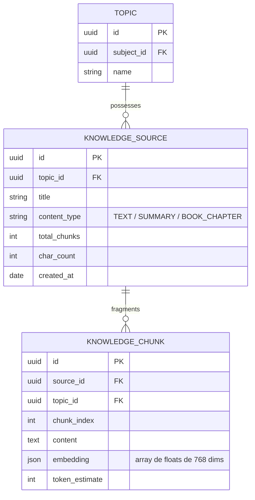

# Especificação Técnica — Sprint 07: Base de Conhecimento RAG, Chunking Semântico & Validação de Questões

> **Sprint:** 07  
> **Marco do PRD:** Marco 7 — Inteligência Artificial & Avaliação Semântica (Fase 2 / Sprint 7)  
> **Status:** Em Execução (TDD)  
> **Cobertura Alvo:** 100% no backend e integração  

---

## 1. Escopo da Sprint 07
A Sprint 07 estabelece a fundação de IA do **Study Reviewer**:
1. **Entidades de Conhecimento**:
   - `KnowledgeSource`: documento cadastrado (livro, resumo, anotação) vinculado a um `topic_id`.
   - `KnowledgeChunk`: fragmentos textuais do documento (512 tokens com 10% de overlap) indexados com embeddings vetoriais.
   - `ValidationResult`: resultado da auditoria de uma questão contra a base do tema (`is_grounded`, `confidence_score`, `evidence_chunks`, `reasoning`, `suggested_improvements`).
2. **Serviços de Domínio Puros**:
   - `SemanticChunkerService`: segmentação inteligente preservando fronteiras de frases, parágrafos e eliminando ruídos.
   - `KnowledgeGroundingService`: cálculo matemático de similaridade por cosseno ($S_C(u, v) = \frac{u \cdot v}{\|u\| \|v\|}$) e ranqueamento determinístico.
3. **Casos de Uso da Aplicação**:
   - `IngestKnowledgeSourceUseCase`: sanitização, chunking, vetorização e persistência atômica.
   - `GetTopicKnowledgeSourcesUseCase`: listagem das fontes do tema com contagem de chunks.
   - `DeleteKnowledgeSourceUseCase`: remoção idempotente de fonte e cascata de chunks.
   - `ValidateQuestionWithKnowledgeUseCase`: validação de prompt e gabarito contra os top-k chunks mais relevantes do tema.
4. **Adaptadores & Infraestrutura**:
   - Modelos relacionais `KnowledgeSourceModel` e `KnowledgeChunkModel`.
   - Repositório `SqlAlchemyKnowledgeRepository` com busca vetorial com filtro estrito `topic_id`.
   - Adaptador `GeminiEmbeddingAdapter` e `GeminiQuestionValidatorAdapter`.
   - Rotas REST `/api/v1/topics/{topic_id}/knowledge` e `/api/v1/topics/{topic_id}/validate-question`.
   - Rotas Web HTMX para gerenciamento no painel do tema.

---

## 2. Diagrama de Entidades & Arquitetura

