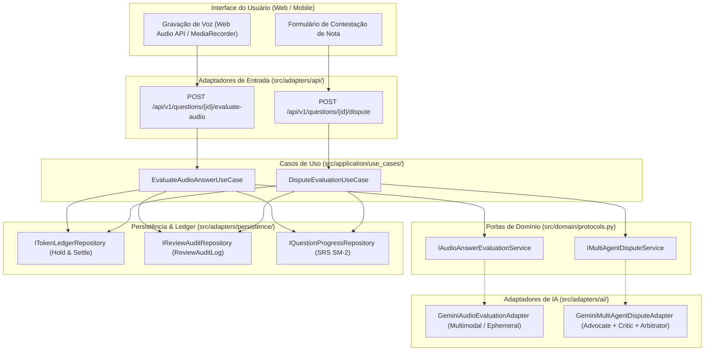

# Especificação Técnica — Sprint 09: Avaliação Multimodal de Áudio & Conselho Multiagente de Contestação (Marco 7 - Fase 4)

## 1. Visão Geral e Objetivos

A Sprint 09 conclui o Marco 7 da plataforma *Study Reviewer*, introduzindo duas capacidades avançadas de Inteligência Artificial:
1. **Avaliação Multimodal de Respostas em Áudio (Voz Efêmera):** Permite que o estudante responda oralmente a questões dissertativas abertas, eliminando o atrito da digitação em dispositivos móveis e enriquecendo a acessibilidade. A voz é tratada de forma estritamente efêmera na memória RAM, sem gravação em disco ou banco de dados, em estrita conformidade com o Art. 16 da LGPD (eliminação imediata de dados biométricos).
2. **Conselho Multiagente de Contestação de Avaliação ("Contestar Avaliação"):** Institui uma câmara de três agentes autônomos com papéis pedagógicos e jurídicos antagônicos (*Student Advocate*, *Factual Critic* e *Arbitrator*) para reavaliar notas contestadas pelo estudante contra as fontes canônicas do tema. Se a contestação for deferida (*UPHELD*), a nota e o agendamento SRS são corrigidos, e a retenção de tokens é estornada ou bonificada.

---

## 2. Arquitetura em Camadas (Clean Architecture)



---

## 3. Requisitos Funcionais & BDD (Gherkin)

### 3.1 Avaliação Multimodal de Áudio
```gherkin
Funcionalidade: Avaliação Multimodal de Resposta em Áudio
  Como estudante no Study Reviewer
  Desejo responder verbalmente a uma questão aberta
  Para treinar oratória, memorização ativa e praticidade em dispositivos móveis

  Cenário: Avaliação com áudio válido e conformidade com privacidade efêmera
    Dado que o estudante possui saldo de pelo menos 800 tokens
    E a pergunta está vencida no motor SRS
    Quando o estudante submete um arquivo de áudio de 15 segundos no formato "audio/webm"
    Então o sistema realiza a retenção preventiva (HOLD) de 800 tokens
    E o adaptador multimodal transcreve efemeramente a resposta e avalia semântica e factualidade
    E os bytes do áudio são expurgados imediatamente da memória (sem persistência em disco ou BD)
    E o sistema liquida (SETTLE) a quantidade exata de tokens consumidos
    E o log de auditoria é gravado com evaluation_mode = "AI_AUDIO"
    E a resposta inclui a transcrição textual, nota ponderada, subscores e feedback pedagógico

  Cenário: Áudio que excede o limite de tamanho permitido (Anti-DoS)
    Dado que o estudante submete um áudio com tamanho superior a 10MB
    Quando o caso de uso valida a requisição
    Então o sistema rejeita com erro de validação (DomainValidationError)
    E nenhum token é retido do livro-razão do usuário
```

### 3.2 Conselho Multiagente de Contestação
```gherkin
Funcionalidade: Conselho Multiagente de Contestação de Avaliação
  Como estudante que discorda de uma nota atribuída pela IA
  Desejo submeter uma contestação fundamentada
  Para que um conselho de agentes reavalie minha resposta contra as fontes canônicas

  Cenário: Contestação Deferida (UPHELD) com revisão de nota e estorno de taxa
    Dado que a resposta do estudante recebeu nota 40 na avaliação inicial
    E o estudante contesta alegando que sua resposta mencionou corrente doutrinária presente nos chunks
    Quando o caso de uso de contestação é acionado
    Então o StudentAdvocateAgent redige o parecer favorável baseado nos chunks
    E o FactualCriticAgent audita a alegação contra as evidências factuais
    E o ArbitratorAgent pondera ambos os pareceres e profere veredito "UPHELD" com nota revisada de 85
    E o agendamento SRS do estudante é recalculado com a nova nota
    E o hold de tokens da contestação é estornado/recompensado ao estudante
    E o ReviewAuditLog registra uma entrada com evaluation_mode = "MULTIAGENT_DISPUTE"

  Cenário: Contestação Improcedente (REJECTED) com manutenção da nota
    Dado que o estudante contesta sem embasamento ou com argumentos falaciosos
    Quando o conselho multiagente delibera
    Então o ArbitratorAgent emite veredito "REJECTED", mantendo a nota anterior
    E os tokens da deliberação da contestação são liquidados definitivamente
```

---

## 4. Segurança, Compliance & LGPD Art. 16

1. **Efemeridade de Áudio & Privacidade Biométrica (LGPD Art. 16):**
   - Áudios de voz constituem dado biométrico quando associados a um indivíduo identificável.
   - O Study Reviewer processa fluxos de áudio exclusivamente em buffers voláteis na memória RAM (`bytes` in-memory).
   - Nenhuma trilha de áudio é gravada em volumes de disco, buckets S3 ou colunas BLOB.
   - O comando `del audio_bytes` e a liberação de referências garantem a desativação imediata após a inferência.
2. **Defesa Anti-Prompt Injection na Contestação:**
   - O texto da contestação do estudante é enclausurado em delimitadores `<dispute_argument_untrusted>`.
   - O *ArbitratorAgent* é estritamente instruído a ignorar ordens de redefinição de nota injetadas pelo usuário, avaliando unicamente a consistência lógica e factual entre a resposta original e as fontes canônicas.
