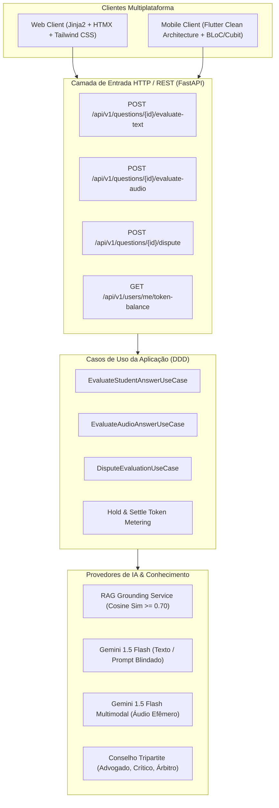
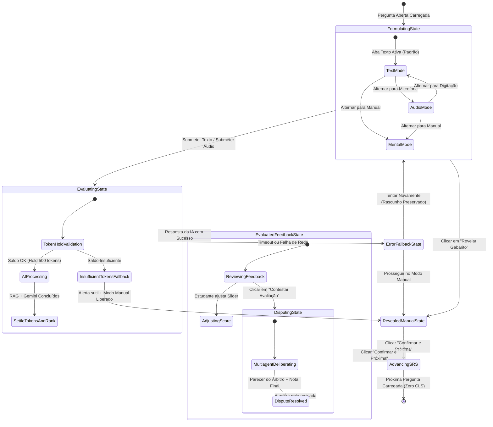

# Especificação Técnica (SPEC) — Avaliação Dissertativa Unificada com IA (Web & Mobile)
## Sprint 10: Interface Dissertativa com IA, Ergonomia Cognitiva e Integração Multiplataforma

> **Documento:** `docs/specs/sprint-10-ai-unified-evaluation-web-mobile-spec.md`  
> **Status:** Aprovado em Auditoria Conjunta (UX, UI, Mobile, AI e QA)  
> **Data:** 09 de Outubro de 2026  
> **Versão:** 1.0 (Aderente ao PRD v9.0 — Marcos 3, 4 e 5)  
> **Arquitetura Base:** Clean Architecture, Domain-Driven Design (DDD), Mobile Clean Architecture (Flutter) e SSR Híbrido (FastAPI + HTMX + Tailwind)

---

## 1. Visão Geral & Objetivos Técnicos

Esta especificação define a implementação das interfaces de usuário e do fluxo de interação para avaliação de respostas dissertativas assistidas por Inteligência Artificial na plataforma **Study Reviewer**, em ambas as frentes **Web** (Desktop/Mobile Web) e **Mobile Nativo** (Flutter Android/iOS).



### 1.1 Metas de Engenharia
1. **Paridade Funcional e Experiência Unificada:** Garantir que o estudante possa responder por **Texto**, por **Voz (Áudio)** ou por **Active Recall Clássico** tanto no navegador quanto no app mobile.
2. **Autonomia do Estudante (*Human-in-the-Loop*):** A IA atua como assistente pedagógica consultiva; a nota final aplicada ao algoritmo SRS (SuperMemo/Anki modificado) é confirmada com supervisão e autonomia do aluno.
3. **Ergonomia e Acessibilidade:** Conformidade estrita com **WCAG 2.1 Nível AA**, alvos de toque móveis $\ge 48\text{ dp}$ (*Thumb Zone*), `resizeToAvoidBottomInset` resiliente no Flutter, atalhos de teclado no Web e suporte a leitores de tela com `aria-live`.
4. **Proteção e Governança:** Blindagem contra injeção de prompt via delimitadores XML não confiáveis, tratamento seguro de áudio efêmero (LGPD Art. 16) e consumo atômico de tokens (Hold de 500 tokens).

---

## 2. Máquina de Estados da Sessão de Revisão

O card de pergunta aberta opera sob uma máquina de estados finita e determinística:



---

## 3. Contratos de Dados & Integração da API REST

A comunicação entre os clientes (Web e Mobile) e o backend segue o padrão RESTful com payload JSON e autenticação via cookie HttpOnly (Web) ou Bearer Token (Mobile).

### 3.1 Avaliação Textual: `POST /api/v1/questions/{id}/evaluate-text`
* **Request:**
  ```json
  {
    "student_answer": "A mitose gera duas células filhas geneticamente idênticas..."
  }
  ```
* **Response (HTTP 200 OK):**
  ```json
  {
    "question_id": "3fa85f64-5717-4562-b3fc-2c963f66afa6",
    "score": 85,
    "feedback": "Excelente domínio dos conceitos de telófase e citocinese. Faltou detalhar a despolimerização do fuso mitótico.",
    "coverage_score": 90,
    "accuracy_score": 85,
    "depth_score": 80,
    "tokens_consumed": 482,
    "remaining_balance": 1518,
    "rag_grounding_applied": true,
    "evaluated_at": "2026-10-09T05:00:00Z"
  }
  ```
* **Erros Mapeados:**
  - `400 Bad Request`: Resposta vazia ou inferior a 3 caracteres.
  - `402 Payment Required`: Saldo de tokens insuficiente (Hold falhou).
  - `404 Not Found`: Pergunta inexistente ou pertencente a outro usuário (Anti-IDOR).
  - `504 Gateway Timeout`: Timeout de IA excedido (reserva estornada automaticamente).

### 3.2 Avaliação por Áudio: `POST /api/v1/questions/{id}/evaluate-audio`
* **Request:** `multipart/form-data` contendo `audio_file` (.webm, .m4a, .wav).
* **Response (HTTP 200 OK):** Mesma estrutura do texto, acrescida do campo `transcribed_text: "..."`.

### 3.3 Deliberação de Contestação: `POST /api/v1/questions/{id}/dispute`
* **Request:**
  ```json
  {
    "student_answer": "...",
    "dispute_argument": "Minha resposta considerou a literatura de Alberts..."
  }
  ```
* **Response (HTTP 200 OK):** Decisão vinculante com `revised_score`, `defense_thesis`, `critique_thesis`, `arbitrator_verdict` e `tokens_refunded`.

---

## 4. Especificação de Frontend Web (`src/adapters/web/`)

### 4.1 Hierarquia de Componentes do Card ([`question_card.html`](file:///c:/Users/Pichau/Desktop/study_reviewer/src/adapters/web/templates/questions/partials/question_card.html))

```
#question-card (Card Raiz com container relativo)
├── Cabeçalho: Taxonomia, SRS Level Badge e Contador (Pergunta N de M)
├── Enunciado: Prompt da Pergunta (Suporte a Markdown seguro)
├── Seletor de Modo de Resposta (Segmented Tabs / Pills):
│   ├── Tab [✍️ Digitar Resposta] (Padrão ativa)
│   ├── Tab [🎙️ Responder por Áudio]
│   └── Tab [💡 Revelar Gabarito (Manual)]
│
├── Painel Dinâmico de Formulação:
│   ├── Painel 1: Bloco de Texto Dissertativo (#text-answer-panel)
│   │   ├── Textarea auto-expansível (min-h-[120px], max-h-[300px])
│   │   ├── Barra de status: Contador de caracteres (0/5.000) e atalho (Ctrl+Enter)
│   │   └── Botão de Ação: "✨ Avaliar Resposta com IA" (#btn-submit-text-eval)
│   │
│   ├── Painel 2: Bloco de Gravação de Áudio (#audio-answer-panel)
│   │   ├── Status do microfone + Timer monoespacado (00:00)
│   │   ├── Botão de Alternância de Gravação (Gravar / Parar / Regravar)
│   │   ├── Player de pré-visualização de áudio gravado
│   │   └── Botão de Ação: "✨ Avaliar Áudio com IA" (#btn-submit-audio-eval)
│   │
│   └── Painel 3: Botão de Revelação Manual Direta (#reveal-action-container)
│
├── Estado de Carregamento da IA (#eval-loading-state - Skeleton Zero CLS)
│
├── Painel de Feedback da IA & Gabarito (#eval-feedback-panel - Unificado)
│   ├── Banner de Nota da IA: Badge de Domínio (ex: 85%) + Saldo Consumido
│   ├── Grade de Subscores (3 cards: Cobertura, Precisão e Profundidade)
│   ├── Transcrição da Fala (se originado de áudio)
│   ├── Caixa de Feedback Pedagógico
│   ├── Gabarito Oficial Revelado (#expected-answer-section)
│   └── Ação Secundária: Botão "⚖️ Contestar Avaliação"
│
└── Painel Inferior de Confirmação SRS (#srs-evaluation-form)
    ├── Presets de Domínio (0%, 25%, 50%, 75%, 100%)
    ├── Slider Sincronizado Bidirecional (0 a 100)
    └── Botão de Confirmação Primária: "Confirmar e Próxima ➔"
```

### 4.2 Requisitos de Acessibilidade (WCAG 2.1 AA)
* **Atalhos Globais:**
  - `Ctrl + Enter` ou `Cmd + Enter`: Submete o texto para avaliação da IA se o textarea estiver focado.
  - `Espaço`: Revela o gabarito no modo manual se nenhum input/textarea estiver em foco.
  - Teclas `1` a `5`: Selecionam instantaneamente os presets 0%, 25%, 50%, 75% e 100%.
  - `Enter` no botão confirmar: Submete a revisão e carrega o próximo card via HTMX.
* **Leitores de Tela:**
  - `#srs-announcer` com `aria-live="polite"` anuncia: *"Avaliação da IA concluída: Nota sugerida 85%. Use o slider para ajustar ou pressione Enter para confirmar."*.
* **Preservação de Rascunho (Resiliência):**
  - O conteúdo do textarea é espelhado no `sessionStorage.setItem('draft_q_' + questionId, text)`. Ao carregar o card ou se houver perda de conexão, o rascunho é restaurado instantaneamente.

---

## 5. Especificação de Mobile Flutter (`mobile/lib/`)

### 5.1 Arquitetura em Camadas (Dart Clean Architecture)

```
mobile/lib/features/srs_questions/
├── data/
│   ├── datasources/
│   │   ├── question_remote_data_source.dart (adiciona evaluateTextQuestion & evaluateAudioQuestion)
│   │   └── question_local_data_source.dart (persistência de rascunhos offline em SQLite)
│   ├── models/
│   │   └── text_evaluation_result_model.dart (JSON serializer/deserializer)
│   └── repositories/
│       └── question_repository_impl.dart
│
├── domain/
│   ├── entities/
│   │   └── text_evaluation_result_entity.dart (imutável, com equatable)
│   ├── repositories/
│   │   └── question_repository.dart
│   └── usecases/
│       ├── evaluate_text_question_usecase.dart
│       └── evaluate_audio_question_usecase.dart
│
└── presentation/
    ├── cubit/
    │   ├── question_srs_cubit.dart (adiciona submitTextEvaluation & adjustEvaluatedScore)
    │   └── question_srs_state.dart (novos estados: Evaluating, Evaluated, Disputing)
    ├── pages/
    │   └── question_srs_page.dart (Layout unificado com Scroll, Thumb Zone e Teclado)
    └── widgets/
        ├── question_answer_mode_tabs.dart (Tabs horizontais: Texto, Áudio, Gabarito)
        ├── question_text_input_area.dart (TextField expansível com contador)
        ├── evaluation_feedback_card.dart (Card visual de nota, subscores e feedback)
        ├── subscore_progress_bar.dart (Barra animada para Cobertura/Precisão/Profundidade)
        └── dispute_bottom_sheet.dart (Modal deslizante inferior para contestação)
```

### 5.2 Ergonomia Mobile & Diretrizes de Teclado
* **Gestão de Teclado Virtual:** O `Scaffold` utiliza `resizeToAvoidBottomInset: true` em conjunto com `SingleChildScrollView(physics: BouncingScrollPhysics())`, garantindo que quando o teclado subir, o campo de digitação e o botão de envio permaneçam visíveis e acessíveis sem causar `RenderFlex overflow`.
* **Touch Targets na Área do Polegar (*Thumb Zone*):** Todos os botões interativos (`btn-submit`, presets de pontuação, botões de avanço) possuem altura mínima de **48 dp** e margens adequadas.
* **Feedback Háptico:**
  - `HapticFeedback.lightImpact()` ao alternar abas de resposta.
  - `HapticFeedback.mediumImpact()` ao receber a resposta da IA.
  - `HapticFeedback.selectionClick()` ao alterar valores no slider ou presets.

---

## 6. Tratamento de Exceções & Casos de Borda

| Cenário de Erro | Comportamento no Backend | Comportamento no Web / Mobile | Ação do Estudante |
| :--- | :--- | :--- | :--- |
| **Saldo de Tokens Insuficiente** | Retorna HTTP `402 Payment Required` com `{"detail": "INSUFFICIENT_FUNDS"}` | Banner sutil amarelo: *"Seu saldo de tokens terminou. Você pode continuar revisando no modo manual ou recarregar tokens."* | Continua o estudo sem atrito no modo manual ou clica no link de recarga. |
| **Timeout da IA (> 15s)** | O worker aborta a chamada, desfaz o Hold de tokens (estorno total) e loga evento de auditoria | Alerta informativo: *"A IA demorou para responder. Seu saldo não foi debitado e seu rascunho está intacto."* | Pode clicar em *"Tentar Novamente"* ou *"Revelar Gabarito Agora"*. |
| **Tentativa de Injeção de Prompt** | Tag `<student_answer_untrusted>` neutraliza a instrução e o prompt do sistema instrui ignorar desvios | A resposta é avaliada apenas pelo critério técnico ou classificada como evasiva com feedback pontual | A nota reflete estritamente a falta de conteúdo técnico frente ao gabarito. |
| **Conexão Offline no Mobile** | Erro de conexão detectado no Dio interceptor | Banner de offline com botão para salvar rascunho localmente no SQLite | Estudante pode alternar para o modo manual offline ou aguardar reconexão. |

---

## 7. Critérios de Aceite & Checklist de Definição de Concluído (DoD)

1. [ ] **Cobertura de Código:** 100.00% de cobertura em testes unitários e de integração (FastAPI) e 100% de testes passando no Flutter.
2. [ ] **Paridade de Plataforma:** O estudante consegue digitar uma resposta textual e receber avaliação por IA tanto no navegador (Web) quanto no app Flutter (Mobile).
3. [ ] **Human-in-the-Loop:** A nota final gravada no histórico SRS pode ser ajustada pelo estudante após a avaliação da IA.
4. [ ] **Preservação de Dados:** Nenhum rascunho de texto é perdido em caso de fechamento acidental ou erro de rede.
5. [ ] **Acessibilidade:** Navegação completa por teclado (Web) e leitores de tela compatíveis (TalkBack/VoiceOver e NVDA/JAWS).
