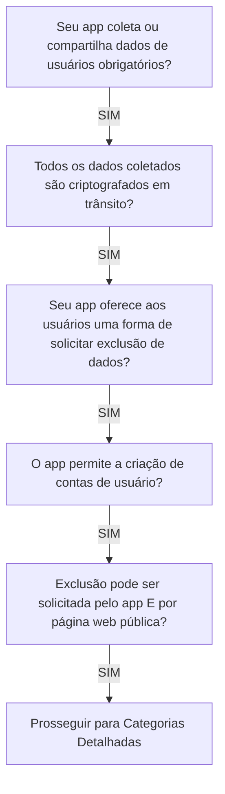

# Guia de Preenchimento da Seção de Segurança dos Dados (Data Safety)
## Google Play Console — Study Reviewer Mobile

> **Documento:** `docs/store/data-safety-checklist.md`  
> **Versão:** 1.0.0  
> **Data:** 07 de Outubro de 2026  
> **Pacote Android:** `com.studyreviewer.app`  
> **Aderência Regulatória:** Google Play Developer Policy, LGPD (Lei 13.709/2018) e GDPR (Regulamento UE 2016/679).  
> **Links Vinculados:**  
> - [Política de Privacidade Pública](https://studyreviewer.com/privacy)  
> - [Formulário Web de Exclusão](https://studyreviewer.com/privacy/account-deletion-request)  
> - [Especificação da Sprint 05](file:///c:/Users/Pichau/Desktop/study_reviewer/docs/specs/sprint-05-mobile-app-google-play-spec.md)

---

## 1. Visão Geral da Política de Segurança dos Dados da Google Play

A Google Play Store exige que todos os desenvolvedores declarem formalmente no **Google Play Console** como seus aplicativos coletam, compartilham e protegem os dados dos usuários.

O **Study Reviewer** adota uma arquitetura de **Privacidade por Design (Privacy by Design)**:
1. **Nenhum dado é vendido ou compartilhado com terceiros** (sem redes de publicidade, corretores de dados ou rastreadores de marketing).
2. **Coleta Estritamente Funcional:** Todos os dados coletados têm como propósito exclusivo a autenticação do usuário, o cálculo matemático do algoritmo de repetição espaçada (SRS [1..180d]) e a integridade de sincronização offline.
3. **Criptografia de Ponta a Ponta:** Criptografia em trânsito (HTTPS / TLS 1.3) e em repouso no dispositivo móvel (AES-256-GCM via Android Keystore).
4. **Mecanismo Duplo de Exclusão:** Exclusão nativa no app e formulário web público externo para usuários que desinstalaram o aplicativo.

---

## 2. Formulário Passo a Passo: Perguntas Preliminares (Overview)

Ao abrir o **Google Play Console > Política do app > Segurança dos dados**, responda às perguntas preliminares da seguinte forma:



### 2.1 Respostas Exatas do Questionário Preliminar:

| Pergunta do Google Play Console | Resposta | Justificativa Técnica / Documentação |
| :--- | :---: | :--- |
| **O seu app coleta ou compartilha algum dos tipos de dados do usuário obrigatórios?** | **SIM** | O app coleta dados cadastrais (nome, e-mail) para autenticação e telemetria de estudo (respostas SRS). |
| **Todos os dados de usuários coletados pelo seu app são criptografados em trânsito?** | **SIM** | Todo tráfego de rede entre o app Flutter e o backend FastAPI trafega exclusivamente por `HTTPS` com protocolo **TLS 1.3 / TLS 1.2**. |
| **O seu app fornece uma forma para os usuários solicitarem a exclusão dos dados deles?** | **SIM** | Oferecemos exclusão direta no app (`DELETE /api/v1/auth/account`) e formulário web externo (`/privacy/account-deletion-request`). |
| **O seu app permite que os usuários criem uma conta?** | **SIM** | Autenticação via Google Sign-In (OAuth2 / OIDC). |
| **Como os usuários podem solicitar a exclusão da conta?** | **No app E na web** | Em conformidade com a política obrigatória da Google Play para apps com criação de conta. |
| **URL do formulário de exclusão de conta na Web:** | `https://studyreviewer.com/privacy/account-deletion-request` | Página pública externa que não exige login prévio caso o app já tenha sido desinstalado. |
| **Os dados são excluídos totalmente ou retidos de forma desidentificada?** | **Excluídos / Anonimizados** | Registros de identificação são excluídos de imediato; logs históricos passam por `SET NULL` (anonimização per LGPD Art. 16, IV). |

---

## 3. Matriz Completa de Tipos de Dados Coletados

Navegue pela lista de categorias no Console e marque estritamente os campos detalhados abaixo:

### 3.1 Categoria: Informações Pessoais (Personal Info)

#### A. Nome (Name)
* **Coletado:** Sim
* **Compartilhado com terceiros:** Não
* **Processamento temporário (efêmero):** Não (persistido na conta do usuário)
* **Dado obrigatório ou opcional:** Obrigatório para contas autenticadas em nuvem
* **Finalidades da coleta (Marque no Console):**
  - [x] **Funcionalidade do app (`App functionality`):** Exibição do nome e avatar no cabeçalho do perfil e histórico de estudos.
  - [x] **Gerenciamento de contas (`Account management`):** Identificação cadastral do titular da conta.

#### B. Endereço de e-mail (Email address)
* **Coletado:** Sim
* **Compartilhado com terceiros:** Não
* **Processamento temporário (efêmero):** Não (chave única de identificação)
* **Dado obrigatório ou opcional:** Obrigatório para contas autenticadas em nuvem
* **Finalidades da coleta (Marque no Console):**
  - [x] **Funcionalidade do app (`App functionality`):** Comunicação de segurança e vínculo com sessões de estudo.
  - [x] **Gerenciamento de contas (`Account management`):** Chave primária de autenticação via Google OAuth2 e recuperação/exclusão de conta.

---

### 3.2 Categoria: Atividade no App (App Activity)

#### A. Interações no app (App interactions)
* **Dados envolvidos:** Eventos de revisão de flashcards, tempo de resposta, respostas em texto e notas de autoavaliação (0 a 100).
* **Coletado:** Sim
* **Compartilhado com terceiros:** Não
* **Processamento temporário (efêmero):** Não (armazenado para cálculo do algoritmo de espaçamento)
* **Dado obrigatório ou opcional:** Obrigatório para o funcionamento do motor de estudo
* **Finalidades da coleta (Marque no Console):**
  - [x] **Funcionalidade do app (`App functionality`):** Alimentar o motor de repetição espaçada (SRS [1..180d]) e o algoritmo de rotação de pool (Gap Indexing). Sem esses dados, o app não consegue calcular as datas das próximas revisões.
  - [x] **Análise (`Analytics`):** Geração dos gráficos de retenção e pirâmide de maturidade de conhecimento no Hub de Desempenho.

---

### 3.3 Categoria: Informações e Desempenho do App (App Info and Performance)

#### A. Registros de falhas (Crash logs)
* **Dados envolvidos:** Stack traces de exceções em tempo de execução capturadas pelo Flutter Engine e interceptors do Dio.
* **Coletado:** Sim
* **Compartilhado com terceiros:** Não
* **Processamento temporário (efêmero):** Sim (utilizado para diagnóstico e depuração)
* **Dado obrigatório ou opcional:** Obrigatório para garantia de qualidade
* **Finalidades da coleta (Marque no Console):**
  - [x] **Análise (`Analytics`):** Monitoramento de estabilidade e detecção precoce de falhas (ANRs e crashes).
  - [x] **Funcionalidade do app (`App functionality`):** Diagnóstico de problemas de sincronização offline.

#### B. Diagnósticos (Diagnostics)
* **Dados envolvidos:** Latência de chamadas à API, tempos de sincronização de lote e métricas de desempenho de renderização local.
* **Coletado:** Sim
* **Compartilhado com terceiros:** Não
* **Processamento temporário (efêmero):** Sim
* **Finalidades da coleta (Marque no Console):**
  - [x] **Análise (`Analytics`):** Otimização da infraestrutura e vazão do endpoint `/study/sync-answers`.

---

### 3.4 Categoria: Dispositivos ou Outros Identificadores (Device or Other IDs)

#### A. ID do dispositivo ou outros identificadores (Device or other IDs)
* **Dados envolvidos:** `device_id` pseudoaleatório (UUIDv4) gerado na primeira inicialização do app móvel.
* **Coletado:** Sim
* **Compartilhado com terceiros:** Não
* **Processamento temporário (efêmero):** Não (persistido no armazenamento local criptografado)
* **Dado obrigatório ou opcional:** Obrigatório para a sincronização offline
* **Finalidades da coleta (Marque no Console):**
  - [x] **Funcionalidade do app (`App functionality`):** Desduplicação de eventos durante a sincronização em lote (`POST /api/v1/study/sync-answers`) e resolução determinística de conflitos de concorrência quando o usuário estuda em múltiplos dispositivos.
  - [x] **Prevenção contra fraudes, segurança e conformidade (`Fraud prevention, security, and compliance`):** Rastreabilidade de sessões ativas e invalidação atômica de tokens em caso de revogação de credenciais.

---

## 4. Práticas de Segurança e Proteção Criptográfica

Na seção final do formulário, confirme os seguintes compromissos técnicos da arquitetura:

```
┌────────────────────────────────────────────────────────────────────────┐
│                        CAMADAS DE SEGURANÇA                            │
├──────────────────────────────────┬─────────────────────────────────────┤
│      CRIPTOGRAFIA EM TRÂNSITO    │        CRIPTOGRAFIA EM REPOUSO      │
│  • Protocolo: TLS 1.3 / HTTPS     │  • Mobile: AES-256-GCM (Keystore)   │
│  • HSTS (Strict-Transport-Sec)   │  • Tokens: FlutterSecureStorage     │
│  • Certificados SSL X.509 A+     │  • Servidor: Volumes Criptografados │
└──────────────────────────────────┴─────────────────────────────────────┘
```

### 4.1 Criptografia em Trânsito (Data in Transit)
* **Implementação:** Toda e qualquer comunicação entre os clientes móveis e os servidores da aplicação utiliza exclusivamente protocolos criptográficos seguros (TLS 1.2 e TLS 1.3). Conexões HTTP em texto puro são terminantemente rejeitadas com redirecionamento forçado para HTTPS e cabeçalho `Strict-Transport-Security` (HSTS).

### 4.2 Criptografia em Repouso (Data at Rest)
* **No Dispositivo Android:** 
  * Chaves e tokens de autenticação Bearer são armazenados através do `flutter_secure_storage`, que delega a proteção criptográfica ao **Android Keystore**, utilizando cifra simétrica **AES-256-GCM** com chaves geradas em hardware seguro (TEE / Secure Element).
  * O cache local de questões e eventos de estudo pendentes é mantido em sandbox isolada da aplicação (`/data/data/com.studyreviewer.app/`), inacessível por outros aplicativos sem privilégios de root.
* **No Servidor / Banco de Dados:**
  * O PostgreSQL corporativo opera sobre volumes criptografados em repouso (AES-256).

---

## 5. Política e Mecanismos de Exclusão de Dados (Account & Data Deletion)

Para cumprir a exigência rigorosa da Google Play Store (em vigor desde 2024 para aplicativos que exigem login), o Study Reviewer disponibiliza dois caminhos transparentes:

### 5.1 Caminho 1: Exclusão Direta no Aplicativo (In-App)
1. O usuário autenticado navega em:  
   `Configurações (Settings) > Minha Conta > Excluir Minha Conta`.
2. Um diálogo modal com duplo fator de confirmação alerta sobre a irreversibilidade do procedimento.
3. Ao confirmar, o app dispara a requisição autenticada:  
   `DELETE /api/v1/auth/account`
4. **Comportamento do Sistema:**
   - O registro do usuário na tabela `users` é sumariamente expurgado (`HARD DELETE`).
   - Sessões ativas em cache/Redis são imediatamente invalidadas.
   - O app executa `flutter_secure_storage.deleteAll()`, limpa o banco de dados local SQLite/SharedPreferences e redireciona para a tela de boas-vindas.
   - **Retenção Analítica sob a LGPD (Art. 16, IV):** As linhas de auditoria de revisão (`review_audit_logs`) e eventos de estudo (`study_events`) têm o campo `user_id` atualizado para `NULL` via integridade referencial `ON DELETE SET NULL`, preservando estatísticas globais desidentificadas sem qualquer elo com a pessoa física titular.

### 5.2 Caminho 2: Formulário Web Externo (Public Web Deletion Form)
Exigido pela Google Play para possibilitar a exclusão caso o usuário já tenha desinstalado o aplicativo do smartphone:

* **URL Pública:** `https://studyreviewer.com/privacy/account-deletion-request`
* **Fluxo de Confirmação Segura (Double Opt-In):**
  1. O titular informa seu endereço de e-mail cadastrado.
  2. O backend gera um token criptográfico efêmero com validade de 15 minutos e envia um link de confirmação para o e-mail informado.
  3. O usuário clica no link e confirma a exclusão no navegador.
  4. O sistema processa o expurgo idêntico ao fluxo in-app e envia recibo de encerramento da conta.

---

## 6. Tabela-Resumo para Validação Antes do Envio

| Seção do Console | Campo Selecionado | Valor |
| :--- | :--- | :--- |
| **Coleta de Dados** | O app coleta dados? | **Sim** |
| **Compartilhamento** | O app compartilha dados com terceiros? | **Não (0 compartilhamentos)** |
| **Criptografia** | Em trânsito? | **Sim (TLS 1.3 / HTTPS)** |
| **Exclusão de Conta** | Oferece exclusão in-app? | **Sim (`Configurações > Excluir`)** |
| **Exclusão Web** | URL externa pública informada? | **`https://studyreviewer.com/privacy/account-deletion-request`** |
| **Informações Pessoais** | Nome e E-mail | **Coletados para Gestão de Conta e Funcionalidade** |
| **Atividade no App** | Interações e progresso de estudo | **Coletados para Funcionalidade (SRS) e Análise** |
| **Desempenho** | Crash logs e Diagnósticos | **Coletados para Análise e Qualidade** |
| **Identificadores** | ID de Dispositivo (`device_id`) | **Coletado para Sincronização e Prevenção a Fraude** |

---

## 7. Instruções para os Revisores da Google Play (App Access Credentials)

Na seção **Acesso ao app** do Google Play Console, cadastre as credenciais de teste com as seguintes informações:

* **Nome da Credencial:** `Google Play Review Test Account`
* **Nome de Usuário / E-mail:** `google-reviewer@studyreviewer.com`
* **Senha:** `<SENHA_CONFIGURADA_NO_SECRETS_STORE>`
* **Instruções Adicionais para o Revisor:**
  > "O aplicativo permite autenticação de demonstração utilizando o e-mail informado acima. Ao entrar, o revisor terá acesso imediato à rotação contínua de flashcards, fila diária de perguntas abertas SRS, gráficos de retenção no Hub de Desempenho e configurações de conta com exclusão sob demanda."
