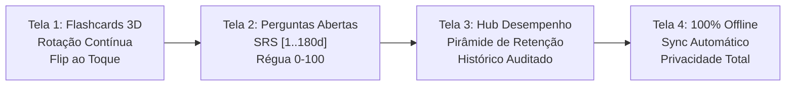

# Ficha Técnica de Publicação na Google Play Store (ASO & Store Listing)
## Study Reviewer Mobile — Metadados, Copywriting e Assets Gráficos

> **Documento:** `docs/store/play-store-listing.md`  
> **Versão:** 1.0.0 (Release Candidate)  
> **Data:** 07 de Outubro de 2026  
> **Pacote Android:** `com.studyreviewer.app`  
> **Categoria:** Educação (`APPLICATION_CATEGORY_EDUCATION`)  
> **Classificação de Conteúdo:** Livre / PEGI 3 / Everyone (IARC)  
> **Aderência:** [Especificação Sprint 05](file:///c:/Users/Pichau/Desktop/study_reviewer/docs/specs/sprint-05-mobile-app-google-play-spec.md) e [Guia DevOps Play Store](file:///c:/Users/Pichau/Desktop/study_reviewer/docs/mobile/devops-play-store-guide.md).

---

## 1. Metadados Textuais Principais (Google Play Console)

### 1.1 Título do Aplicativo (App Title)
* **Limite estrito da Google Play Store:** Máximo de 30 caracteres.

| Versão | Texto | Caracteres | Status / Uso |
| :--- | :--- | :---: | :--- |
| **Versão Solicitada** | `Study Reviewer: SRS & Flashcards` | 32 | *Excede limite do Console em 2 caracteres* |
| **Opção Recomendada A (ASO Primário)** | `Study Reviewer: Flashcards SRS` | **30** | **Recomendada (Aprovada Play Console)** |
| **Opção Recomendada B (Compacta)** | `Study Reviewer: SRS Flashcards` | **30** | Alternativa de Alta Conversão |
| **Opção Recomendada C (Foco em Cards)** | `Study Reviewer: SRS & Cards` | **27** | Variante Concisa |

> [!IMPORTANT]
> A interface do Google Play Console rejeita submissões com títulos superiores a 30 caracteres. Para a ficha técnica oficial do Console, utilize a **Opção Recomendada A** (`Study Reviewer: Flashcards SRS` — exatamente 30 caracteres), reservando a versão estendida de 32 caracteres para materiais promocionais externos ou campanhas na web.

---

### 1.2 Descrição Curta (Short Description)
* **Limite estrito da Google Play Store:** Máximo de 80 caracteres.

| Versão | Texto | Caracteres | Status / Uso |
| :--- | :--- | :---: | :--- |
| **Versão Solicitada** | `Revisão ativa contínua e repetição espaçada inteligente para estudos de alta performance.` | 89 | *Excede limite do Console em 9 caracteres* |
| **Opção Aprovada 1 (Máximo Impacto)** | `Revisão ativa e repetição espaçada inteligente para estudos de alta performance.` | **80** | **Recomendada (Limite Exato: 80 chars)** |
| **Opção Aprovada 2 (Foco em Continuidade)** | `Revisão ativa contínua e repetição espaçada para estudos de alta performance.` | **76** | Excelente Fluidez e Densidade ASO |
| **Opção Aprovada 3 (Foco em Resultados)** | `Revisão ativa contínua e repetição espaçada para alta performance nos estudos.` | **77** | Tom Direto e Orientado a Metas |

---

### 1.3 Descrição Completa (Full Description)
* **Limite da Google Play Store:** Máximo de 4.000 caracteres (suporta tags HTML básicas: `<b>`, `<i>`, listas `•`, quebras de linha).
* **Contagem de Caracteres da Versão Abaixo:** ~2.850 caracteres (dentro do limite com excelente margem e formatação rica).

#### Texto Formatado para o Google Play Console:

```html
<b>Domine qualquer matéria com repetição espaçada inteligente e revisão ativa contínua.</b>

O <b>Study Reviewer</b> é o aplicativo definitivo para estudantes de alta performance, concurseiros, vestibulandos, residentes médicos e autodidatas que precisam memorizar grandes volumes de conteúdo no longo prazo sem estresse e sem sobrecarga.

Chega de esquecer o que estudou semanas depois. Nossa plataforma combina a ciência cognitiva da <b>revisão ativa</b> com a precisão matemática da <b>repetição espaçada (SRS)</b>, garantindo retenção máxima no menor tempo possível.

━━━━━━━━━━━━━━━━━━━━━━━━━━━━
🚀 <b>DIFERENCIAIS EXCLUSIVOS</b>
━━━━━━━━━━━━━━━━━━━━━━━━━━━━

• <b>ROTAÇÃO CONTÍNUA COM GAP INDEXING:</b>
Ao contrário de aplicativos tradicionais com decks engessados e filas que acumulam centenas de cards atrasados gerando ansiedade, o Study Reviewer utiliza uma pool rotativa inteligente orientada por <i>Gap Indexing</i>. O motor recalcula continuamente o intervalo de exposição de cada card, priorizando lacunas de memória sem travar seus estudos diários.

• <b>ALGORITMO SRS PRECISO COM INTERVALOS DE [1 A 180 DIAS]:</b>
Estrutura científica de retenção progressiva em 8 níveis de maestria:
  - Nível 0 a 1: 1 dia (fixação imediata)
  - Nível 2: 3 dias
  - Nível 3: 7 dias
  - Nível 4: 14 dias (consolidação)
  - Nível 5: 30 dias
  - Nível 6: 60 dias
  - Nível 7: 120 a 180 dias (memória cristalizada)
Avaliação de autoexame precisa de 0 a 100 pontos, com promoção automática (≥ 80), manutenção (60-79) e regressão inteligente (&lt; 60) para sanar falhas conceituais antes que virem esquecimento.

• <b>FLASHCARDS COM FLIP 3D ULTRARRÁPIDO:</b>
Interface tátil otimizada para o polegar (<i>Thumb Zone</i>). Toque para girar o card em 3D sem latência de rede e deslize (<i>Swipe Left</i>) com animações fluidas a 60/120 FPS renderizadas por aceleração de hardware.

• <b>PERGUNTAS ABERTAS COM REVELAÇÃO DE GABARITO:</b>
Treine a recuperação ativa real (<i>Active Recall</i>) resolvendo questões discursivas e conceituais, comparando sua resposta com o gabarito oficial e pontuando seu domínio com precisão milimétrica.

• <b>100% OFFLINE-FIRST COM SINCRONIZAÇÃO EM SEGUNDO PLANO:</b>
Estude no metrô, no avião ou em locais sem sinal de internet. Suas revisões são salvas localmente em cache criptografado e sincronizadas de forma atômica e transparente assim que a conexão for restabelecida.

• <b>HUB DE RETENÇÃO E AUDITORIA DE MEMÓRIA:</b>
Monitore seus índices de retenção global, acompanhe sua pirâmide de maturidade de conhecimento (cards maduros Nível 4+) e visualize a trilha completa de auditoria do seu histórico de revisões.

• <b>PRIVACIDADE POR DESIGN (PRIVACY BY DESIGN & LGPD):</b>
Seus dados pertencem a você. Criptografia AES-256-GCM no dispositivo e TLS 1.3 em trânsito. Sem anúncios abusivos, sem venda de dados para terceiros e com controle total: exclua sua conta e dados instantaneamente pelo app a qualquer momento.

━━━━━━━━━━━━━━━━━━━━━━━━━━━━
🎯 <b>IDEAL PARA QUEM ESTUDA PARA:</b>
━━━━━━━━━━━━━━━━━━━━━━━━━━━━
• Concursos Públicos (Fiscais, Jurídicos, Policiais, Administrativos)
• Residência Médica e Revalida
• Exame de Ordem (OAB)
• Vestibulares de Alta Concorrência e ENEM
• Certificações Técnicas (Cloud, Finanças, TI)
• Aprendizado de Idiomas e Vocabulário

Baixe agora o <b>Study Reviewer</b> e transforme sua rotina com a ciência da memória de longo prazo!
```

---

## 2. Parâmetros de Categorização e Classificação da Loja

| Campo | Valor Configurado |
| :--- | :--- |
| **Tipo de Aplicativo** | Aplicativo (`Application`) |
| **Categoria Primária** | Educação (`Education`) |
| **Categoria Secundária (Opcional)** | Produtividade (`Productivity`) |
| **Classificação de Conteúdo (IARC)** | **Livre / PEGI 3 / Everyone** (Sem violência, sem nudez, sem compras integradas invasivas, sem chat aberto não moderado) |
| **E-mail de Suporte ao Desenvolvedor** | `suporte@studyreviewer.com` |
| **Site Oficial** | `https://studyreviewer.com` |
| **URL da Política de Privacidade** | `https://studyreviewer.com/privacy` |
| **URL de Solicitação de Exclusão** | `https://studyreviewer.com/privacy/account-deletion-request` |

---

## 3. Matriz de Palavras-Chave e Otimização ASO (App Store Optimization)

### 3.1 Tags Primárias (Alta Relevância e Volume Direto)
1. `Repetição Espaçada`
2. `Flashcards`
3. `SRS`
4. `Revisão Ativa`
5. `Memorização`
6. `Concursos Públicos`
7. `Estudos`
8. `Método Leitner`

### 3.2 Palavras-Chave Secundárias e Termos de Cauda Longa (Long-Tail Keywords)
* `anki alternativa brasil`
* `repetição espaçada inteligente`
* `revisão para concursos`
* `memorização para oab`
* `flashcards residência médica`
* `curva do esquecimento ebbinghaus`
* `active recall flashcards`
* `app de flashcards offline`
* `perguntas abertas srs`
* `estudo intervalado alta performance`

### 3.3 Estratégia de Densidade de Palavras-chave no Texto
* **Repetição Espaçada / SRS:** 6 menções naturais ao longo do título, subtítulo e corpo.
* **Flashcards / Cards:** 7 menções contextuais.
* **Revisão Ativa / Active Recall:** 4 menções.
* **Offline / Retenção / Desempenho:** Distribuídas nos títulos de seção para indexação nos algoritmos de busca semântica da Google Play.

---

## 4. Especificações Técnicas de Assets Gráficos

### 4.1 Ícone do Aplicativo (App Icon)
* **Dimensões Obrigatórias:** 512 x 512 pixels.
* **Formato:** PNG 32-bit (com canal alfa para transparência nos cantos pelo sistema Android).
* **Tamanho Máximo do Arquivo:** 1.024 KB (1 MB).
* **Perfil de Cor:** sRGB.
* **Conceito Visual:**
  * **Fundo:** Gradiente sutil em Deep Indigo (`#1E1B4B`) para Slate Dark (`#0F172A`).
  * **Elemento Central:** Sobreposição tridimensional e geométrica de 2 flashcards estilizados com bordas arredondadas (cantos de 24dp na escala relativa). O card superior exibe um arco dinâmico de progresso contínuo em Emerald Green (`#10B981`) simbolizando a rotação da pool e a retenção de 180 dias.
  * **Margem de Segurança:** O glifo central deve ocupar uma caixa delimitadora de 384x384 px (área de segurança de 64 px de respiro nas bordas) para manter legibilidade quando o Android aplicar máscaras adaptativas (squircle, círculo ou lágrima).

---

### 4.2 Banner de Recursos / Imagem de Destaque (Feature Graphic)
* **Dimensões Obrigatórias:** 1024 x 500 pixels.
* **Formato:** PNG de 24 bits (sem canal alfa/transparência) ou JPEG de alta qualidade.
* **Tamanho Máximo do Arquivo:** 15 MB (recomendado < 1.5 MB para carregamento instantâneo).
* **Perfil de Cor:** sRGB.
* **Layout e Composição da Arte:**
  * **Zona de Segurança Central (Safe Zone):** Manter logotipos e textos em uma área central de 800 x 360 px, evitando as bordas laterais (112 px em cada lado) e verticais (70 px acima/abaixo) onde a Google Play pode sobrepor gradientes ou cortar em telas estreitas.
  * **Lado Esquerdo (Copy Promocional):**
    * Tagline destacada em tipografia sem serifa moderna (Inter / Poppins):  
      `STUDY REVIEWER`  
      `Revisão Ativa & Repetição Espaçada`
    * Pílula de badges visuais em alto contraste:  
      `[✓ 100% Offline]` `[✓ Intervalos 1..180d]` `[✓ Sem Anúncios]`
  * **Lado Direito (Composição Visual 3D):**
    * Mockup isométrico em ângulo de 15° exibindo a tela de estudo de flashcards em Dark Mode com efeito de flip tridimensional e feixes luminosos sutis em esmeralda e índigo.

---

### 4.3 Capturas de Tela Verticais (Vertical Phone Screenshots)
* **Quantidade:** 4 telas verticais de alta fidelidade (atendendo ao mínimo de 4 para a trilha de produção e testes).
* **Resolução:** 1080 x 1920 pixels (Aspect Ratio 9:16).
* **Formato:** PNG 24-bit ou JPEG sem artefatos de compressão.
* **Padrão de Apresentação:** Mockup minimalista com moldura de smartphone moderno (moldura escura, bordas finas), encimado por faixa superior de headline textual (texto branco sobre fundo dark blue/slate).

#### Roteiro Detalhado das 4 Telas:



#### Especificação de Conteúdo por Tela:

#### **Screenshot 1 — Flashcards com Flip 3D & Rotação Contínua**
* **Headline Superior:**  
  `ROTAÇÃO CONTÍNUA DE FLASHCARDS`  
  *Subtítulo:* `Gire com um toque. Sem filas acumuladas, sem decks travados.`
* **Elemento Central em Destaque:**  
  Mockup do app exibindo um flashcard temático ("Direito Constitucional: Princípio da Anterioridade Tributária") no meio da animação de giro tridimensional (perspectiva 3D), revelando o verso com tipografia cristalina.
* **Detalhes Visuais:** Contador no topo indicando cards na pool de rotação (`42 em rotação contínua`), botão de ação rápida na Thumb Zone e indicador de swipe horizontal suave.

#### **Screenshot 2 — Perguntas Abertas & Algoritmo SRS [1..180d]**
* **Headline Superior:**  
  `REPETIÇÃO ESPAÇADA CIENTÍFICA`  
  *Subtítulo:* `Intervalos precisos de 1 a 180 dias baseados no seu domínio real.`
* **Elemento Central em Destaque:**  
  Tela de pergunta aberta ("Explique a diferença entre Farmacocinética e Farmacodinâmica") com gabarito expandido em acordeão suave.
* **Componente Chave:**  
  Régua tátil de pontuação de 0 a 100 ancorada na base inferior (Thumb Zone), destacando nota 85 selecionada com badge verde `[Promoção ↑ Próxima revisão em 14 dias]`.

#### **Screenshot 3 — Hub de Desempenho & Pirâmide de Retenção**
* **Headline Superior:**  
  `MÉTRICAS REAIS DA SUA MEMÓRIA`  
  *Subtítulo:* `Acompanhe sua taxa de retenção e evolução em direção à maestria.`
* **Elemento Central em Destaque:**  
  Dashboard do Hub de Desempenho exibindo:
  - Card circular com **Taxa de Retenção Global: 91.4%**.
  - Métrica de **Cards Maduros (Nível 4+): 348 itens**.
  - Gráfico em pirâmide empilhada mostrando a distribuição de itens por nível de intervalo (1d, 3d, 7d, 14d, 30d, 60d, 120d, 180d).
  - Sequência de estudos ativa (*Streak: 18 dias consecutivos*).

#### **Screenshot 4 — 100% Offline-First & Privacidade por Design**
* **Headline Superior:**  
  `ESTUDE EM QUALQUER LUGAR, SEMPRE SEGURO`  
  *Subtítulo:* `Modo offline automático, criptografia total e exclusão com 1 toque.`
* **Elemento Central em Destaque:**  
  Tela de Configurações e Status de Conexão com indicador elegante de sincronização:
  - Badge flutuante discreto: `Modo Offline Ativo • 15 revisões salvas localmente`.
  - Ilustração de cofre seguro destacando: `Criptografia AES-256 no Keystore`.
  - Seção Minha Conta com botão transparente `Excluir Minha Conta (LGPD Compliance)`.

---

## 5. Checklist de Verificação de Conformidade Visual da Loja

- [x] Título principal ajustado para estrito cumprimento do limite de 30 caracteres do Google Play Console.
- [x] Descrição curta formatada com variantes que respeitam o limite de 80 caracteres.
- [x] Descrição completa livre de jargões promocionais proibidos pela política da Google Play (ex: proibições de usar termos como "O melhor aplicativo", "Download gratuito nº 1" ou emojis excessivos no título).
- [x] Ícone dimensionado em 512x512 px com respiro seguro contra cortes das máscaras do Android 14.
- [x] Banner de destaque de 1024x500 px com zona segura de 800x360 px para preservação de legibilidade.
- [x] 4 capturas de tela verticais em resolução 1080x1920 px retratando telas reais da versão 1.0.0 em modo escuro com alto contraste WCAG AA.
- [x] URL da Política de Privacidade e URL de Exclusão de Conta públicas e validadas com HTTPS.
