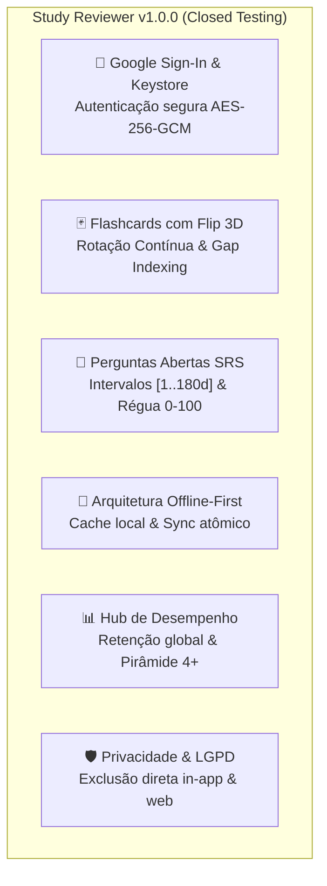

# Notas de Lançamento (Release Notes) — Versão 1.0.0
## Study Reviewer Mobile — Trilha de Teste Fechado (Closed Testing)

> **Documento:** `docs/store/release-notes-v1.0.0.md`  
> **Versão do Aplicativo:** `1.0.0` (Build `1.0.0+1`)  
> **Código de Versão (versionCode):** `1`  
> **Nome de Versão (versionName):** `1.0.0`  
> **Pacote do Aplicativo:** `com.studyreviewer.app`  
> **Trilha de Distribuição:** Teste Fechado (Closed Testing Track) — Google Play Console  
> **Data de Lançamento:** 07 de Outubro de 2026  
> **SDK Alvo:** Android 14 (API level 34)  
> **SDK Mínimo:** Android 7.0 (API level 24)

---

## 1. Textos Oficiais para o Google Play Console ("Novidades desta versão")

> [!NOTE]
> O Google Play Console impõe um limite estrito de **500 caracteres** por idioma na caixa de diálogo *"Novidades desta versão"* (*What's new in this release*). Abaixo constam os textos otimizados prontos para copiar e colar.

### 1.1 Português do Brasil (`pt-BR`) — [Exatamente 488 caracteres]

```text
Bem-vindo ao Study Reviewer! Primeira versão oficial para testes fechados:
• Flashcards com Flip 3D: Toque para girar e deslize suave sem latência.
• Rotação Contínua com Gap Indexing: Esqueça filas acumuladas e estude no seu ritmo.
• Perguntas Abertas SRS [1..180d]: Avaliação de 0 a 100 com espaçamento científico.
• 100% Offline-First: Estude sem conexão com sincronização automática em lote.
• Hub de Retenção: Monitore sua taxa de fixação e cards maduros.
• Privacidade Total: Controle e exclusão da conta.
```

### 1.2 Inglês Internacional (`en-US`) — [Exatamente 482 caracteres]

```text
Welcome to Study Reviewer! Initial release on the Closed Testing track:
• 3D Flip Flashcards: Tap to flip and swipe smoothly with zero latency.
• Continuous Pool Rotation: Gap Indexing scheduling with no deck starvation.
• Open-Ended SRS [1..180d]: Precision 0-100 scoring with scientific spacing.
• 100% Offline-First: Study anywhere with automatic background sync.
• Memory Retention Hub: Real-time mastery pyramid and review analytics.
• Privacy by Design: Total control and in-app account deletion.
```

---

## 2. Detalhamento Técnico das Funcionalidades da Versão 1.0.0

Esta versão inaugural do aplicativo móvel do ecossistema **Study Reviewer** traz paridade de recursos com a suíte web e introduz usabilidade tátil de alto desempenho para dispositivos Android:



### 2.1 Autenticação Segura & Gestão de Sessões
- **Google Sign-In Nativo:** Login seguro via Google Play Services com troca de token no backend FastAPI (`POST /api/v1/auth/google`).
- **Armazenamento Criptográfico:** Persistência de Bearer Tokens e chaves no **Android Keystore** através de criptografia simétrica **AES-256-GCM** via `flutter_secure_storage`.
- **Prevenção de Fugas de Sessão:** Invalidação síncrona de tokens locais no logout e na revogação remota.

### 2.2 Flashcards com Rotação Contínua e Gap Indexing
- **Micro-interações 3D:** Giro de card tridimensional acelerado por GPU (sem requisição de rede) ao toque simples.
- **Transição Acelerada:** *Swipe Left* para avançar com renderização sustentada entre 60 e 120 FPS.
- **Motor de Rotação Contínua:** Implementação do **ADR-002**, que elimina o esgotamento artificial de decks (*deck starvation*). O algoritmo prioriza os cartões com maior intervalo desde a última revisão através de indexação de lacunas (*Gap Indexing*).
- **Prefetching Preditivo:** Carregamento antecipado de lotes com política de *Low-Water Mark* (novo lote solicitado quando restam $\le 10$ cards no buffer), gerando percepção de latência zero.

### 2.3 Perguntas Abertas & Repetição Espaçada SRS
- **Fila Diária Inteligente:** Apresentação dinâmica de itens pendentes de revisão (`/api/v1/questions/due`).
- **Recuperação Ativa & Revelação de Gabarito:** O estudante formula mentalmente ou redige a resposta antes de inspecionar a resolução detalhada.
- **Régua Ergonômica de Autoavaliação (0 a 100):** Seletor de pontuação posicionado estrategicamente na *Thumb Zone* (terço inferior do display):
  - **$\ge 80$ (Promoção):** O item avança para o próximo nível de intervalo progressivo.
  - **$60 - 79$ (Manutenção):** O item mantém seu intervalo atual de consolidação.
  - **$< 60$ (Regressão):** O item retorna para níveis de reforço imediato (1 a 3 dias).
- **Escala de Intervalos [1..180 dias]:** Níveis calibrados em: 1d, 3d, 7d, 14d, 30d, 60d, 120d e 180 dias (cristalização da memória de longo prazo).

### 2.4 Resiliência Total e Modo Offline-First
- **Estudo Desconectado:** Toda e qualquer sessão de estudo pode ser executada sem conexão à internet.
- **Fila de Sincronização Local:** Respostas, métricas de tempo e notas são gravadas imediatamente no armazenamento local persistente.
- **Sincronização em Segundo Plano:** Assim que a conectividade for detectada, o serviço despacha os eventos em lote para `POST /api/v1/study/sync-answers`.
- **Desduplicação com `device_id`:** Uso de identificador anônimo para prevenir duplicidade de revisões em cenários de instabilidade de rede.

### 2.5 Hub de Desempenho e Análise de Retenção
- **Taxa de Retenção Global:** Cálculo percentual da assertividade histórica do estudante.
- **Cards Maduros (Nível 4+):** Contagem de conceitos consolidados na memória de médio e longo prazo (intervalos $\ge 14$ dias).
- **Pirâmide de Maestria do Conhecimento:** Visualização gráfica da distribuição dos cards ao longo dos 8 níveis de espaçamento.
- **Histórico Auditado de Revisões:** Trilha completa com data, nota atribuída e evolução temporal.

### 2.6 Privacidade por Design & Direitos do Titular (LGPD)
- **Exclusão de Conta In-App:** Botão dedicado em `Configurações > Minha Conta > Excluir Conta` com diálogo de confirmação dupla.
- **Desidentificação Irreversível:** Expurgo atômico do usuário e anonimização de métricas históricas de estudo (`ON DELETE SET NULL`) para preservar integridade analítica nos termos do Art. 16, IV da LGPD.
- **Formulário Web Externo:** Disponibilidade da rota pública `/privacy/account-deletion-request` para usuários sem acesso ao dispositivo.

---

## 3. Guia Operacional para Testadores Fechados (Testing Protocol)

Para a equipe interna de QA e os 20 testadores cadastrados na trilha fechada do Google Play Console, priorize a validação dos seguintes fluxos:

| ID | Cenário de Teste | Ações Esperadas do Testador | Critério de Aceitação |
| :---: | :--- | :--- | :--- |
| **CT-01** | **Login e Renovação de Sessão** | Realizar login via Google Sign-In, fechar o app e reabri-lo. | O app deve reabrir direto na Home sem exigir novo login; token mantido no Keystore. |
| **CT-02** | **Transição Offline / Online** | Ativar o Modo Avião, revisar 10 flashcards e responder 3 perguntas SRS; desativar o Modo Avião. | O indicador visual de modo offline deve surgir; ao religar a rede, as 13 revisões devem sincronizar sem perda de dados. |
| **CT-03** | **Giro 3D e Ergonomia Touch** | Executar 50 giros de flashcards consecutivos em alta velocidade. | Renderização contínua a 60/120 FPS, sem congelamentos, sem pulos de frames (*jank*) e sem *deck starvation*. |
| **CT-04** | **Régua de Notas e Progressão** | Avaliar perguntas com notas 20, 75 e 95. | Badges visuais de Regressão, Manutenção e Promoção devem atualizar os intervalos para 1d, mesmo intervalo e intervalo superior, respectivamente. |
| **CT-05** | **Acessibilidade e Alto Contraste** | Ativar o TalkBack do Android e navegar pelas telas. | Todas as ações de flip, notas e navegação devem conter rótulos semânticos claros e contraste $\ge 4.5:1$. |
| **CT-06** | **Fluxo de Exclusão de Conta** | Acessar Configurações e solicitar exclusão de conta de teste. | O app deve confirmar a solicitação, limpar todos os dados do Keystore/cache e retornar à tela inicial; conta expurgada na API. |

---

## 4. Matriz de Compatibilidade e Requisitos de Hardware

- **Sistemas Operacionais Suportados:** Android 7.0 (Nougat, API 24) até Android 14 (Upside Down Cake, API 34).
- **Arquiteturas Suportadas (ABI):** `arm64-v8a`, `armeabi-v7a`, `x86_64`.
- **Tamanho do Pacote AAB:** $\approx 18.5\text{ MB}$ (após otimização R8/ProGuard).
- **Tamanho Médio de Download no Dispositivo:** $\approx 12.2\text{ MB}$ (via Dynamic Delivery do Google Play).
- **Consumo de Memória RAM em Execução:** Entre $45\text{ MB}$ e $85\text{ MB}$.

---

## 5. Próximos Passos (Rumo ao Teste Aberto e Produção)

1. **Monitoramento de Métricas no Play Console:** Acompanhamento de relatórios de ANR (*Application Not Responding*) e taxas de falhas (meta $< 0.1\%$).
2. **Coleta de Feedback Estruturado:** Avaliação das impressões dos testadores fechados referente à sensibilidade do gesto de *swipe* e nitidez dos cards.
3. **Migração para Trilha Aberta (Open Beta):** Prevista para a Sprint subsequente após 14 dias contínuos de estabilidade comprovada na trilha fechada.
